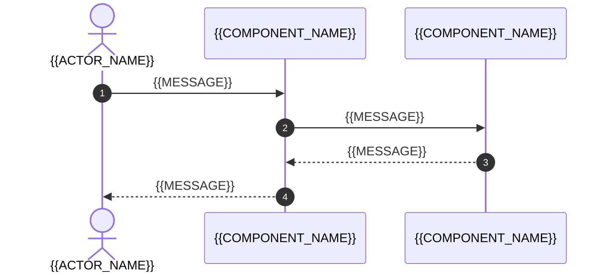

# Tóm tắt mã nguồn hiện có (Codebase Summary): {{PROJECT_NAME}}

<!-- fill: Chép thành docs/brownfield/CODEBASE_SUMMARY.md ở bước 0a (brownfield/PLAYBOOK_BROWNFIELD.md). Tài liệu là ảnh chụp hiện trạng tại commit ở §1, cố định sau Gate 0R. Mọi khẳng định về mã nguồn kèm bằng chứng: đường dẫn file:dòng trong inline code, hoặc lệnh đã chạy kèm exit code. Không ghi giá trị secret, token hay dữ liệu cá nhân đọc được trong repo. Điền §1 đến §6, §8, §9 bằng cách đọc file và lệnh chỉ đọc (git, liệt kê file, đếm dòng), chưa chạy lệnh của dự án; chỉ chạy lệnh ở §7 khi §2 đạt (brownfield/PLAYBOOK_BROWNFIELD.md mục 5.1). Frontmatter assembled_from ghi "brownfield/00_Codebase_Summary_Template.md@<template_version>". -->

## 1. Phạm vi quét (Scan Scope)

| Hạng mục | Giá trị |
| --- | --- |
| Kho mã | <!-- fill: tên repo hoặc đường dẫn --> |
| Nhánh và commit đo | <!-- fill: tên nhánh, mã commit đầy đủ của HEAD ngay sau commit của Prompt B0 (brownfield/PLAYBOOK_BROWNFIELD.md mục 5.1); là BASE của lệnh kiểm tra sót từ bước này --> |
| Commit đo không đổi mã sản phẩm | <!-- fill: lệnh git diff --name-status giữa commit ở Intake §4 và commit đo, cùng kết quả; mỗi file thuộc nhóm mà brownfield/PLAYBOOK_BROWNFIELD.md mục 5.1 cho phép (tài liệu, cấu hình agent, specflow/, .gitignore đã duyệt, file có sẵn ở §9) --> |
| Ngày quét | {{DATE}} |
| Người quét | {{AUTHOR}} |
| Phạm vi đã đọc | <!-- fill: thư mục và file đã đọc thật; repo lớn thì đọc manifest, cấu hình, CI, điểm vào và mã của luồng chính trước, phần còn lại theo module khi cần. Không khẳng định về phần chưa đọc --> |
| Thư mục bỏ qua | <!-- fill: thư mục sinh tự động, thư viện vendor, file build; nêu lý do --> |
| Tổng số dòng mã (không tính test) | <!-- fill: số, kèm lệnh đo --> |
| Tổng số dòng test | <!-- fill: số, kèm lệnh đo --> |

## 2. Điều kiện an toàn trước khi chạy lệnh (Safety Preconditions)

<!-- fill: Mỗi kho dữ liệu, hàng đợi, cache và dịch vụ ngoài mà mã hoặc test kết nối tới một hàng, lấy từ §6 và §8. Cột Đích khi quét ghi nơi lệnh ở §7 thật sự kết nối: cơ sở dữ liệu cục bộ hoặc dùng một lần, container, dịch vụ giả lập. Chuỗi xác thực mặc định của công cụ cloud cũng là một hàng; hook của Claude Code chạy lệnh của dự án đã tắt theo brownfield/PLAYBOOK_BROWNFIELD.md mục 5.1 quy tắc 6. Git hook đang bật (Intake §4) một hàng: các lệnh git đã chạy với core.hooksPath=/dev/null và commit tới Prompt B1 đã bỏ qua hook; công cụ quét secret của hook ghi lệnh đã chạy riêng trên file đã đổi và kết quả (brownfield/PLAYBOOK_BROWNFIELD.md mục 5.1 quy tắc 8). Hàng nào trỏ tới môi trường dùng chung (staging, production) hoặc chưa xác định được thì không chạy lệnh, ghi câu hỏi BLOCKING ở §11. Lệnh ở §7 chạy trong worktree sạch của commit đo, đặt tường minh biến trỏ tới đích ở cột Đích khi quét. -->

| Kho dữ liệu hoặc dịch vụ | Nơi cấu hình | Đích khi quét | Đạt |
| --- | --- | --- | :---: |
| {{EXTERNAL_SYSTEM}} | <!-- fill: file:dòng hoặc tên biến môi trường --> | <!-- fill: đích cục bộ hoặc dùng một lần --> | [ ] |
| Git hook | <!-- fill: file cấu hình hook, hoặc Không có --> | <!-- fill: hook đã tắt bằng core.hooksPath=/dev/null ở commit và worktree nào; công cụ quét secret: lệnh chạy riêng và kết quả --> | [ ] |

## 3. Bảng module (Module Inventory)

<!-- fill: Mỗi đơn vị mã có trách nhiệm riêng một hàng: thư mục, package hoặc service. Chia phân hệ theo PLAYBOOK mục 5: phần cross-cutting (xác thực, giới hạn tần suất, logging) và thư viện dùng chung không là phân hệ, trừ khi có dữ liệu riêng hoặc API riêng; chúng vẫn có hàng, cột Mã phân hệ ghi Không có. Số phân hệ ở đây đổi docs_mode so với Intake mục 5 thì ghi câu hỏi ở §11 (PLAYBOOK mục 5, xét lại ở Gate 0R). Cột Mã phân hệ đặt ở bước này theo CONVENTIONS mục 4 và được SRS to-be dùng lại cho phân hệ còn tồn tại; test REG ở Regression Baseline dùng mã này. Cột Phụ thuộc vào liệt kê module khác mà module này import hoặc gọi. -->

| Mã phân hệ | Module | Đường dẫn | Trách nhiệm | Số dòng mã | Có test | Phụ thuộc vào |
| --- | --- | --- | --- | --- | :---: | --- |
| `{{MODULE_CODE}}` | {{MODULE_NAME}} | <!-- fill: đường dẫn trong inline code --> | <!-- fill --> | <!-- fill --> | <!-- fill: chọn một: Có \| Không --> | <!-- fill: module khác, hoặc Không có --> |

## 4. Điểm vào (Entry Points)

| Điểm vào | Loại | Vị trí | Ghi chú |
| --- | --- | --- | --- |
| <!-- fill --> | <!-- fill: chọn một: HTTP \| lệnh dòng lệnh \| job định kỳ \| consumer hàng đợi \| màn hình \| khác --> | <!-- fill: file:dòng --> | <!-- fill --> |

## 5. Luồng chính (Main Flows)

<!-- fill: Mỗi luồng nghiệp vụ quan trọng một mục 5.N có sơ đồ tuần tự dựng từ mã thật; participant là module ở §3, mỗi bước ghi file:dòng trong phần mô tả dưới sơ đồ. Luồng ở đây là nguồn cho danh sách hành vi phải giữ ở Regression Baseline. -->

### 5.1. Luồng {{FEATURE_NAME}}

## 6. Cấu hình và biến môi trường thực tế (Actual Configuration)

| Tên biến hoặc khóa cấu hình | Nơi đọc | Bắt buộc | Có giá trị mặc định trong mã | Secret |
| --- | --- | :---: | :---: | :---: |
| <!-- fill: tên, không ghi giá trị --> | <!-- fill: file:dòng --> | <!-- fill: chọn một: Có \| Không --> | <!-- fill: chọn một: Có \| Không --> | <!-- fill: chọn một: Có \| Không --> |

## 7. Lệnh build, test và chạy (Working Commands)

<!-- fill: Chỉ ghi lệnh đã chạy thật trong phiên quét, trong worktree sạch của commit đo, sau khi mọi hàng ở §2 đạt; lệnh hỏng vẫn ghi, kèm lỗi rút gọn. Không chạy lệnh ghi vào dữ liệu hay hạ tầng dùng chung, không chạy migration lên cơ sở dữ liệu không phải đích ở §2. Cài dependency đúng theo lockfile, không cập nhật lockfile; dừng mọi tiến trình đã khởi động cho hàng Chạy cục bộ; sau khi chạy, git status của worktree không có file được theo dõi nào bị đổi. Repo không có công cụ test thì hàng Test ghi Không có và nêu ở §11. Hàng Lint, Format, Typecheck, Migration: repo không có công cụ đó thì ghi Không có ở cột Lệnh và căn cứ ở cột Ghi chú (manifest, cấu hình, CI đã đọc); lệnh format chạy ở chế độ chỉ kiểm, không ghi file; migration chỉ chạy lên cơ sở dữ liệu dùng một lần ở §2. Lệnh chạy được ở bảng này là lệnh verify mà Prompt B1 điền vào CLAUDE.md, thắng lệnh của stack profile (brownfield/PLAYBOOK_BROWNFIELD.md mục 5.5). -->

| Mục đích | Lệnh | Exit code | Thời gian chạy | Ghi chú |
| --- | --- | :---: | --- | --- |
| Cài dependency | <!-- fill --> | <!-- fill --> | <!-- fill --> | <!-- fill --> |
| Build | <!-- fill --> | <!-- fill --> | <!-- fill --> | <!-- fill --> |
| Test | <!-- fill --> | <!-- fill --> | <!-- fill --> | <!-- fill: số test pass, fail, skip --> |
| Chạy cục bộ | <!-- fill --> | <!-- fill --> | <!-- fill --> | <!-- fill --> |
| Lint | <!-- fill: lệnh, hoặc Không có --> | <!-- fill --> | <!-- fill --> | <!-- fill --> |
| Format | <!-- fill: lệnh ở chế độ chỉ kiểm, hoặc Không có --> | <!-- fill --> | <!-- fill --> | <!-- fill --> |
| Typecheck | <!-- fill: lệnh, hoặc Không có --> | <!-- fill --> | <!-- fill --> | <!-- fill --> |
| Migration | <!-- fill: lệnh áp migration lên cơ sở dữ liệu dùng một lần ở §2, hoặc Không có --> | <!-- fill --> | <!-- fill --> | <!-- fill --> |

## 8. Phụ thuộc ngoài (External Dependencies)

| Hệ thống | Cách gọi | Vị trí trong mã | Có môi trường thử |
| --- | --- | --- | :---: |
| {{EXTERNAL_SYSTEM}} | <!-- fill: giao thức, thư viện client --> | <!-- fill: file:dòng --> | <!-- fill: chọn một: Có \| Không --> |

## 9. Tài liệu và cấu hình agent có sẵn (Existing Docs & Agent Files)

<!-- fill: Mọi file đã có trong repo mà bố cục specflow cũng dùng tên hoặc thư mục: CLAUDE.md, AGENTS.md, .claude/, .mcp.json, docs/. Cột Xử lý ghi quyết định đã duyệt ở Gate 0 (Intake §4) và đã áp ở bước chuẩn bị repo. Thêm một hàng cho .gitignore khi bước chuẩn bị repo đã sửa theo Gate 0, và một hàng cho mỗi file bị gitignore không do specflow tạo đã loại khỏi lệnh thứ ba của lệnh kiểm tra sót (brownfield/PLAYBOOK_BROWNFIELD.md mục 5.5 quy tắc 3). Dòng có sẵn trong file này không tính khi chạy lệnh kiểm tra sót. -->

| File hoặc thư mục | Nội dung chính | Xử lý |
| --- | --- | --- |
| <!-- fill --> | <!-- fill --> | <!-- fill: chọn một: giữ nguyên \| gộp vào CLAUDE.md của specflow \| chuyển vào docs/legacy/ \| chuyển nội dung vào tài liệu specflow (ghi tài liệu đích; làm ở prompt tạo tài liệu đó). Cách xử lý và thời điểm theo brownfield/PLAYBOOK_BROWNFIELD.md mục 5.5 quy tắc 2 --> |

## 10. Phạm vi tối thiểu cho repo nhỏ (Minimal Scope)

<!-- fill: Repo dưới 5.000 dòng mã (theo §1) được phép: §3 gộp theo thư mục cấp một, §5 chỉ cần luồng dài nhất và luồng ghi dữ liệu, §8 ghi một dòng. §1, §2, §6, §7 luôn đầy đủ. Ghi quyết định vào bảng; repo lớn hơn ghi Không. -->

| Áp dụng phạm vi tối thiểu | Căn cứ |
| --- | --- |
| <!-- fill: chọn một: Có \| Không --> | <!-- fill: số dòng mã ở §1 --> |

## 11. Giả định và câu hỏi mở (Assumptions & Open Questions)

| ID | Loại | Nội dung | Lý do hoặc ảnh hưởng | BLOCKING | Người trả lời |
| --- | --- | --- | --- | :---: | --- |
| AQ-01 | <!-- fill: chọn một: Giả định \| Câu hỏi --> | <!-- fill --> | <!-- fill --> | <!-- fill: chọn một: Có \| Không --> | <!-- fill --> |

## 12. Lịch sử phiên bản (Version History)

| Phiên bản | Ngày | Người sửa | Nội dung thay đổi | Lý do và người yêu cầu | Người duyệt |
| --- | --- | --- | --- | --- | --- |
| 0.1.0 | {{DATE}} | {{AUTHOR}} | Bản khởi tạo | Khởi tạo theo pipeline brownfield | Chưa duyệt |
