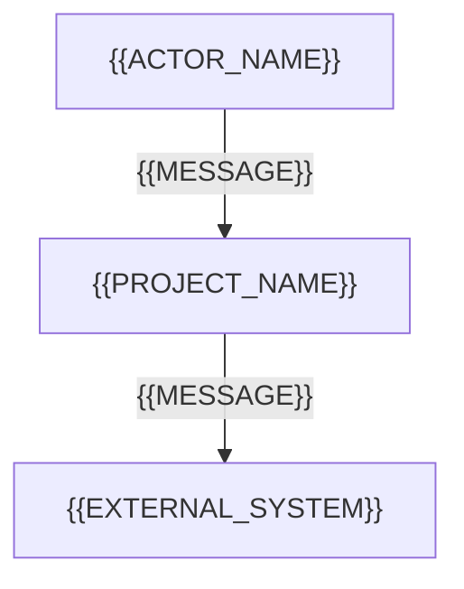
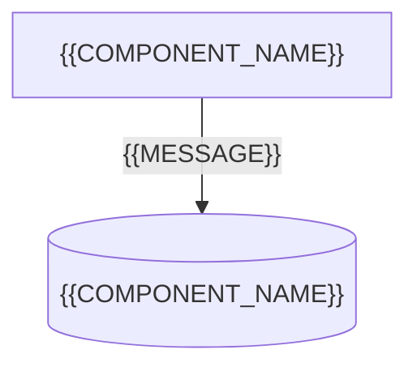
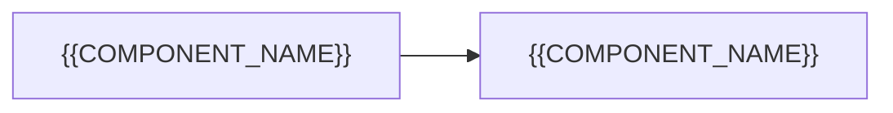

# Kiến trúc hiện trạng (As-Is Architecture): {{PROJECT_NAME}}

<!-- fill: Chép thành docs/brownfield/AS_IS_ARCHITECTURE.md ở bước 0b (brownfield/PLAYBOOK_BROWNFIELD.md). Tài liệu mô tả hệ thống đang chạy, không mô tả hệ thống mong muốn: mọi hàng ghi hiện trạng kèm bằng chứng (file:dòng trong inline code, file manifest, output lệnh). Không có bằng chứng thì ghi "Chưa xác định" và thêm câu hỏi ở §13. Tài liệu là ảnh chụp tại commit của Codebase Summary §1, cố định sau Gate 0R. Kiến trúc mong muốn viết sau, ở docs/ARCHITECTURE.md theo core/02. Frontmatter assembled_from ghi "brownfield/01_As_Is_Architecture_Recovery_Template.md@<template_version>". -->

## 1. Tóm tắt hiện trạng (As-Is Summary)

<!-- fill: 3 đến 5 câu: hệ thống làm gì, chạy ở đâu, kiểu kiến trúc thực tế, điểm yếu lớn nhất. -->

| Hạng mục | Hiện trạng | Bằng chứng |
| --- | --- | --- |
| Kiểu kiến trúc thực tế | <!-- fill: ví dụ một ứng dụng, nhiều dịch vụ, ứng dụng và job tách rời --> | <!-- fill --> |
| Số bề mặt | <!-- fill: bề mặt ứng với overlay nào ở PLAYBOOK mục 3 --> | <!-- fill --> |

## 2. Tech stack thực tế (Actual Tech Stack)

<!-- fill: Lấy từ file manifest và lockfile (ví dụ package.json kèm lockfile, pyproject.toml, go.mod, pom.xml), không lấy từ tài liệu cũ. Phiên bản ghi đúng như lockfile. -->

| Lớp (Layer) | Công nghệ | Phiên bản trong lockfile | Nguồn | Còn được hỗ trợ |
| --- | --- | --- | --- | :---: |
| <!-- fill --> | <!-- fill --> | <!-- fill --> | <!-- fill: file manifest --> | <!-- fill: chọn một: Có \| Không \| Chưa xác định --> |

## 3. Góc nhìn C4 phục dựng (Recovered C4 Views)

### 3.1. Bối cảnh hệ thống (System Context)



### 3.2. Vùng chứa (Container)

<!-- fill: Mỗi đơn vị triển khai và kho dữ liệu đang chạy thật; cạnh ghi giao thức quan sát được trong mã hoặc cấu hình. -->



### 3.3. Thành phần của module phức tạp nhất (Component)



## 4. Cấu trúc thư mục thực tế (Actual Repository Layout)

<!-- fill: Cây thư mục tới cấp đủ thấy ranh giới module; ghi chú lệch so với cách tách tầng giao tiếp, nghiệp vụ, truy cập dữ liệu (quy tắc 1 ở core/02 §1.2), ví dụ controller truy vấn thẳng cơ sở dữ liệu. -->

```text
.
```

| Module (Codebase Summary §3) | Tầng thực tế có | Vi phạm tách tầng quan sát được | Bằng chứng |
| --- | --- | --- | --- |
| `{{MODULE_CODE}}` {{MODULE_NAME}} | <!-- fill --> | <!-- fill: hoặc Không có --> | <!-- fill --> |

## 5. Dữ liệu hiện tại (Current Data)

<!-- fill: Schema trích từ file migration hoặc file schema của ORM trong repo. Cấu trúc hay số bản ghi của cơ sở dữ liệu đang chạy chỉ lấy khi chủ dự án tự chạy truy vấn và gửi kết quả, hoặc cấp quyền chỉ đọc trên một bản sao không phải production; không đọc dữ liệu cá nhân. Bề mặt không lưu trữ ghi N/A kèm lý do. -->

```mermaid
erDiagram
    {{ENTITY_NAME}} {
        string id PK "Khóa chính"
    }
```

| Bảng hoặc collection | Số bản ghi xấp xỉ | Nguồn schema | Vấn đề toàn vẹn quan sát được |
| --- | --- | --- | --- |
| <!-- fill --> | <!-- fill: số do chủ dự án cung cấp, hoặc Chưa xác định --> | <!-- fill: file migration hoặc file schema --> | <!-- fill: ví dụ thiếu khóa ngoại, thiếu ràng buộc duy nhất; hoặc Không có --> |

## 6. Mối quan tâm xuyên suốt hiện trạng (As-Is Cross-cutting Concerns)

| Hạng mục | Hiện trạng | Bằng chứng | Rủi ro |
| --- | --- | --- | --- |
| Xác thực và phân quyền | <!-- fill --> | <!-- fill --> | <!-- fill --> |
| Xử lý lỗi và định dạng phản hồi lỗi | <!-- fill --> | <!-- fill --> | <!-- fill --> |
| Ghi log | <!-- fill --> | <!-- fill --> | <!-- fill --> |
| Cấu hình và secret | <!-- fill: tham chiếu Codebase Summary §6; secret có nằm trong mã không (chỉ ghi vị trí, không ghi giá trị) --> | <!-- fill --> | <!-- fill --> |
| Quan sát (metric, trace, health check) | <!-- fill --> | <!-- fill --> | <!-- fill --> |
| Quốc tế hóa | <!-- fill --> | <!-- fill --> | <!-- fill --> |
| Tác vụ nền | <!-- fill --> | <!-- fill --> | <!-- fill --> |
| Cache | <!-- fill --> | <!-- fill --> | <!-- fill --> |

## 7. Quy ước giao tiếp hiện có (Current Interface Conventions)

<!-- fill: Kiểu API, định dạng phản hồi, phân trang, idempotency đang dùng; mã lỗi và thông báo lỗi tìm thấy trong mã. Contract hiện tại được chụp lại ở Regression Baseline §5. -->

| Hạng mục | Hiện trạng | Bằng chứng |
| --- | --- | --- |
| Kiểu giao tiếp | <!-- fill --> | <!-- fill --> |
| Định dạng phản hồi thành công và lỗi | <!-- fill --> | <!-- fill --> |
| Mã lỗi đang dùng | <!-- fill: liệt kê, hoặc "không có mã, chỉ thông điệp" --> | <!-- fill --> |

## 8. Triển khai hiện tại (Current Deployment)

| Hạng mục | Hiện trạng | Bằng chứng |
| --- | --- | --- |
| Nơi chạy và cách triển khai | <!-- fill --> | <!-- fill: file CI, script triển khai, cấu hình hạ tầng --> |
| Migration khi triển khai | <!-- fill --> | <!-- fill --> |
| Sao lưu và khôi phục | <!-- fill --> | <!-- fill --> |
| Quay lui | <!-- fill --> | <!-- fill --> |

## 9. Bảo mật hiện trạng (As-Is Security)

| Kiểm soát | Hiện trạng | Bằng chứng | Mức rủi ro |
| --- | --- | --- | --- |
| <!-- fill: mỗi kiểm soát một hàng: CORS, CSRF, security headers, quản lý secret, mã hóa khi truyền, lưu mật khẩu, chống injection, mã hóa đầu ra, dữ liệu cá nhân khi lưu, nhật ký kiểm toán, giới hạn tần suất, quét dependency --> | <!-- fill --> | <!-- fill --> | <!-- fill: chọn một: Cao \| Trung bình \| Thấp --> |

## 10. Kiểm thử hiện có (Current Tests)

| Loại test | Số lượng | Công cụ | Lệnh chạy | Kết quả lần chạy gần nhất |
| --- | --- | --- | --- | --- |
| <!-- fill --> | <!-- fill --> | <!-- fill --> | <!-- fill: lấy từ Codebase Summary §7 --> | <!-- fill: pass, fail, skip --> |

## 11. Nợ kỹ thuật (Technical Debt)

| Vấn đề | Bằng chứng | Mức độ | Ảnh hưởng tới to-be |
| --- | --- | --- | --- |
| <!-- fill --> | <!-- fill: file:dòng hoặc output lệnh --> | <!-- fill: chọn một: Cao \| Trung bình \| Thấp --> | <!-- fill: yêu cầu hoặc NFR nào bị cản --> |

## 12. Phạm vi tối thiểu cho repo nhỏ (Minimal Scope)

<!-- fill: Repo dưới 5.000 dòng mã (Codebase Summary §1) được phép ghi N/A kèm lý do ở §3.3 và §7, và gộp các hàng không có cơ chế ở §6 thành một hàng "Không có". §2, §4, §5, §11 luôn đầy đủ. Ghi quyết định vào bảng; repo lớn hơn ghi Không. -->

| Áp dụng phạm vi tối thiểu | Căn cứ |
| --- | --- |
| <!-- fill: chọn một: Có \| Không --> | <!-- fill: số dòng mã ở Codebase Summary §1 --> |

## 13. Giả định và câu hỏi mở (Assumptions & Open Questions)

| ID | Loại | Nội dung | Lý do hoặc ảnh hưởng | BLOCKING | Người trả lời |
| --- | --- | --- | --- | :---: | --- |
| AQ-01 | <!-- fill: chọn một: Giả định \| Câu hỏi --> | <!-- fill --> | <!-- fill --> | <!-- fill: chọn một: Có \| Không --> | <!-- fill --> |

## 14. Lịch sử phiên bản (Version History)

| Phiên bản | Ngày | Người sửa | Nội dung thay đổi | Lý do và người yêu cầu | Người duyệt |
| --- | --- | --- | --- | --- | --- |
| 0.1.0 | {{DATE}} | {{AUTHOR}} | Bản khởi tạo | Khởi tạo theo pipeline brownfield | Chưa duyệt |
