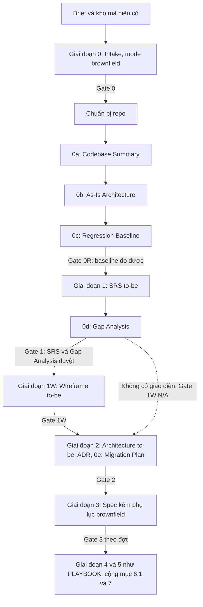

# Playbook cho dự án đang có mã nguồn (Brownfield Playbook)

## 1. Phạm vi (Scope)

Dùng khi Intake chốt `mode: brownfield`: dự án đã có mã nguồn đang chạy và hành vi của nó phải được giữ. Playbook này bổ sung cho [PLAYBOOK.md](../PLAYBOOK.md): mọi giai đoạn, template lõi, overlay, stack profile, starter, prompt và quy tắc ở PLAYBOOK vẫn áp dụng, trừ ngoại lệ ghi rõ ở mục 5.1 (test `REG` ở Giai đoạn 0R). Khi `CLAUDE.md` hay rule có sẵn của repo mâu thuẫn với mục 5, mục 5 thắng. Phần thêm vào:

- Bước chuẩn bị repo sau Gate 0: áp quyết định về `CLAUDE.md`, `.claude/` và tài liệu có sẵn.
- Giai đoạn 0R (phục hồi hiện trạng) trước SRS: 0a Codebase Summary, 0b As-Is Architecture, 0c Regression Baseline.
- 0d Gap Analysis sau khi viết SRS to-be; Giai đoạn 1W vẽ wireframe to-be sau Gap Analysis khi có giao diện; 0e Migration Plan cùng Architecture to-be.
- Phụ lục SPEC cho brownfield ở Giai đoạn 3, và phần bổ sung cho từng prompt của PLAYBOOK (mục 6.1).

Template của bộ này nằm trong `brownfield/`; tài liệu sinh ra nằm trong `docs/brownfield/` theo bố cục ở CONVENTIONS mục 6. Chọn overlay theo bề mặt của hệ thống đang chạy (PLAYBOOK mục 3); stack profile theo mục 5.5.

Phần thêm ở bản `2.1.0` của file này áp cho dự án có Intake tạo từ template Intake `1.2.0` trở lên: commit đo, git hook, vòng viết và chạy test `REG`, loại và số TC ở Regression Baseline §6.1, profile khớp, nơi đích `docs/legacy/`, sửa `.gitignore`, lệnh kiểm tra sót quét file bị gitignore, ba tiêu chí Gate 0R mới ở mục 3.1 và các bước mới của Prompt B0 đến B2. Dự án có Intake cũ hơn giữ quy tắc của bản `2.0.0`; tài liệu đã duyệt không phải sửa lại.

Phần thêm ở bản `2.2.0` của file này áp cho dự án có Intake tạo từ template Intake `1.3.0` trở lên: Giai đoạn 1W sau Gap Analysis với wireframe to-be, giá trị `Giữ nguyên` cho màn hình không đổi (mục 5.3 quy tắc 5), việc sửa Gap Analysis khi Giai đoạn 1W sửa SRS to-be (mục 2.1), tiêu chí Gate 1W ở mục 3.2 và dòng Prompt 1W ở mục 6.1. Dự án có Intake cũ hơn không có Giai đoạn 1W và giữ quy tắc của bản `2.1.0`.

Bản `2.3.0` của file này ghép các bước brownfield vào quy trình 3 bước của PLAYBOOK mục 2 (mục 2 dưới đây) và sửa dòng Prompt 4 ở mục 6.1 cho plan của đợt: pha đầu của mỗi SPEC chạy test ở §9.2 của SPEC đó. Plan một SPEC (Intake cũ hơn `1.3.0`) có một SPEC nên quy tắc cũ không đổi.

Bản `2.4.0` của file này thêm vào tiêu chí Gate 1W ở mục 3.2 phạm vi của bảng đánh giá heuristic và bảng kiểm mẫu thiết kế lừa người dùng (CONVENTIONS mục 10): chỉ màn hình có trang. Quy tắc áp cho chỉ mục tạo từ template wireframe `1.2.0` trở lên; chỉ mục tạo từ bản cũ hơn không có hai bảng này.

## 2. Pipeline brownfield (Brownfield Pipeline)

Các bước brownfield nằm trong 3 bước của PLAYBOOK mục 2: chuẩn bị repo, Giai đoạn 0R (0a, 0b, 0c) và 0d Gap Analysis thuộc bước 1 Yêu cầu; 0e Migration Plan và phụ lục SPEC thuộc bước 2 Thiết kế; bước 3 Kế hoạch và thực thi như PLAYBOOK, cộng mục 6.1 và 7.



| Giai đoạn | Trả lời câu hỏi | Template | Đầu ra trong dự án | Gate |
| --- | --- | --- | --- | --- |
| Chuẩn bị repo | `CLAUDE.md` và tài liệu có sẵn được xử lý thế nào | Không có | `CLAUDE.md` của specflow, tài liệu trùng đường dẫn đã chuyển vào `docs/legacy/` | Không có gate riêng |
| 0a. Codebase Summary | Mã đang có gì, chạy thế nào, lệnh nào chạy được an toàn | [00_Codebase_Summary_Template.md](00_Codebase_Summary_Template.md) | `docs/brownfield/CODEBASE_SUMMARY.md` | Gate 0R |
| 0b. As-Is Architecture | Kiến trúc thật đang chạy và nợ kỹ thuật, có bằng chứng | [01_As_Is_Architecture_Recovery_Template.md](01_As_Is_Architecture_Recovery_Template.md) | `docs/brownfield/AS_IS_ARCHITECTURE.md` | Gate 0R |
| 0c. Regression Baseline | Hành vi nào phải giữ, được test nào bảo vệ, coverage hiện tại bao nhiêu | [02_Regression_Baseline_Template.md](02_Regression_Baseline_Template.md) | `docs/brownfield/REGRESSION_BASELINE.md` | Gate 0R |
| 1. SRS to-be | Toàn bộ hệ thống đích làm gì, kể cả phần giữ nguyên | SRS của giai đoạn (PLAYBOOK mục 4) | `docs/srs/` | Gate 1 |
| 0d. Gap Analysis | To-be khác hiện trạng ở đâu, RB nào đổi | [03_Gap_Analysis_Template.md](03_Gap_Analysis_Template.md) | `docs/brownfield/GAP_ANALYSIS.md` | Gate 1 |
| 1W. Wireframe to-be | Màn hình mới hoặc đổi theo Gap Analysis trông và điều hướng thế nào; màn hình nào giữ nguyên | `core/07_Wireframe_Template/` (PLAYBOOK mục 2.2.1) | `docs/wireframes/` | Gate 1W |
| 2. Architecture to-be và ADR | Hệ thống sẽ được xây thế nào | Architecture của giai đoạn, `core/03_ADR_Template.md` | `docs/ARCHITECTURE.md`, `docs/adr/` | Gate 2 |
| 0e. Migration Plan | Đi từ hiện trạng tới to-be qua bước nào, quay lui ra sao | [04_Migration_Plan_Template.md](04_Migration_Plan_Template.md) | `docs/brownfield/MIGRATION_PLAN.md` | Gate 2 |
| 3. Spec | Hợp đồng thực thi của một bước | Spec của giai đoạn và [Spec_Brownfield_Addendum.md](Spec_Brownfield_Addendum.md) | `docs/specs/` | Gate 3 |

### 2.1. Vòng đời tài liệu (Document Lifecycle)

| Tài liệu | Sau gate của nó | Cập nhật khi nào |
| --- | --- | --- |
| Codebase Summary, As-Is Architecture | Cố định: ảnh chụp tại commit đo | Chỉ sửa lỗi ghi chép (PLAYBOOK mục 8, mức PATCH). Kiến trúc sau thay đổi nằm ở `docs/ARCHITECTURE.md` |
| Regression Baseline | Sống | Đầu Giai đoạn 2, sau khi Gate 1 duyệt: trạng thái RB theo Gap Analysis §5. Sync Docs của mỗi SPEC: hàng của RB được đổi hoặc bỏ, và hàng §6.1 cho test `REG` mới mà SPEC thêm (cột Bảo vệ bởi của RB trỏ tới test đó) |
| SRS to-be | Sống, như SRS greenfield | Theo PLAYBOOK mục 8; SRS to-be mô tả toàn bộ hệ thống đích và trở thành SRS của dự án |
| Gap Analysis | Cố định sau Gate 1 | Chỉ khi SRS to-be đổi, theo PLAYBOOK mục 8, kể cả khi Giai đoạn 1W phát hiện lệch và sửa SRS to-be (Intake tạo từ template Intake `1.3.0` trở lên); Gap Analysis được duyệt lại cùng SRS trước Gate 1W |
| Wireframe to-be | Sống, như SRS to-be | Theo PLAYBOOK mục 8 |
| Migration Plan | Sống | Sync Docs của mỗi SPEC: cột Trạng thái ở §2. Đổi chiến lược thì ADR mới và PLAYBOOK mục 8 |

## 3. Gate brownfield (Brownfield Gates)

### 3.1. Gate 0R: mốc hồi quy đo được (Regression Gate)

Không viết SRS to-be khi Gate 0R chưa đạt. Gate đạt khi mọi tiêu chí ở hai bảng dưới đạt.

| Tiêu chí | Kiểm chứng |
| --- | --- |
| Mọi hàng ở mục điều kiện an toàn đạt trước khi chạy lệnh đầu tiên của dự án | Codebase Summary §2 |
| Lệnh build và test hiện có đã chạy thật trong worktree sạch của commit đo, ghi exit code | Codebase Summary §1, §7 |
| Commit đo chỉ khác commit ở Intake §4 ở những file mà mục 5.1 cho phép | Codebase Summary §1 |
| Mọi phân hệ có mã phân hệ theo CONVENTIONS mục 4 | Codebase Summary §3 |
| `docs_mode` ở Intake khớp tiêu chí ở PLAYBOOK mục 5 khi tính lại với mã phân hệ ở Codebase Summary §3, hoặc Intake và dòng `docs_mode` của `CLAUDE.md` đã cập nhật để người duyệt Gate 0 duyệt lại cùng Gate 0R | Intake mục 5, mục 14 và Version History; `CLAUDE.md` |
| Mục lệnh verify của `CLAUDE.md` đã điền từ Codebase Summary §7 | `CLAUDE.md` |
| Mọi luồng chính có sơ đồ dựng từ mã, mỗi bước có `file:dòng` | Codebase Summary §5 |
| Mọi khẳng định ở As-Is Architecture có bằng chứng, hoặc ghi "Chưa xác định" kèm câu hỏi | As-Is Architecture |
| Chủ dự án duyệt ba tài liệu, không còn câu hỏi `BLOCKING` | `status: approved` và Version History của ba tài liệu; mục Giả định và câu hỏi mở |

Tiêu chí thuộc Regression Baseline; số mục tính theo tài liệu đó, và Regression Baseline §8 ghi cùng câu chữ:

| Tiêu chí | Đạt? |
| --- | :---: |
| §1 và §2 có số liệu từ lệnh đã chạy; §2 theo module, hoặc một dòng cho toàn repo khi §9 ghi Có | [ ] |
| Mọi luồng chính ở Codebase Summary §5 có ít nhất một RB | [ ] |
| Mọi RB mức Must có test bảo vệ pass trên mã sản phẩm của commit đo, hoặc thủ tục thủ công ở §6.2 được chủ dự án chấp nhận | [ ] |
| Contract bên ngoài đã chụp ở §5 trên dữ liệu ở §4 | [ ] |
| Test hỏng sẵn đã liệt kê ở §7 | [ ] |
| Không còn câu hỏi BLOCKING ở §11 | [ ] |

### 3.2. Bổ sung cho Gate 1, Gate 1W và Gate 2 (Gate 1, Gate 1W & Gate 2 Additions)

| Gate | Thêm tiêu chí |
| --- | --- |
| Gate 1 | Gap Analysis `approved`; mọi RB bị đổi hoặc bỏ có hàng ở Gap Analysis §5 và được chủ dự án duyệt; SRS to-be §1.2 và Gap Analysis §1.2 khớp nhau |
| Gate 1W | Intake tạo từ template Intake `1.3.0` trở lên và có Giai đoạn 1W: màn hình mới hoặc đổi theo Gap Analysis có trang wireframe; FR mà màn hình của nó không đổi ghi `Giữ nguyên` ở bảng đối chiếu kèm dẫn Regression Baseline §5; SRS to-be đổi ở Giai đoạn 1W thì Gap Analysis đã sửa và duyệt lại; chỉ mục tạo từ template wireframe `1.2.0` trở lên: bảng đánh giá heuristic và bảng kiểm mẫu thiết kế lừa người dùng (CONVENTIONS mục 10.3, 10.4) chỉ xét màn hình có trang, màn hình `Giữ nguyên` không có đánh giá riêng |
| Gate 2 | Regression Baseline §3 ghi trạng thái theo Gap Analysis §5 đã duyệt; Migration Plan `approved`; ADR chiến lược chuyển đổi `accepted`; mỗi bước ở Migration Plan §2 có danh sách RB phải pass |

## 4. Danh mục nạp ngữ cảnh (Context Loading Manifest)

Bảng này bổ sung PLAYBOOK mục 6; giai đoạn không có trong bảng dùng nguyên dòng của PLAYBOOK. Quy tắc "MUST NOT đọc `examples/` hoặc bộ mẫu cũ" vẫn áp dụng ở mọi giai đoạn.

| Giai đoạn | MUST đọc | MUST NOT đọc |
| --- | --- | --- |
| 0. Intake | Như PLAYBOOK mục 6, cộng file này mục 1 và 5, cây thư mục và manifest của repo, `CLAUDE.md`, `AGENTS.md`, `.claude/`, `.mcp.json` và `docs/` có sẵn trong repo, `.gitignore`, cấu hình git hook (`.pre-commit-config.yaml`, `.husky/`, `.git/hooks`, `core.hooksPath`), cấu hình và fixture của bộ chạy test | Như PLAYBOOK mục 6, cộng file env không phải file mẫu |
| Chuẩn bị repo | `CLAUDE.md` có sẵn, file này mục 5.1 và 5.5, Intake §4 và §13, Agent Context của giai đoạn, `.gitignore` và cấu hình git hook | Mã nguồn |
| 0a, 0b | `CLAUDE.md`, file này, `specflow/CONVENTIONS.md`, Intake, template của bước, `specflow/core/02_Architecture_Core_Template.md` §1.2; trong repo: theo thứ tự đọc ở mục 5.2 | File env không phải file mẫu; tài liệu cũ của repo dùng làm bằng chứng (chỉ dùng làm gợi ý để tìm mã) |
| 0c | `CLAUDE.md`, file này mục 3 đến 5, `specflow/CONVENTIONS.md` mục 4, Intake §4, Codebase Summary, As-Is Architecture, template Regression Baseline, test hiện có, mã của luồng chính | Như 0a, cộng mã ngoài luồng chính khi đã đủ bằng chứng |
| 1. SRS to-be | Như PLAYBOOK mục 6, cộng file này mục 5.3, Codebase Summary, As-Is Architecture, Regression Baseline | Như PLAYBOOK mục 6 |
| 0d | `CLAUDE.md`, file này mục 3 đến 5, `specflow/CONVENTIONS.md` mục 4, SRS to-be, Codebase Summary §3, As-Is Architecture, Regression Baseline, template Gap Analysis | Mã nguồn, trừ khi cần xác nhận một hàng "Một phần" |
| 1W. Wireframe to-be | Như PLAYBOOK mục 6, cộng file này mục 2.1 và 5.3, Gap Analysis, Regression Baseline §5 | Như PLAYBOOK mục 6 |
| 2. Architecture to-be, 0e | Như PLAYBOOK mục 6, cộng file này mục 3 đến 5, As-Is Architecture, Gap Analysis, Regression Baseline, template Migration Plan | Như PLAYBOOK mục 6 |
| 3. Spec | Như PLAYBOOK mục 6, cộng Migration Plan (bước đang làm), Regression Baseline, Gap Analysis §1.2 và §5, phụ lục SPEC | Như PLAYBOOK mục 6, cộng mã của phân hệ không thuộc bước đang làm |
| 4a. Plan | Như PLAYBOOK mục 6, cộng Migration Plan §6 | Như PLAYBOOK mục 6 |
| 4b. Coding | Như PLAYBOOK mục 6; test ở SPEC §9.2 được chạy dù nằm ngoài File Diff, chỉ sửa test nằm trong File Diff | Như PLAYBOOK mục 6 |
| 5. Verify và Sync | Như PLAYBOOK mục 6, cộng file này mục 2.1 và 7, Regression Baseline, Migration Plan | Như PLAYBOOK mục 6 |
| Resume | Như PLAYBOOK mục 6, cộng file này mục 2, 4, 5 và prompt của bước đang dở ở mục 6 | Như PLAYBOOK mục 6 |

## 5. Quy tắc cho agent (Agent Rules)

Các quy tắc dưới bổ sung PLAYBOOK mục 7. Phạm vi áp của phần thêm ở bản `2.1.0` và `2.2.0` theo mục 1.

### 5.1. An toàn ở Giai đoạn 0R (Phase 0R Safety)

"Lệnh của dự án" là lệnh chạy mã hoặc script của repo: cài dependency, build, test, chạy cục bộ, migration. Lệnh chỉ đọc (git, liệt kê file, đếm dòng) không thuộc nhóm này.

"Commit đo" là HEAD của nhánh làm việc khi Prompt B0 xong: commit của Prompt B0, hoặc HEAD lúc đó nếu B0 không có gì để commit. So với commit ghi ở Intake §4, nó chỉ được khác ở tài liệu và cấu hình agent (`docs/`, `plans/`, `CLAUDE.md`, `AGENTS.md`, `.claude/`, `.mcp.json`), thư mục `specflow/`, `.gitignore` đã duyệt ở Gate 0 và file có sẵn đã xử lý theo mục 5.5 quy tắc 2. Prompt B1 kiểm điều này bằng `git diff --name-status <commit ở Intake §4> <commit đo>` và ghi lệnh cùng kết quả ở Codebase Summary §1; mỗi dòng của kết quả thuộc một trong các nhóm trên, không có file mã sản phẩm nào.

1. Trước lệnh đầu tiên của dự án, điền Codebase Summary §2, §6, §8 chỉ bằng cách đọc file. Mọi biến hay khóa cấu hình trỏ tới kho dữ liệu, hàng đợi, cache hay dịch vụ ngoài MUST trỏ tới đích cục bộ hoặc dùng một lần (container, cơ sở dữ liệu rỗng, dịch vụ giả lập). Không xác định được đích thì không chạy lệnh, ghi câu hỏi `BLOCKING`.
2. Lệnh của dự án chỉ chạy trong một worktree sạch tạo từ commit đo (`git worktree add` ra thư mục ngoài repo, hoặc bản clone mới), để file env và file cấu hình cục bộ bị git bỏ qua trong thư mục làm việc không được nạp tự động. Mỗi lệnh đặt tường minh mọi biến ở Codebase Summary §6 trỏ tới kho dữ liệu hoặc dịch vụ, với giá trị là đích ở §2; biến xác thực thừa hưởng từ shell (khóa cloud, cấu hình kube, token của công cụ) được bỏ khỏi môi trường của lệnh; chuỗi xác thực mặc định của công cụ cloud tính là một dịch vụ ngoài ở §2.
3. MUST NOT mở file env không phải file mẫu. Tên biến đọc từ mã và file env mẫu; cần biết một biến trỏ tới đâu thì hỏi chủ dự án.
4. Cấu trúc hay số bản ghi của cơ sở dữ liệu đang chạy chỉ lấy khi chủ dự án tự chạy truy vấn và gửi kết quả, hoặc cấp quyền chỉ đọc trên một bản sao không phải production. Không ghi chuỗi kết nối vào tài liệu.
5. Không ghi giá trị secret, token hay dữ liệu cá nhân vào bất kỳ tài liệu nào. Bản ghi request, response và ảnh chụp màn hình che dữ liệu cá nhân và thông tin xác thực (header `Authorization`, cookie, token, khóa API, mã phiên) trước khi lưu (Regression Baseline §4, §5).
6. Cấu hình Claude Code có sẵn trong repo: trước Prompt 0, chủ dự án xem hook trong `.claude/settings.json`, `.claude/settings.local.json` và server trong `.mcp.json`. Hook chạy lệnh của dự án được tắt từ trước Prompt 0 tới khi Gate 0R đạt; sau đó chỉ bật lại khi hook đặt tường minh biến môi trường theo mục 5.4 quy tắc 6. `CLAUDE.md` có sẵn mâu thuẫn với mục 5 này thì mục 5 thắng.
7. Giai đoạn 0R không sửa mã sản phẩm. Ngoại lệ duy nhất, ghi đè PLAYBOOK mục 1.2 nguyên tắc 1, mục 7 quy tắc 4, 5 và 7 chỉ cho phần này: ở bước 0c agent thêm test `REG` cho RB mức Must chưa có test. Phần được thêm gồm file test, dữ liệu test tổng hợp, và cấu hình cùng dependency test mà Gate 0 đã duyệt (Intake §4); test viết trong thư mục làm việc theo vòng ở quy tắc 9, nằm trong một commit riêng trên nhánh làm việc không chạm mã sản phẩm, là hậu duệ của commit đo (không bắt buộc là con trực tiếp; commit ở giữa chỉ đổi tài liệu và cấu hình agent), và pass khi chạy trong worktree sạch tạo từ commit đó; Regression Baseline §1 ghi commit đó; dependency test mới được ghi ADR ở Giai đoạn 2. Ngoại lệ mặc định được phép; chủ dự án có thể từ chối ở Gate 0. Khi bị từ chối, hoặc khi repo chưa có công cụ test và Gate 0 không duyệt thêm, thủ tục thủ công ở Regression Baseline §6.2 có rủi ro được chủ dự án chấp nhận thay cho test, và SPEC đầu tiên chạm RB đó thêm test `REG` theo phụ lục SPEC.
8. Git hook đang bật (Intake §4; `.pre-commit-config.yaml`, `.husky/`, hook trong `.git/hooks`, `core.hooksPath`) chạy không chỉ ở commit mà cả ở `git worktree add` và `git checkout` (hook `post-checkout`), trước khi Codebase Summary §2 đạt. Vì vậy mọi lệnh git có thể gọi hook trong Giai đoạn 0R (commit, `worktree add`, checkout) chạy với `git -c core.hooksPath=/dev/null`, kể cả hook chỉ định dạng hay lint, vì chúng có thể sửa file đã kiểm. Commit message ghi hook đã bỏ qua; Codebase Summary §2 tổng hợp cho commit tới Prompt B1, Regression Baseline §1 ghi cho commit test `REG`. Hook quét secret thì không được thay bằng việc bỏ qua: trước mỗi commit, chạy trực tiếp công cụ quét của hook (không qua trình quản lý hook, vì nó có thể chạy script cục bộ của repo) chỉ trên file đã đổi của commit đó, không nạp file env, và ghi lệnh cùng kết quả ở cùng chỗ. Công cụ báo có secret thì không commit (quy tắc 5). Không chạy riêng được công cụ quét (thiếu công cụ, thiếu file cấu hình như baseline của nó) thì hỏi chủ dự án trước khi commit.
9. Vòng viết và chạy test `REG` ở bước 0c: viết và sửa test trong thư mục làm việc, không chạy test ở đó. Để chạy, chép các file test, dữ liệu test và cấu hình test chưa commit, cùng manifest và lockfile khi Gate 0 duyệt thêm dependency test, vào worktree sạch của commit đo, giữ đường dẫn tương đối, rồi chạy theo quy tắc 2; lỗi thì sửa ở thư mục làm việc và chép lại. Worktree này chỉ để chạy, không commit từ đó. Khi mọi test pass, tạo một commit test `REG` duy nhất trên nhánh làm việc theo quy tắc 7, rồi tạo worktree sạch mới từ commit đó, chạy lại toàn bộ test và đo lại coverage cho Regression Baseline §1 và §2. Lượt chạy lại này hỏng, hoặc Gate 0R đòi thêm test, thì sửa theo cùng vòng và gộp vào commit test `REG` đó (`git commit --amend` khi nó còn là HEAD, nếu không thì một commit sửa rồi gộp lại trước Gate 0R), để Regression Baseline §1 vẫn ghi một commit.

### 5.2. Bằng chứng và phạm vi đọc (Evidence & Reading Scope)

1. Mọi khẳng định về hiện trạng kèm bằng chứng: `file:dòng`, file manifest, hoặc lệnh đã chạy kèm exit code. Không suy đoán; thiếu bằng chứng thì ghi "Chưa xác định" và đặt câu hỏi.
2. Thứ tự đọc repo: cây thư mục và số dòng theo thư mục; manifest và lockfile; cấu hình và CI; điểm vào; rồi đọc kỹ mã của từng luồng chính. Phần còn lại đọc theo phân hệ khi cần. Codebase Summary §1 ghi phạm vi đã đọc thật; không khẳng định về phần chưa đọc.
3. Repo từ 5.000 dòng mã trở lên: Prompt B1 chạy hai lượt, lượt đầu chỉ Codebase Summary, lượt sau As-Is Architecture.
4. Tài liệu cũ của repo chỉ là gợi ý để tìm mã, không là bằng chứng.

### 5.3. Mã phân hệ và ID (Module Codes & IDs)

1. Codebase Summary §3 đặt mã phân hệ theo CONVENTIONS mục 4 ở bước 0a, và chia phân hệ theo PLAYBOOK mục 5: phần cross-cutting (xác thực, giới hạn tần suất, logging) và thư viện dùng chung không là phân hệ, trừ khi có dữ liệu riêng hoặc API riêng; chúng vẫn có hàng ở §3, cột Mã phân hệ ghi `Không có`. Regression Baseline dùng mã phân hệ này cho TC ID của test `REG`.
2. SRS to-be §1.2 dùng lại mã as-is cho phân hệ còn tồn tại; phân hệ mới có mã mới; phân hệ tách hoặc gộp ghi ánh xạ ở Gap Analysis §1.2.
3. Regression Baseline §6.1 theo CONVENTIONS mục 4: mọi test bảo vệ một RB mang loại `REG`, kể cả test đã có trước Giai đoạn 0R; một test tham số hóa là một TC; TC dùng mã phân hệ của hành vi được bảo vệ, không phải mã phân hệ chứa file test (hành vi cross-cutting dùng mã phân hệ của luồng chịu hành vi đó); NN duy nhất theo cặp mã phân hệ và loại trong toàn dự án. TC ID giữ mã as-is, không đánh số lại; test `REG` mà SPEC thêm sau này đánh số tiếp theo số lớn nhất của cặp đó ở SRS §8, Regression Baseline §6.1 và các SPEC. RB ID không dùng lại; RB bị bỏ ghi `deprecated` (PLAYBOOK mục 7 quy tắc 8).
4. Tên test không chứa TC ID hay RB ID (CONVENTIONS mục 4).
5. Màn hình và wireframe (áp cho dự án có Intake tạo từ template Intake `1.3.0` trở lên và có Giai đoạn 1W). Wireframe mô tả giao diện to-be; màn hình đang có không được vẽ lại dạng as-is, vì ảnh chụp đã có ở Regression Baseline §5. Màn hình mới hoặc đổi theo Gap Analysis có `SCR ID` ở SRS to-be §3 và có trang wireframe. Màn hình không đổi ghi `Giữ nguyên` ở cột `SCR ID` của SRS to-be §3, không có trang; FR chỉ dùng màn hình không đổi ghi `Giữ nguyên` ở bảng đối chiếu của chỉ mục wireframe, kèm dẫn hàng ảnh chụp ở Regression Baseline §5. Một màn hình đang có mà phải hiện thực thêm FR mới là màn hình đổi.

### 5.4. Giữ hành vi khi đổi mã (Preserving Behavior)

1. Giữ nguyên mọi hành vi trong Regression Baseline, trừ RB được duyệt đổi hoặc bỏ ở Gap Analysis §5.
2. Không refactor ngoài File Diff của SPEC đang làm, kể cả khi thấy mã cần cải thiện; đề xuất ghi vào mục Giả định và câu hỏi mở hoặc bảng nợ kỹ thuật.
3. Test `REG` mô tả hành vi hiện tại, kể cả hành vi có vẻ sai; sửa hành vi đó là một thay đổi to-be, đi qua Gap Analysis.
4. Test ở SPEC §9.2 chạy xanh trên mã hiện tại trước khi đổi mã, không theo bước đỏ; test mới ở SPEC §9.1 vẫn đỏ trước, xanh sau (phụ lục SPEC mục 4).
5. RB mức Should không có test thì không nằm trong mốc kiểm tra bắt buộc ở Migration Plan §6; rủi ro ghi ở Regression Baseline §11.
6. Từ Giai đoạn 1 trở đi, lệnh của dự án chạy trong thư mục làm việc (không bắt buộc worktree sạch), nhưng mọi biến trỏ tới kho dữ liệu, hàng đợi, cache hay dịch vụ ngoài được đặt tường minh tới đích cục bộ hoặc dùng một lần theo ARCHITECTURE §10.2; lệnh không dựa vào file env của máy và bỏ biến xác thực thừa hưởng từ shell như mục 5.1 quy tắc 2. Lệnh verify trong `CLAUDE.md` ghi sẵn các biến này.

### 5.5. Stack profile và file có sẵn trong repo (Stack Profile & Existing Files)

1. Chọn stack profile khớp stack hiện có theo định nghĩa ở PLAYBOOK mục 3. Có profile khớp:
   - ARCHITECTURE to-be §2.1 ghi version, cây thư mục và cách làm đang chạy (As-Is Architecture §2), không ghi giá trị của profile. Mọi điểm hiện trạng lệch profile (minor version, cây thư mục, cách xác thực, envelope lỗi, lệnh verify) gom vào một ADR ở Giai đoạn 2.
   - Khối PROFILE-CONTENT và placeholder nguồn `Profile` mâu thuẫn với hiện trạng không chép nguyên văn: tài liệu ghi giá trị đang chạy và dẫn ADR đó.
   - Nâng hiện trạng lên giá trị của profile là thay đổi to-be, đi qua Gap Analysis và Migration Plan.

   Không có profile khớp thì ghi `none`, theo PLAYBOOK mục 3 quy tắc 5 và CONVENTIONS mục 2; không chọn một profile lệch thành phần nền rồi ghi lệch từng điểm. Khi đó ARCHITECTURE to-be §2.1 dựng từ As-Is Architecture §2 cộng thay đổi có ADR. Trong cả hai trường hợp, lệnh verify lấy từ lệnh đã chạy được ở Codebase Summary §7, vì lệnh đã chạy được trên repo thắng lệnh của profile (PLAYBOOK mục 2.1; Prompt B1 điền vào `CLAUDE.md`).
2. `CLAUDE.md`, `AGENTS.md`, `.claude/` hay tài liệu trong `docs/` đã có trong repo: không ghi đè. Ở Prompt 0, liệt kê chúng ở Intake §4 và mục Giả định và câu hỏi mở của Intake, mỗi mục một cách xử lý đề xuất. Chủ dự án quyết định ở Gate 0; Codebase Summary §9 ghi lại. Bốn cách xử lý và thời điểm làm:
   - Giữ nguyên.
   - Gộp vào `CLAUDE.md` của specflow, ở Prompt B0: mục `## Documentation Layout` của specflow đứng đầu, rule sẵn có của dự án giữ ở các mục sau.
   - Chuyển vào `docs/legacy/`, ở Prompt B0: giữ đường dẫn con (ví dụ `docs/architecture.md` thành `docs/legacy/architecture.md`). Dùng khi file trùng bố cục specflow: trùng đường dẫn mà CONVENTIONS mục 6 dùng (so không phân biệt hoa thường, vì `docs/architecture.md` và `docs/ARCHITECTURE.md` là cùng một file trên hệ thống file không phân biệt hoa thường), hoặc trùng tên với tài liệu mà khối Documentation Layout thay thế. Tài liệu viết cho bên ngoài (ví dụ contract cho bên gọi API) thường chọn giữ nguyên. File trong `docs/legacy/` là tài liệu cũ, chỉ dùng làm gợi ý (mục 5.2 quy tắc 4); lệnh kiểm tra sót ở quy tắc 3 bỏ qua thư mục này.
   - Chuyển nội dung vào tài liệu specflow: Prompt B0 giữ nguyên file. Prompt tạo tài liệu đích (ví dụ Prompt 2 cho `docs/ARCHITECTURE.md`) chuyển phần nội dung có bằng chứng vào tài liệu đó, xóa file cũ và ghi việc này ở Version History của tài liệu đích. File trùng đường dẫn với một tài liệu specflow cần tạo sớm hơn thì Prompt B0 chuyển nó vào `docs/legacy/` trước.

   Thư mục hay file mà specflow cần commit (`CLAUDE.md`, `.claude/rules/`, `docs/`, `plans/`) bị `.gitignore` bỏ qua: Prompt 0 ghi dòng `.gitignore` đề xuất ở Intake mục 13. Git không mở lại được file nằm trong thư mục đã bị bỏ qua, nên ví dụ `.claude/` được đổi thành `.claude/*` kèm `!.claude/rules/`. Gate 0 duyệt; Prompt B0 sửa `.gitignore` đúng như đã duyệt.
3. Lệnh kiểm tra sót ở PLAYBOOK mục 4 chỉ chạy trên phần do specflow tạo hoặc sửa: dòng thêm mới trong file đã có từ trước, toàn bộ file mới chưa commit, và file bị `.gitignore` bỏ qua gồm `CLAUDE.md`, file Markdown trong `docs/` và `plans/`, mọi file trong `.claude/rules/` (lệnh thứ ba; lượt quét này bắt rule hay tài liệu mà git không theo dõi nên không commit được). Thư mục `docs/legacy/` không được quét. Chạy ở thư mục gốc của dự án (thư mục con nếu repo là monorepo), với biến `BASE` là commit ở Codebase Summary §1; trước khi có Codebase Summary, `BASE` là commit ghi ở Intake §4. Kết quả MUST rỗng. Một dòng đến từ file bị bỏ qua mà không do specflow tạo (ví dụ output build trong `docs/`) thì ghi file hoặc thư mục đó ở Codebase Summary §9 và thêm `':(exclude)<đường dẫn>'` vào lệnh thứ ba; một thư mục loại một lần cho cả cây con.

```bash
: "${BASE:?BASE chưa đặt}"
pattern='<!-- (SLOT|PROFILE-SLOT|slot-hint|fill)[ :-]|[{][{][A-Z][A-Z0-9_]*[}][}]'
paths=(docs plans CLAUDE.md .claude ':(exclude)docs/legacy')
git diff -z --name-only --relative --no-ext-diff --diff-filter=d "$BASE" -- "${paths[@]}" |
  while IFS= read -r -d '' f; do
    git diff -U0 --no-color --no-ext-diff --no-textconv --relative "$BASE" -- ":(literal)$f" | grep -vE '^\+\+\+ ' | grep -E '^\+' | grep -E "$pattern" |
      while IFS= read -r line; do printf '%s: %s\n' "$f" "${line#+}"; done
  done
git ls-files -z --others --exclude-standard -- "${paths[@]}" |
  while IFS= read -r -d '' f; do grep -HnE "$pattern" "$f"; done
git ls-files -z --others --ignored --exclude-standard -- ':(glob)docs/**/*.md' ':(glob)plans/**/*.md' ':(glob).claude/rules/**' CLAUDE.md ':(exclude)docs/legacy' |
  while IFS= read -r -d '' f; do grep -HnE "$pattern" "$f"; done
```

## 6. Prompt cho Claude Code (Prompts)

Chạy trong phiên Claude Code ở gốc repo đang có. Prompt 0 đến 6, Prompt 1W và Prompt Resume dùng như ở PROMPTS.md, cộng phần bổ sung ở mục 6.1. Prompt B0 đến B4 chạy ở các bước riêng của brownfield theo pipeline ở mục 2.

### 6.1. Bổ sung cho prompt của PROMPTS.md (Additions to PROMPTS.md Prompts)

Mỗi prompt của PLAYBOOK thêm vào phần Đọc và phần Nhiệm vụ như bảng dưới. Mọi prompt: lệnh kiểm tra sót chạy theo mục 5.5 thay cho lệnh ở PLAYBOOK mục 4.

| Prompt | Thêm vào phần Đọc | Thêm vào Nhiệm vụ |
| --- | --- | --- |
| Prompt 0 | `specflow/brownfield/PLAYBOOK_BROWNFIELD.md` mục 1 và 5; cây thư mục, manifest, `CLAUDE.md`, `AGENTS.md`, `.claude/`, `.mcp.json`, `docs/` có sẵn | Intake §4 ghi kho mã và commit `HEAD` lúc bắt đầu, quy mô, công cụ test hiện có, quyết định về test `REG`, công cụ đo độ phủ test, git hook đang bật (mục 5.1 quy tắc 8), file có sẵn kèm cách xử lý đề xuất (mục 5.5 quy tắc 2); thư mục specflow cần commit mà bị `.gitignore` bỏ qua thì đề xuất dòng `.gitignore` ở Intake mục 13; không ghi đè file có sẵn. Đề xuất cần chủ dự án duyệt trước bước chuẩn bị repo hay trước lệnh đầu tiên của dự án (cách xử lý file có sẵn, dòng `.gitignore`, cách xử lý git hook, môi trường chạy test `REG`, công cụ đo độ phủ) ghi ở Intake mục 13 là Giả định, `BLOCKING: Không`, kèm "duyệt ở Gate 0": duyệt Gate 0 là duyệt các đề xuất đó, và chủ dự án sửa đề xuất nào thì sửa trước khi duyệt. Repo đã có `CLAUDE.md`: chưa tạo `CLAUDE.md`, ghi bản specflow đề xuất vào mục Giả định và câu hỏi mở của Intake; điều kiện dừng thành "Intake đã tạo". Repo chưa có `CLAUDE.md`: tạo như PLAYBOOK, giữ các dòng Brownfield của Agent Context |
| Prompt 1 | File này mục 5.3; `docs/brownfield/CODEBASE_SUMMARY.md`, `docs/brownfield/AS_IS_ARCHITECTURE.md`, `docs/brownfield/REGRESSION_BASELINE.md` | SRS to-be mô tả toàn bộ hệ thống đích; §1.2 dùng lại mã phân hệ ở Codebase Summary §3; hành vi RB đang Giữ có FR tương ứng; có giao diện (Intake tạo từ template Intake `1.3.0` trở lên): màn hình không đổi so với hiện trạng ghi `Giữ nguyên` ở cột `SCR ID` của SRS §3 theo mục 5.3 quy tắc 5, Gap Analysis xác nhận ở Prompt B3; file có sẵn có cách xử lý "chuyển nội dung vào tài liệu specflow" với SRS là tài liệu đích thì chuyển ở bước này (mục 5.5 quy tắc 2). Sau khi dừng, chạy Prompt B3 |
| Prompt 1W | File này mục 2.1 và 5.3; `docs/brownfield/GAP_ANALYSIS.md`, `docs/brownfield/REGRESSION_BASELINE.md` §5 | Chạy sau khi Gate 1 duyệt SRS to-be và Gap Analysis. Wireframe to-be theo mục 5.3 quy tắc 5: trang cho màn hình mới hoặc đổi, `Giữ nguyên` kèm dẫn Regression Baseline §5 cho FR của màn hình không đổi. Lệch làm SRS to-be đổi thì sửa cả Gap Analysis theo PLAYBOOK mục 8 (chạy lại phần tương ứng của Prompt B3) để duyệt lại cùng SRS trước Gate 1W. Intake cũ hơn `1.3.0`: không có prompt này |
| Prompt 2 | File này mục 3 đến 5; `docs/brownfield/AS_IS_ARCHITECTURE.md`, `docs/brownfield/GAP_ANALYSIS.md`, `docs/brownfield/REGRESSION_BASELINE.md` | Trước khi viết ARCHITECTURE, ghi trạng thái Đổi đã duyệt hoặc Bỏ đã duyệt ở Regression Baseline §3 cho mọi RB ở Gap Analysis §5 đã duyệt, kèm version của Gap Analysis. ARCHITECTURE §2.1 theo mục 5.5 quy tắc 1, các điểm lệch so với profile khớp gom vào một ADR; ADR cho mọi thay đổi so với As-Is Architecture §2 và cho dependency test thêm ở Giai đoạn 0R. Cổng verify ở PLAYBOOK mục 11 cần lệnh mà Codebase Summary §7 chưa có (độ phủ test khi Giai đoạn 0R chỉ cài tạm hoặc đo cách khác, audit dependency, kiểm contract): chọn công cụ ở ARCHITECTURE kèm ADR và thêm lệnh vào mục lệnh verify của `CLAUDE.md`, sau các lệnh B1 đã điền. File có sẵn có cách xử lý "chuyển nội dung vào tài liệu specflow" với ARCHITECTURE là tài liệu đích thì chuyển ở bước này (mục 5.5 quy tắc 2). Sau khi dừng, chạy Prompt B4 |
| Prompt 3 | `specflow/brownfield/Spec_Brownfield_Addendum.md`; `docs/brownfield/MIGRATION_PLAN.md` (bước đang làm), `docs/brownfield/REGRESSION_BASELINE.md`, `docs/brownfield/GAP_ANALYSIS.md` §1.2 và §5 | Áp đủ ba phần và các quy tắc của phụ lục |
| Prompt 4 | `docs/brownfield/MIGRATION_PLAN.md` §6 | Pha đầu của mỗi SPEC chạy test ở §9.2 của SPEC đó trên mã hiện tại (sau các SPEC đứng trước trong plan) và ghi cột Pass trước khi SPEC đó đổi mã; mỗi pha chạy lại mốc kiểm tra hồi quy |
| Prompt 5 | File này mục 7; `docs/brownfield/MIGRATION_PLAN.md` §6, `docs/brownfield/REGRESSION_BASELINE.md` §5 | Chạy test ở SPEC §9.2 và mốc kiểm tra hồi quy của bước; so contract bên ngoài với ảnh chụp |
| Prompt 6 | File này mục 2.1; `docs/brownfield/REGRESSION_BASELINE.md`, `docs/brownfield/MIGRATION_PLAN.md` | Cập nhật Regression Baseline §3 và §6.1, cột Trạng thái ở Migration Plan §2 theo mục 2.1 |
| Prompt Resume | File này mục 2, 4 và 5 | Giai đoạn đang dở gồm cả bước chuẩn bị repo, bước 0a đến 0e và Giai đoạn 1W sau Gap Analysis; tiếp tục bằng Prompt B0 đến B4, hoặc prompt của PROMPTS.md cộng bảng này |

### Prompt B0: Chuẩn bị repo

```text
Intake đã duyệt với mode brownfield. Áp quyết định của Gate 0 về file có sẵn trong repo.

Đọc: CLAUDE.md nếu có, specflow/brownfield/PLAYBOOK_BROWNFIELD.md mục 1, 5.1 và 5.5, docs/intake/PROJECT_INTAKE.md §4 và §13, Agent Context của giai đoạn, .gitignore, cấu hình git hook.

Nhiệm vụ:
1. Với mỗi file có sẵn ở Intake §4, làm đúng cách xử lý đã duyệt, theo mục 5.5 quy tắc 2: giữ nguyên; gộp vào CLAUDE.md của specflow; chuyển vào docs/legacy/ giữ đường dẫn con; hoặc, với "chuyển nội dung vào tài liệu specflow", giữ nguyên file tới prompt tạo tài liệu đích.
2. CLAUDE.md: Prompt 0 đã tạo thì chỉ kiểm mục Documentation Layout đứng đầu và các dòng Brownfield còn đủ. Repo có CLAUDE.md từ trước thì gộp theo Agent Context của giai đoạn: mục Documentation Layout đứng đầu, giữ các dòng Brownfield, rule sẵn có của dự án ở các mục sau.
3. Gate 0 duyệt sửa .gitignore (Intake §13) thì sửa đúng dòng đã duyệt, để CLAUDE.md, .claude/rules/, docs/ và plans/ commit được.
4. Chỉ đổi tài liệu, cấu hình agent và .gitignore đã duyệt; không đổi mã, không chạy lệnh của dự án. Commit riêng các thay đổi này, xử lý git hook theo mục 5.1 quy tắc 8. HEAD sau commit này là commit đo (mục 5.1).

Dừng khi: mọi file có sẵn đã xử lý đúng quyết định, lệnh kiểm tra sót ở mục 5.5 của PLAYBOOK_BROWNFIELD trả về rỗng, git status sạch. Mở phiên mới cho Prompt B1 để Claude Code nạp CLAUDE.md mới.
```

### Prompt B1: Codebase Summary và As-Is Architecture

```text
Repo đã chuẩn bị theo Prompt B0. Bắt đầu bước 0a và 0b.

Đọc: CLAUDE.md, specflow/brownfield/PLAYBOOK_BROWNFIELD.md, specflow/CONVENTIONS.md, docs/intake/PROJECT_INTAKE.md, specflow/core/02_Architecture_Core_Template.md §1.2; trong repo đọc theo thứ tự ở mục 5.2 của PLAYBOOK_BROWNFIELD.
Template: specflow/brownfield/00_Codebase_Summary_Template.md, specflow/brownfield/01_As_Is_Architecture_Recovery_Template.md.

Nhiệm vụ:
1. Tạo docs/brownfield/CODEBASE_SUMMARY.md. Điền §1, §2, §3, §4, §6, §8, §9 bằng cách đọc file và lệnh chỉ đọc (git, liệt kê file, đếm dòng); chưa chạy lệnh của dự án. Commit đo ở §1 là HEAD sau commit của Prompt B0; chạy git diff --name-status giữa commit ở Intake §4 và commit đo, ghi lệnh và kết quả ở §1, và dừng nếu có file mã sản phẩm (mục 5.1). Mã phân hệ ở §3 theo CONVENTIONS mục 4 và quy tắc chia phân hệ ở PLAYBOOK mục 5; số phân hệ đổi docs_mode so với Intake mục 5 thì ghi câu hỏi ở §11 (BLOCKING: Không, quyết ở Gate 0R) kèm đề xuất cập nhật Intake và dòng docs_mode của CLAUDE.md.
2. Khi mọi hàng ở §2 đạt: tạo worktree sạch từ commit đo ngoài repo, rồi chạy trong đó lệnh cài dependency, build, test, chạy cục bộ và mọi lệnh lint, format, typecheck, migration mà repo có, mỗi lệnh đặt tường minh biến trỏ tới đích ở §2 và bỏ biến xác thực thừa hưởng; ghi vào §7 kèm exit code. Migration chỉ chạy lên cơ sở dữ liệu dùng một lần ở §2. Hàng nào ở §2 không đạt: không chạy lệnh, ghi câu hỏi BLOCKING và dừng.
3. Điền mục lệnh verify của CLAUDE.md: thay đúng dòng "Hoàn thiện ở Giai đoạn 0R (Prompt B1)." bằng một câu dẫn và bảng lệnh đã chạy được ở §7, mỗi lệnh ghi sẵn biến môi trường theo mục 5.4 quy tắc 6. Lệnh ở §7 thắng lệnh của stack profile (mục 5.5 quy tắc 1).
4. Vẽ luồng chính ở §5 từ mã thật, mỗi bước có file:dòng.
5. Tạo docs/brownfield/AS_IS_ARCHITECTURE.md: tech stack từ lockfile, C4 phục dựng, cây thư mục thực tế, schema từ file migration hoặc schema của ORM, cross-cutting, triển khai, bảo mật, test, nợ kỹ thuật; mỗi hàng có bằng chứng.
6. Không sửa mã; không mở file env không phải file mẫu; không ghi secret hay dữ liệu cá nhân; không tạo Regression Baseline. Commit theo mục 5.1 quy tắc 8.

Repo từ 5.000 dòng mã trở lên: lượt này chỉ làm nhiệm vụ 1 đến 4 rồi dừng; nhiệm vụ 5 làm ở lượt sau khi tôi xác nhận.

Dừng khi: tài liệu của lượt ở status in-review, mục lệnh verify của CLAUDE.md không còn dòng "Hoàn thiện ở Giai đoạn", lệnh kiểm tra sót ở mục 5.5 của PLAYBOOK_BROWNFIELD trả về rỗng.
```

### Prompt B2: Regression Baseline

```text
Codebase Summary và As-Is Architecture đã duyệt. Bắt đầu bước 0c.

Đọc: CLAUDE.md, specflow/brownfield/PLAYBOOK_BROWNFIELD.md mục 3 đến 5, specflow/CONVENTIONS.md mục 4, docs/intake/PROJECT_INTAKE.md §4, docs/brownfield/CODEBASE_SUMMARY.md, docs/brownfield/AS_IS_ARCHITECTURE.md, test hiện có, mã của các luồng chính.
Template: specflow/brownfield/02_Regression_Baseline_Template.md.

Nhiệm vụ:
1. Tạo docs/brownfield/REGRESSION_BASELINE.md. Đo coverage theo mã phân hệ của Codebase Summary §3 trong worktree sạch của commit đo, theo lựa chọn ở hàng "Công cụ đo độ phủ test" của Intake §4: có sẵn; cài tạm trong worktree đo, không đổi manifest hay lockfile; thêm vào dev-dependency ở commit test REG, còn số ở commit đo vẫn đo bằng cài tạm; hoặc đo bằng cách khác kèm giới hạn. Intake không có hàng này thì hỏi tôi trước khi đo. Ghi công cụ, lệnh và số liệu ở §1, §2; không đo được nhánh thì ghi N/A kèm lý do.
2. Lập danh sách RB ở §3: mỗi luồng chính ít nhất một RB, mỗi RB có bằng chứng; RB mức Must có test bảo vệ hoặc thủ tục thủ công.
3. Chuẩn bị dữ liệu tổng hợp ở §4; chụp contract bên ngoài ở §5 trên môi trường cục bộ, che dữ liệu cá nhân và thông tin xác thực.
4. Theo quyết định ở Intake §4: nếu được phép, viết test REG cho RB mức Must chưa có test (chỉ file test, dữ liệu test tổng hợp, cấu hình và dependency test đã duyệt) theo vòng ở mục 5.1 quy tắc 9: viết trong thư mục làm việc, chạy trong worktree sạch của commit đo tới khi pass trên mã hiện tại, rồi một commit test REG duy nhất không chạm mã sản phẩm, xử lý git hook theo mục 5.1 quy tắc 8, và đo lại coverage; nếu không, viết thủ tục thủ công ở §6.2 để tôi duyệt rủi ro. Gán TC ID ở §6.1 cho mọi test bảo vệ theo mục 5.3 quy tắc 3: mọi test mang loại REG, kể cả test đã có; test tham số hóa là một TC; mã phân hệ của hành vi được bảo vệ.
5. Liệt kê test hỏng sẵn ở §7; tự kiểm §8 và mục 3.1 của PLAYBOOK_BROWNFIELD.

Dừng khi: Regression Baseline ở status in-review, lệnh kiểm tra sót ở mục 5.5 của PLAYBOOK_BROWNFIELD trả về rỗng. Không viết SRS.
```

### Prompt B3: Gap Analysis

```text
SRS to-be đã viết theo Prompt 1 của specflow/PROMPTS.md cộng phần bổ sung ở mục 6.1 của PLAYBOOK_BROWNFIELD. Bắt đầu bước 0d.

Đọc: CLAUDE.md, specflow/brownfield/PLAYBOOK_BROWNFIELD.md mục 3 đến 5, specflow/CONVENTIONS.md mục 4, SRS to-be, docs/brownfield/CODEBASE_SUMMARY.md §3, docs/brownfield/AS_IS_ARCHITECTURE.md, docs/brownfield/REGRESSION_BASELINE.md.
Template: specflow/brownfield/03_Gap_Analysis_Template.md.

Nhiệm vụ:
1. Tạo docs/brownfield/GAP_ANALYSIS.md. Lập ánh xạ mã phân hệ as-is sang to-be ở §1.2, khớp SRS to-be §1.2.
2. Mỗi FR và NFR của SRS to-be một hàng ở §2 hoặc §3, so với hiện trạng có bằng chứng; khác biệt dữ liệu ở §4.
3. Mọi RB mà SRS to-be đổi hoặc bỏ ghi ở §5; RB bị đổi mà SRS to-be không nêu lý do thì ghi câu hỏi BLOCKING. Chưa sửa Regression Baseline; trạng thái RB ghi sau khi Gate 1 duyệt.
4. Tổng hợp việc cần làm theo ưu tiên ở §6.

Dừng khi: Gap Analysis ở status in-review, lệnh kiểm tra sót ở mục 5.5 của PLAYBOOK_BROWNFIELD trả về rỗng. Không viết ARCHITECTURE.
```

### Prompt B4: Migration Plan

```text
ARCHITECTURE to-be đã viết theo Prompt 2 của specflow/PROMPTS.md cộng phần bổ sung ở mục 6.1 của PLAYBOOK_BROWNFIELD. Bắt đầu bước 0e.

Đọc: CLAUDE.md, specflow/brownfield/PLAYBOOK_BROWNFIELD.md mục 3 đến 5, specflow/CONVENTIONS.md mục 4, docs/ARCHITECTURE.md, ADR liên quan, docs/brownfield/GAP_ANALYSIS.md, docs/brownfield/REGRESSION_BASELINE.md.
Template: specflow/brownfield/04_Migration_Plan_Template.md, specflow/core/03_ADR_Template.md.

Nhiệm vụ:
1. Tạo docs/brownfield/MIGRATION_PLAN.md. Chọn chiến lược chuyển đổi và tạo ADR proposed cho lựa chọn đó.
2. Chia việc ở Gap Analysis §6 thành các bước nhỏ theo thứ tự; mỗi bước có điều kiện bắt đầu, điều kiện xong, RB phải pass, cách ngắt, cách quay lui và SPEC dự kiến.
3. Lập kế hoạch di chuyển dữ liệu có đối soát nếu Gap Analysis §4 có thực thể cần chuyển.
4. Ghi lệnh kiểm tra hồi quy cho từng bước ở §6.

Dừng khi: Migration Plan ở status in-review cùng ARCHITECTURE, ADR chiến lược ở status proposed, lệnh kiểm tra sót ở mục 5.5 của PLAYBOOK_BROWNFIELD trả về rỗng. Không viết SPEC.
```

## 7. Bổ sung Definition of Ready và Definition of Done (DoR & DoD Additions)

| Hạng mục | Tiêu chí | Đạt? |
| --- | --- | :---: |
| DoR | Gate 0R đạt; Gap Analysis và Migration Plan `approved`; ADR chiến lược `accepted`; bước đang làm ở Migration Plan §2 có SPEC | [ ] |
| DoR | SPEC áp đủ phụ lục brownfield: bảng §2.1 mở rộng, bảng §9.2 phủ mọi RB của bước, DoD bổ sung, `parent` có Migration Plan và Regression Baseline | [ ] |
| DoD | Mọi test ở SPEC §9.2 pass trên mã hiện tại trước khi đổi; sau khi đổi, test của RB Giữ và test đã cập nhật của RB Đổi đã duyệt pass, test của RB Bỏ đã duyệt đã xóa; contract bên ngoài khớp ảnh chụp, trừ khác biệt đã duyệt | [ ] |
| DoD | Mốc kiểm tra hồi quy của bước ở Migration Plan §6 đạt | [ ] |
| DoD | Regression Baseline §3 và §6.1, cột Trạng thái ở Migration Plan §2 đã cập nhật theo mục 2.1 | [ ] |
