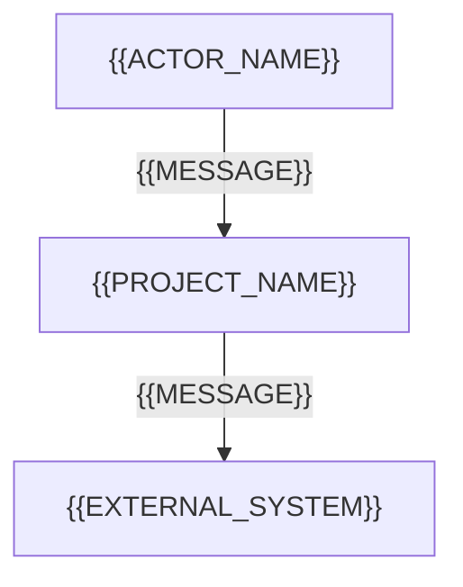

# Tài liệu kiến trúc hệ thống (System Architecture Document): {{PROJECT_NAME}}

<!-- fill: Chép thành docs/ARCHITECTURE.md. Thêm SRS đã duyệt vào parent (docs/srs/SRS.md hoặc docs/srs/00_SRS_MASTER.md). Tham khảo ISO/IEC/IEEE 42010:2022 (khái niệm view, rationale ghi bằng ADR; không tuyên bố tuân thủ) và dùng mô hình C4. Tài liệu trả lời WHERE và HOW; mọi lựa chọn trong tài liệu là một giá trị duy nhất, không để "A hoặc B". Quyết định then chốt có ADR theo PLAYBOOK mục 2.3 và được liệt kê ở §12; lựa chọn đánh dấu "có ADR" MUST có ADR bao phủ. Frontmatter assembled_from ghi nguồn theo CONVENTIONS mục 3. -->

## 1. Mục tiêu và nguyên tắc kiến trúc (Architectural Goals & Principles)

### 1.1. Thuộc tính chất lượng (Quality Attributes)

| Thuộc tính | NFR liên quan | Cách đạt (tóm tắt, chi tiết ở §8.1) |
| --- | --- | --- |
| <!-- fill: ví dụ khả năng mở rộng, độ tin cậy, bảo mật, khả năng bảo trì --> | <!-- fill: NFR ID trong SRS §7 --> | <!-- fill --> |

### 1.2. Nguyên tắc bắt buộc cho coding agent (Golden Rules)

1. Tách tầng (Layer Isolation). Tầng giao tiếp (route handler, controller, màn hình, command handler) chỉ nhận input, validate và map output; MUST NOT chứa logic nghiệp vụ hay truy cập lưu trữ trực tiếp. Tầng nghiệp vụ (service, use case) xử lý nghiệp vụ và điều phối transaction. Tầng truy cập dữ liệu (repository, gateway, adapter) đóng gói truy vấn và lời gọi hệ thống ngoài.
2. Không phụ thuộc vòng (No Circular Dependencies). Phân hệ A phụ thuộc phân hệ B thì B MUST NOT phụ thuộc ngược lại A; giao tiếp qua interface công khai hoặc sự kiện.
3. Kiểu nghiêm ngặt (Strict Typing). Mọi payload, entity và chữ ký hàm có kiểu tường minh; MUST NOT dùng cơ chế thoát kiểm tra kiểu của ngôn ngữ. Quy tắc cụ thể theo ngôn ngữ nằm trong rule của bề mặt ở `.claude/rules/`.
4. Không hardcode secret. Secret chỉ đi qua cơ chế ở §6.4 và §9.1.
5. Ghi log qua logger có cấu trúc (§6.3); MUST NOT in trực tiếp ra stdout hoặc stderr ngoài logger.
6. Chỉ module cấu hình đọc biến môi trường; nơi khác nhận cấu hình qua tham số hoặc dependency injection.
7. Tiền tệ dùng một biểu diễn chính xác duy nhất cho toàn hệ thống: <!-- fill: chọn một: kiểu thập phân chính xác \| số nguyên theo đơn vị tiền nhỏ nhất; ghi N/A nếu hệ thống không xử lý tiền -->; MUST NOT dùng số dấu phẩy động.
8. Thời gian lưu và truyền theo UTC, định dạng ISO 8601; chuyển múi giờ chỉ ở tầng hiển thị.
9. Validate tại biên (input người dùng, hệ thống ngoài, file, hàng đợi); dữ liệu đã qua biên được tin cậy bên trong. Giá trị do client tính (giá, số tiền, quyền, trạng thái) MUST NOT được tin: server tính lại hoặc kiểm tra lại từ nguồn chân lý.
10. Migration chỉ đổi cấu trúc và dữ liệu, MUST NOT chứa logic nghiệp vụ; migration đi một chiều (forward-only) và có kế hoạch rollback trong SPEC.
11. <!-- fill: quy tắc riêng của dự án, hoặc xóa dòng này nếu không có -->

### 1.3. Kiểu kiến trúc (Architectural Style)

| Hạng mục | Quyết định |
| --- | --- |
| Kiểu kiến trúc | <!-- fill: chọn một, có ADR: modular monolith \| microservices \| serverless \| kiểu khác nêu rõ --> |
| Ranh giới phân hệ | <!-- fill: cách các phân hệ ở §4.1 giao tiếp với nhau: gọi interface trong tiến trình, sự kiện, gọi qua mạng --> |
| ADR | <!-- fill: ADR ID --> |

## 2. Tech stack cố định (Fixed Tech Stack)

### 2.1. Bảng công nghệ (Technology Table)

<!-- fill: Mỗi bề mặt một nhóm hàng, chép từ mục có heading chứa (Tech Stack) của stack profile đã chọn trong Intake mục 14. Phiên bản ghi chính xác (không dùng khoảng hay dấu ^). Mọi lệch so với profile có ADR. Coding agent MUST chỉ dùng thư viện có trong bảng này. -->

| Bề mặt | Lớp (Layer) | Công nghệ | Phiên bản chính xác | Vai trò | ADR |
| --- | --- | --- | --- | --- | --- |
| <!-- fill --> | <!-- fill: ví dụ ngôn ngữ, runtime, framework, lưu trữ, cache, validation, test --> | <!-- fill --> | <!-- fill --> | <!-- fill --> | <!-- fill: ADR ID hoặc "theo profile" --> |

### 2.2. Chính sách dependency (Dependency Policy)

| Quy tắc | Nội dung |
| --- | --- |
| Thêm thư viện mới | Cần ADR `accepted` trước khi cài; ADR nêu lý do, phương án không dùng thư viện, license |
| License cho phép | <!-- fill: danh sách license chấp nhận; license khác cần ADR --> |
| Nguồn package | <!-- fill: registry chính thức hoặc registry nội bộ --> |
| Nâng phiên bản | <!-- fill: mức patch được nâng khi qua cổng verify; mức minor và major cần ADR --> |
| Lockfile | Lockfile được commit; build dùng đúng phiên bản trong lockfile |
| Kiểm tra lỗ hổng | Chạy trong CI (§11); lỗ hổng mức high hoặc critical chặn merge trừ khi có ADR chấp nhận rủi ro |

## 3. Các góc nhìn kiến trúc theo C4 (C4 Architecture Views)

### 3.1. C4 Level 1: bối cảnh hệ thống (System Context)

<!-- fill: Tác nhân và hệ thống ngoài khớp SRS §2.1 và §2.2. Mỗi cạnh ghi mục đích và giao thức. -->



<!-- SLOT: arch.views -->
<!-- slot-hint: Overlay cung cấp C4 Level 2 (container), Level 3 (component) và deployment view của bề mặt. -->

## 4. Cấu trúc thư mục (Repository Layout)

Coding agent MUST đặt file mới đúng cây thư mục dưới đây và MUST NOT tạo thư mục ngoài quy chuẩn.

### 4.1. Ánh xạ phân hệ (Module Mapping)

| Module ID | Mã | Thành phần (container, component) | Thư mục | Bề mặt |
| --- | --- | --- | --- | --- |
| {{MODULE_ID}} | `{{MODULE_CODE}}` | {{COMPONENT_NAME}} | <!-- fill: đường dẫn trong inline code --> | <!-- fill --> |

<!-- SLOT: arch.layout -->
<!-- slot-hint: Overlay cung cấp cây thư mục theo tầng của bề mặt, vị trí file test và tên file cụ thể theo stack profile. -->

## 5. Lược đồ dữ liệu vật lý (Physical Data Schema)

Nguồn chân lý của cấu trúc dữ liệu vật lý. Tên bảng, cột, kiểu và miền giá trị MUST khớp SRS §4 và SRS §10.1; lệch nhau thì sửa theo PLAYBOOK mục 8.

<!-- SLOT: arch.schema -->
<!-- slot-hint: Overlay cung cấp schema vật lý hoặc schema dữ liệu theo DSL của stack profile, kèm checklist bắt buộc. -->

## 6. Mối quan tâm xuyên suốt (Cross-cutting Concerns)

<!-- fill: Mục không áp dụng cho dự án ghi N/A kèm lý do, không xóa. -->

### 6.1. Xác thực và phân quyền (Authentication & Authorization)

Ghi N/A kèm lý do nếu hệ thống không có xác thực. Nếu mô hình xác thực không dùng token (ví dụ session lưu phía server), ghi N/A vào các hàng về token và mô tả mô hình thực tế ở hàng cuối. Cột ADR bắt buộc với hàng đánh dấu `có ADR`; hàng khác ghi `Không cần`.

| Hạng mục | Quyết định | ADR |
| --- | --- | --- |
| Định dạng access token (có ADR) | {{TOKEN_FORMAT}} | <!-- fill --> |
| Thuật toán ký (có ADR) | {{SIGNING_ALG}} | <!-- fill --> |
| Thời hạn access token | {{ACCESS_TTL}} | <!-- fill --> |
| Thời hạn refresh token | {{REFRESH_TTL}} | <!-- fill --> |
| Nơi lưu refresh token (có ADR) | {{REFRESH_STORE}} | <!-- fill --> |
| Xoay vòng refresh token (rotation) | <!-- fill: chọn một: Có, token cũ bị thu hồi ngay khi cấp token mới \| Không, ghi lý do --> | <!-- fill --> |
| Thu hồi khi đăng xuất | <!-- fill --> | <!-- fill --> |
| Nội dung token (claims) | <!-- fill: chỉ định danh và vai trò; MUST NOT chứa dữ liệu cá nhân nhạy cảm --> | <!-- fill --> |
| Mô hình phân quyền (có ADR) | <!-- fill: chọn một: RBAC \| ABAC \| ACL; nêu nơi kiểm tra quyền --> | <!-- fill --> |
| Mô hình xác thực khác | <!-- fill: chỉ khi không dùng token; ngược lại ghi N/A --> | <!-- fill --> |

### 6.2. Xử lý lỗi và envelope phản hồi (Error Handling & Response Envelope)

- Mọi lỗi được map về một mã trong Error Code Registry (§7.1) trước khi ra khỏi hệ thống; MUST NOT trả stack trace hay thông điệp nội bộ cho client.
- Mọi phản hồi dạng request/response (API, IPC) bọc trong envelope dưới đây. Bề mặt không có request/response ghi N/A.
- Nội dung `meta` theo quy ước phân trang ở §7; `correlationId` lấy từ §6.3.

Phản hồi thành công:

```json
{
  "success": true,
  "data": {},
  "meta": {},
  "timestamp": "2026-01-01T00:00:00.000Z"
}
```

Phản hồi lỗi:

```json
{
  "success": false,
  "error": {
    "code": "VALIDATION_ERROR",
    "message": "Thông điệp cho người dùng, không lộ chi tiết nội bộ.",
    "details": [{ "field": "fieldName", "issue": "Mô tả vi phạm" }],
    "correlationId": "id-của-request",
    "timestamp": "2026-01-01T00:00:00.000Z"
  }
}
```

### 6.3. Ghi log (Logging)

| Hạng mục | Quyết định |
| --- | --- |
| Định dạng | <!-- fill: chọn một: JSON một dòng mỗi bản ghi \| key-value --> |
| Mức log | <!-- fill: mức dùng ở từng môi trường --> |
| Correlation ID | Sinh ở biên nếu request chưa có, truyền qua mọi lời gọi nội bộ và ngoài, ghi trong mọi bản ghi log |
| Dữ liệu cấm ghi | Secret, token, mật khẩu, dữ liệu thẻ, dữ liệu cá nhân nhạy cảm chưa che |
| Nơi thu thập | <!-- fill --> |
| Thời gian lưu | <!-- fill: khớp NFR-OBS và NFR-DATA --> |

### 6.4. Cấu hình và biến môi trường (Config & Environment Variables)

<!-- fill: Liệt kê đủ mọi biến. File mẫu biến môi trường của dự án chỉ chứa tên biến và giá trị giả, không chứa secret thật. -->

| Tên biến | Kiểu | Bắt buộc | Mặc định | Mô tả | Secret |
| --- | --- | --- | --- | --- | :---: |
| <!-- fill: UPPER_SNAKE --> | <!-- fill --> | <!-- fill: chọn một: Có \| Không --> | <!-- fill: hoặc "Không có" --> | <!-- fill --> | <!-- fill: chọn một: Có \| Không --> |

### 6.5. Quan sát hệ thống (Observability)

| Hạng mục | Quyết định |
| --- | --- |
| Metric | <!-- fill: metric nghiệp vụ và kỹ thuật chính, nơi thu thập --> |
| Trace | <!-- fill: phạm vi trace, tỉ lệ lấy mẫu --> |
| Health check | <!-- fill: kiểm tra liveness và readiness, mỗi loại kiểm tra gì --> |
| Cảnh báo | <!-- fill: điều kiện cảnh báo gắn NFR-RELI và NFR-PERF, người nhận --> |

### 6.6. Quốc tế hóa (Internationalization)

<!-- fill: ngôn ngữ mặc định, ngôn ngữ hỗ trợ, nơi lưu chuỗi hiển thị, định dạng số, tiền, ngày theo locale; khớp NFR-I18N. -->

### 6.7. Cờ tính năng (Feature Flags)

<!-- fill: cơ chế (chọn một: cấu hình tĩnh theo môi trường | dịch vụ flag), quy ước đặt tên, người được bật tắt, thời hạn gỡ flag sau khi ổn định. -->

### 6.8. Tác vụ nền (Background Jobs)

<!-- fill: cơ chế hàng đợi hoặc lập lịch, chính sách retry và backoff, idempotency của job, xử lý job thất bại cuối cùng (dead letter), giám sát. -->

### 6.9. Chính sách cache (Caching Policy)

| Dữ liệu | Nơi cache | TTL | Cách invalidate | Độ cũ chấp nhận được |
| --- | --- | --- | --- | --- |
| <!-- fill --> | <!-- fill --> | <!-- fill --> | <!-- fill --> | <!-- fill --> |

## 7. Quy ước giao tiếp (Conventions)

### 7.1. Sổ đăng ký mã lỗi (Error Code Registry)

Nguồn duy nhất của mã lỗi. Giai đoạn 2 đưa vào bảng này mọi mã ở SRS §6.3 (kể cả SRS module). SPEC chỉ dùng mã có trong bảng; mã mới được thêm ở đây trước khi SPEC dùng. Cột "Ánh xạ theo bề mặt" ghi cách mã lỗi xuất hiện ở từng bề mặt theo quy ước của bề mặt đó bên dưới; dự án nhiều bề mặt ghi mỗi bề mặt một phần trong cùng ô, mở đầu bằng tên hiển thị của bề mặt (CONVENTIONS mục 2) và dấu hai chấm, các phần cách nhau bằng dấu chấm phẩy, ví dụ `Backend API: HTTP 409; Frontend Web: khóa chuỗi và hành vi hiển thị`.

| Mã lỗi | Ý nghĩa | Phân hệ sở hữu | Loại | Ánh xạ theo bề mặt |
| --- | --- | --- | --- | --- |
| `VALIDATION_ERROR` | Input vi phạm schema hoặc quy tắc validate tại biên | Dùng chung | Lỗi phía client | <!-- fill: theo quy ước của từng bề mặt bên dưới --> |
| `UNAUTHENTICATED` | Thiếu, hết hạn hoặc sai thông tin xác thực | Dùng chung | Lỗi phía client | <!-- fill --> |
| `FORBIDDEN` | Đã xác thực nhưng không có quyền | Dùng chung | Lỗi phía client | <!-- fill --> |
| `RATE_LIMITED` | Vượt giới hạn tần suất | Dùng chung | Lỗi phía client | <!-- fill --> |
| `INTERNAL_ERROR` | Lỗi không lường trước; chi tiết chỉ nằm trong log | Dùng chung | Lỗi phía server | <!-- fill --> |
| <!-- fill: mã lỗi nghiệp vụ UPPER_SNAKE --> | <!-- fill --> | {{MODULE_ID}} | <!-- fill: chọn một: Lỗi phía client \| Lỗi phía server --> | <!-- fill --> |

<!-- SLOT: arch.conventions -->
<!-- slot-hint: Overlay cung cấp quy ước giao tiếp của bề mặt và cách ánh xạ mã lỗi §7.1 sang bề mặt. -->

## 8. Triển khai và vận hành (Deployment & Operations)

### 8.1. Từ NFR tới chiến thuật kiến trúc (NFR to Tactic)

| NFR ID | Chiến thuật (tactic) | Thành phần áp dụng | ADR | Cách kiểm chứng |
| --- | --- | --- | --- | --- |
| NFR-PERF-01 | <!-- fill --> | {{COMPONENT_NAME}} | <!-- fill --> | <!-- fill: test tải, giám sát --> |
| NFR-RELI-01 | <!-- fill --> | {{COMPONENT_NAME}} | <!-- fill --> | <!-- fill --> |
| NFR-SEC-01 | <!-- fill --> | {{COMPONENT_NAME}} | <!-- fill --> | <!-- fill --> |

### 8.2. Sao lưu và khôi phục (Backup & Disaster Recovery)

| Hạng mục | Quyết định |
| --- | --- |
| RPO, RTO | <!-- fill: lấy từ NFR-RELI --> |
| Dữ liệu được sao lưu | <!-- fill --> |
| Tần suất và thời gian giữ bản sao lưu | <!-- fill: đủ để đạt RPO --> |
| Kiểm thử khôi phục | <!-- fill: tần suất, người thực hiện, tiêu chí đạt --> |
| Quy trình khôi phục | <!-- fill: các bước chính, thời gian dự kiến so với RTO --> |

<!-- SLOT: arch.deployment -->
<!-- slot-hint: Overlay cung cấp topology, build, release, migration khi deploy và rollback của bề mặt. -->

## 9. Kiến trúc bảo mật (Security Architecture)

### 9.1. Biện pháp kiểm soát (Security Controls)

| Kiểm soát | Áp dụng | Thiết kế | NFR |
| --- | --- | --- | --- |
| CORS | <!-- fill: chọn một: Có \| N/A: lý do --> | <!-- fill: danh sách origin được phép, không dùng ký tự đại diện ở môi trường thật --> | <!-- fill --> |
| CSRF | <!-- fill: chọn một: Có \| N/A: lý do --> | <!-- fill --> | <!-- fill --> |
| Security headers | <!-- fill: chọn một: Có \| N/A: lý do --> | <!-- fill: danh sách header và giá trị, gồm HSTS khi có HTTPS --> | <!-- fill --> |
| Quản lý secret | Có | <!-- fill: nơi lưu, người được đọc, chu kỳ xoay vòng --> | <!-- fill --> |
| Mã hóa khi truyền | Có | <!-- fill: phiên bản TLS tối thiểu --> | <!-- fill --> |
| Lưu mật khẩu | <!-- fill: chọn một: Có \| N/A: lý do --> | <!-- fill: hash một chiều có salt và tham số làm chậm (ví dụ Argon2id kèm tham số); MUST NOT lưu dạng khôi phục được --> | <!-- fill --> |
| Chống injection | Có | Truy vấn tham số hóa, không nối chuỗi để tạo truy vấn hay lệnh | <!-- fill --> |
| Mã hóa đầu ra | <!-- fill: chọn một: Có \| N/A: lý do --> | <!-- fill: encode theo ngữ cảnh khi hiển thị dữ liệu người dùng để chống XSS --> | <!-- fill --> |
| Dữ liệu cá nhân khi lưu | <!-- fill: chọn một: Có \| N/A: lý do --> | <!-- fill: mã hóa, che, tách bảng, quyền truy cập --> | <!-- fill --> |
| Nhật ký kiểm toán (audit log) | <!-- fill: chọn một: Có \| N/A: lý do --> | <!-- fill: sự kiện được ghi, tính bất biến, thời gian lưu --> | <!-- fill --> |
| Giới hạn tần suất | <!-- fill: chọn một: Có \| N/A: lý do --> | <!-- fill: giới hạn theo nhóm chức năng --> | <!-- fill --> |
| Quét dependency | Có | Theo §2.2 và §11 | <!-- fill --> |

### 9.2. Mô hình mối đe dọa (Threat Model, STRIDE)

| Loại | Mối đe dọa cụ thể | Biện pháp | Cách kiểm chứng |
| --- | --- | --- | --- |
| Spoofing | <!-- fill --> | <!-- fill --> | <!-- fill --> |
| Tampering | <!-- fill --> | <!-- fill --> | <!-- fill --> |
| Repudiation | <!-- fill --> | <!-- fill --> | <!-- fill --> |
| Information disclosure | <!-- fill --> | <!-- fill --> | <!-- fill --> |
| Denial of service | <!-- fill --> | <!-- fill --> | <!-- fill --> |
| Elevation of privilege | <!-- fill --> | <!-- fill --> | <!-- fill --> |

## 10. Chiến lược kiểm thử (Test Strategy)

### 10.1. Tháp kiểm thử (Test Pyramid)

| Loại test | Phạm vi | Tỉ lệ mục tiêu | Công cụ | Chạy ở |
| --- | --- | --- | --- | --- |
| Unit | <!-- fill --> | <!-- fill --> | <!-- fill: từ stack profile --> | <!-- fill: chọn một: local và CI \| chỉ CI --> |
| Integration | <!-- fill --> | <!-- fill --> | <!-- fill --> | <!-- fill --> |
| E2E | <!-- fill --> | <!-- fill --> | <!-- fill --> | <!-- fill --> |
| Concurrency (`CONC`) | Bất biến cốt lõi của từng SPEC | Mỗi bất biến ở SPEC §1.2 ít nhất một test | <!-- fill --> | <!-- fill --> |

### 10.2. Dữ liệu test (Test Data)

| Hạng mục | Quyết định |
| --- | --- |
| Lưu trữ khi test | <!-- fill: chọn một: bản thật chạy cô lập cho mỗi lần chạy \| bản dùng một lần tạo lúc chạy test \| giả lập trong bộ nhớ; nêu lý do --> |
| Fixture và factory | <!-- fill: nơi đặt, quy ước đặt tên --> |
| Dọn dữ liệu | <!-- fill: cơ chế cô lập giữa các test --> |
| Dữ liệu cá nhân | Test MUST NOT dùng dữ liệu cá nhân thật |

### 10.3. Độ phủ và đặt tên (Coverage & Naming)

- Ngưỡng coverage theo NFR-MAINT, đo trên <!-- fill: phạm vi mã được đo và phần loại trừ -->.
- Tên test mô tả hành vi bằng tiếng Anh, không chứa TC ID; SPEC §9 ghi file và tên test của từng TC (CONVENTIONS mục 4). Vị trí file test theo §4.

## 11. Tích hợp và triển khai liên tục (CI/CD)

| Stage | Nội dung | Điều kiện pass | Chặn merge |
| --- | --- | --- | :---: |
| Lint | Theo lệnh verify trong `CLAUDE.md` | 0 lỗi, 0 cảnh báo | Có |
| Typecheck | Theo lệnh verify trong `CLAUDE.md` | 0 lỗi | Có |
| Test | Unit, integration, e2e | 100% pass, coverage đạt NFR-MAINT | Có |
| Build | Tạo artifact triển khai | Exit code 0 | Có |
| Scan | Kiểm tra lỗ hổng dependency và secret trong mã | Không có mức high hoặc critical chưa có ADR | Có |
| Deploy | <!-- fill: môi trường, điều kiện kích hoạt, người duyệt khi lên môi trường thật --> | <!-- fill --> | <!-- fill: chọn một: Có \| Không --> |

Chiến lược nhánh và merge: <!-- fill: nhánh chính, quy tắc review, commit theo Conventional Commits bằng tiếng Anh -->

## 12. Chỉ mục ADR (ADR Index)

| ADR ID | Tiêu đề | Status | File |
| --- | --- | --- | --- |
| ADR-{{ADR_NUMBER}} | {{ADR_TITLE}} | <!-- fill: chọn một: proposed \| accepted \| deprecated \| superseded --> | <!-- fill: đường dẫn file ADR trong inline code, dạng docs/adr/NNNN-<slug>.md --> |

## 13. Giả định và câu hỏi mở (Assumptions & Open Questions)

| ID | Loại | Nội dung | Lý do hoặc ảnh hưởng | BLOCKING | Người trả lời |
| --- | --- | --- | --- | :---: | --- |
| AQ-01 | <!-- fill: chọn một: Giả định \| Câu hỏi --> | <!-- fill --> | <!-- fill --> | <!-- fill: chọn một: Có \| Không --> | <!-- fill --> |

## 14. Chỉ dẫn cho coding agent (Agent Execution Directive)

Khi đọc tài liệu này để thực thi một task, agent MUST:

1. Dùng đúng tên bảng, cột, kiểu dữ liệu ở §5.
2. Đặt file đúng cây thư mục ở §4; MUST NOT tạo thư mục ngoài quy chuẩn.
3. Tuân thủ Golden Rules ở §1.2, đặc biệt tách tầng.
4. Map mọi lỗi về envelope §6.2 với mã trong §7.1.
5. Chỉ dùng thư viện trong §2.1; cần thư viện mới thì đề xuất ADR và dừng.
6. Khi tài liệu này mâu thuẫn với SPEC hoặc mã hiện có: dừng và báo theo PLAYBOOK mục 7.

## 15. Lịch sử phiên bản (Version History)

| Phiên bản | Ngày | Người sửa | Nội dung thay đổi | Lý do và người yêu cầu | Người duyệt |
| --- | --- | --- | --- | --- | --- |
| 0.1.0 | {{DATE}} | {{AUTHOR}} | Bản khởi tạo | Khởi tạo theo pipeline | Chưa duyệt |
