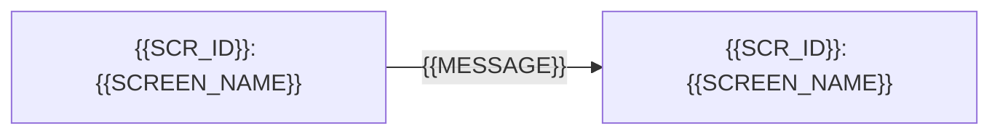

# Chỉ mục wireframe (Wireframe Index): {{PROJECT_NAME}}

<!-- fill: Chép thành docs/wireframes/00_WIREFRAME_INDEX.md ở Giai đoạn 1W (PLAYBOOK mục 2.2.1), chỉ khi Intake mục 14 ghi Giai đoạn 1W: Có, kèm HTML đầy đủ, hoặc Có, chỉ Markdown. parent ghi SRS chứa bảng Giao diện người dùng và FR của màn hình: docs/srs/SRS.md khi docs_mode là monolithic; docs/srs/00_SRS_MASTER.md cùng các file SRS_MODULE_<NAME>.md có FR giao diện khi modular. parent thêm docs/design-system/DESIGN_SYSTEM.md, tài liệu hệ thống thiết kế viết cùng Giai đoạn 1W (CONVENTIONS mục 10.7). overlays ghi các bề mặt có giao diện của dự án theo thứ tự ở Intake. assembled_from ghi "core/07_Wireframe_Template/00_Wireframe_Index_Template.md@<template_version>". Template dùng chung cho mọi bề mặt có giao diện, không có slot: khác biệt giữa web và mobile ghi ở các chú thích fill dưới và ở mục Giai đoạn 1W trong OVERLAY.md của overlay. Trạng thái, version và thay đổi sau khi duyệt theo SRS (CONVENTIONS mục 3, PLAYBOOK mục 8). Chỉ mục không định nghĩa màn hình, FR hay AC: danh sách màn hình có một nguồn là SRS §3, FR ở SRS §6.1, AC ở SRS §8. Tiêu chuẩn UI/UX (lối vào trợ giúp ở mục 3, mục 5, mục 6) theo CONVENTIONS mục 10; chú thích fill chỉ dẫn về đó, không viết lại quy tắc. -->

## 1. Phạm vi và bề mặt (Scope & Surfaces)

- Nguồn danh sách màn hình: bảng Giao diện người dùng ở SRS §3, cột `SCR ID`. Chỉ mục lặp đúng tập `SCR ID` đó; không thêm, bớt hay đổi màn hình ở đây.
- Bản phát hành có màn hình: <!-- fill: các nhãn đợt ở cột Bản phát hành của SRS §6.1 mà FR của màn hình thuộc về, ví dụ R1, R2 -->
- Hệ thống thiết kế: `docs/design-system/DESIGN_SYSTEM.md` <!-- fill: đường dẫn tài liệu hệ thống thiết kế của dự án; token nguồn ở docs/design-system/tokens.json (CONVENTIONS mục 10.7) -->
- Loại dự án: <!-- fill: chọn một: greenfield \| brownfield. Brownfield: wireframe vẽ giao diện to-be sau Gap Analysis; màn hình không đổi ghi Giữ nguyên ở ô SCR ID của SRS §3, không có trang và không có hàng ở danh mục; ảnh chụp giao diện hiện tại ở Regression Baseline §5 -->

| Bề mặt | Kiểu điểm vào | Số màn hình | Ghi chú |
| --- | --- | --- | --- |
| <!-- fill: tên overlay có giao diện, ví dụ frontend-web hoặc mobile-app, hoặc bề mặt khác có màn hình --> | <!-- fill: web: route của trang; mobile: deep link hoặc tên màn hình trong navigator (stack, tab, modal) --> | <!-- fill --> | <!-- fill: ví dụ breakpoint nhỏ nhất (web), hướng màn hình và làm việc khi mất mạng (mobile) --> |

## 2. Danh mục màn hình (Screen Catalog)

<!-- fill: Một hàng cho mỗi SCR ID ở SRS §3, đúng tập ID và tên màn hình như SRS; cột đầu MUST là SCR ID. Điểm vào: web ghi route /đường-dẫn như cột Route của SRS §3; mobile ghi deep link, hoặc tên màn hình trong navigator khi màn hình không mở được bằng deep link. FR chép từ cột FR của SRS §3. Bản phát hành là nhãn đợt sớm nhất trong các FR của màn hình. File HTML ghi đường dẫn docs/wireframes/html/SCR-<MOD>-NN.html khi màn hình có HTML low-fi (tùy chọn, CONVENTIONS mục 7), ghi Không khi không có. Dự án nhiều bề mặt giao diện: màn hình web và màn hình mobile là hai SCR ID khác nhau. -->

| SCR ID | Tên | Điểm vào | Tác nhân | FR | Bản phát hành | File HTML |
| --- | --- | --- | --- | --- | --- | --- |
| {{SCR_ID}} | {{SCREEN_NAME}} | `{{ENTRY_POINT}}` | `ACT_{{ROLE_CODE}}` | FR-{{MODULE_CODE}}-001 | {{RELEASE}} | <!-- fill: chọn một: `docs/wireframes/html/{{SCR_ID}}.html` \| Không \| Theo luồng (màn không có trang riêng, vẽ trong mockup của luồng ở mục 3) --> |

## 3. Sơ đồ điều hướng (Navigation Map)

<!-- fill: Mỗi màn hình của danh mục là một nút, nhãn gồm SCR ID và tên; cạnh là điều hướng chính, nhãn cạnh là thao tác hoặc điều kiện (ví dụ chưa đăng nhập, lưu thành công). Web: ghi route cần đăng nhập và điều hướng bằng nút quay lại của trình duyệt khi khác luồng thường. Mobile: ghi màn hình mở được bằng deep link hoặc thông báo đẩy, nhóm tab hoặc stack của navigator, và nơi cử chỉ quay lại của hệ thống đưa người dùng tới. Sơ đồ khớp mục điều hướng vào và ra của từng trang. -->

<!-- fill: Mockup theo luồng. Với mỗi luồng có màn ghi Theo luồng ở danh mục: một tiêu đề `### Luồng: <tên>` và một khối `text` low-fi vẽ lần lượt các màn đó, mỗi màn mở đầu bằng SCR ID, kèm trạng thái rỗng và lỗi khi màn có. Không có màn nào ghi Theo luồng thì xóa chú thích này. -->

Lối vào trợ giúp: <!-- fill: tiêu chí 3.2.6 ở CONVENTIONS mục 10.2: lối vào trợ giúp lặp ở nhiều màn hình (liên hệ, câu hỏi thường gặp, trợ giúp theo ngữ cảnh) và vị trí tương đối chung của nó trên các màn hình đó; N/A kèm lý do khi sản phẩm không có lối vào trợ giúp -->

## 4. Đối chiếu FR và màn hình (FR ↔ SCR Traceability)

<!-- fill: Đúng một hàng cho mỗi FR ở SRS §6.1 có ưu tiên khác Won't; FR Won't không có hàng. Chế độ modular: gộp FR của master và mọi module. Cột đầu MUST là FR ID, có cột SCR ID. Ô SCR ID ghi một trong: các SCR-* hiện thực FR, phân cách dấu phẩy; "Không có giao diện: <lý do>" cho FR không có màn hình (ví dụ job nền, API cho hệ thống khác); hoặc, chỉ ở dự án brownfield, "Giữ nguyên" kèm dẫn ảnh chụp ở Regression Baseline §5. Mỗi SCR ID của danh mục xuất hiện ở ít nhất một hàng. FR có ở SRS mà không màn hình nào hiện thực, hay màn hình cần một FR mà SRS chưa có, là lệch với SRS: ghi câu hỏi BLOCKING ở mục 7 kèm đề xuất sửa SRS theo PLAYBOOK mục 8, không sửa bảng này cho khớp. -->

| FR ID | SCR ID | Ghi chú |
| --- | --- | --- |
| FR-{{MODULE_CODE}}-001 | {{SCR_ID}} | <!-- fill: phần của FR mà từng màn hình hiện thực khi FR trải trên nhiều màn hình --> |

## 5. Đánh giá heuristic (Heuristic Evaluation)

<!-- fill: Theo CONVENTIONS mục 10.3: đánh giá toàn bộ chỉ mục và các trang theo từng heuristic; đúng một hàng cho mỗi khóa, khóa và tên giữ như template (chép từ bảng heuristic của CONVENTIONS mục 10.3). Mức vấn đề và cách xử lý theo mục 10.3. Gate 1W không đạt khi còn hàng Nghiêm trọng (PLAYBOOK mục 2.2.1). -->

| Khóa heuristic | Heuristic | Đánh giá | Mức vấn đề | Xử lý |
| --- | --- | --- | --- | --- |
| `H1` | Visibility of System Status | <!-- fill: trang, trạng thái hoặc cạnh của sơ đồ điều hướng đã xem và điều thấy được --> | <!-- fill: chọn một: Nghiêm trọng \| Nhỏ \| Không có --> | <!-- fill: việc đã sửa; với vấn đề còn Nhỏ: AQ-NN ở mục 7 hoặc lý do chấp nhận; tên bề mặt khi vấn đề chỉ thuộc một bề mặt; Không khi không tìm thấy vấn đề nào --> |
| `H2` | Match Between the System and the Real World | <!-- fill --> | <!-- fill: chọn một: Nghiêm trọng \| Nhỏ \| Không có --> | <!-- fill --> |
| `H3` | User Control and Freedom | <!-- fill --> | <!-- fill: chọn một: Nghiêm trọng \| Nhỏ \| Không có --> | <!-- fill --> |
| `H4` | Consistency and Standards | <!-- fill: đối chiếu các trang với danh mục Component, Pattern, Template của DESIGN_SYSTEM.md: cùng một việc dùng cùng một Component ID --> | <!-- fill: chọn một: Nghiêm trọng \| Nhỏ \| Không có --> | <!-- fill --> |
| `H5` | Error Prevention | <!-- fill --> | <!-- fill: chọn một: Nghiêm trọng \| Nhỏ \| Không có --> | <!-- fill --> |
| `H6` | Recognition Rather than Recall | <!-- fill --> | <!-- fill: chọn một: Nghiêm trọng \| Nhỏ \| Không có --> | <!-- fill --> |
| `H7` | Flexibility and Efficiency of Use | <!-- fill --> | <!-- fill: chọn một: Nghiêm trọng \| Nhỏ \| Không có --> | <!-- fill --> |
| `H8` | Aesthetic and Minimalist Design | <!-- fill --> | <!-- fill: chọn một: Nghiêm trọng \| Nhỏ \| Không có --> | <!-- fill --> |
| `H9` | Help Users Recognize, Diagnose, and Recover from Errors | <!-- fill --> | <!-- fill: chọn một: Nghiêm trọng \| Nhỏ \| Không có --> | <!-- fill --> |
| `H10` | Help and Documentation | <!-- fill --> | <!-- fill: chọn một: Nghiêm trọng \| Nhỏ \| Không có --> | <!-- fill --> |

## 6. Kiểm mẫu thiết kế lừa người dùng (Deceptive Pattern Check)

<!-- fill: Theo CONVENTIONS mục 10.4: kiểm toàn bộ chỉ mục, các trang và sơ đồ điều hướng theo dấu hiệu của từng mẫu; đúng một hàng cho mỗi khóa, khóa và tên giữ như template (chép từ bảng mẫu lừa của CONVENTIONS mục 10.4). Gate 1W không đạt khi còn hàng Có (PLAYBOOK mục 2.2.1); bỏ mẫu cần đổi quy tắc nghiệp vụ thì sửa SRS theo PLAYBOOK mục 8 trước. -->

| Khóa mẫu lừa | Mẫu | Kết quả | Căn cứ |
| --- | --- | --- | --- |
| `DP1` | Preselection | <!-- fill: chọn một: Không có \| Có --> | <!-- fill: Không có: trang, thành phần hoặc cạnh của sơ đồ điều hướng đã xem; Có: vị trí của mẫu --> |
| `DP2` | Obstruction | <!-- fill: chọn một: Không có \| Có --> | <!-- fill --> |
| `DP3` | Hidden costs | <!-- fill: chọn một: Không có \| Có --> | <!-- fill --> |
| `DP4` | Hard to cancel | <!-- fill: chọn một: Không có \| Có --> | <!-- fill --> |
| `DP5` | Confirmshaming | <!-- fill: chọn một: Không có \| Có --> | <!-- fill --> |

## 7. Giả định và câu hỏi mở (Assumptions & Open Questions)

<!-- fill: Lệch giữa wireframe và SRS có hai loại (PLAYBOOK mục 2.2.1). Wireframe vẽ sai hoặc sót so với SRS thì sửa wireframe. Lập wireframe làm lộ chỗ SRS thiếu hoặc sai (màn hình thêm, bớt hay đổi; FR thiếu; AC không khớp với trạng thái của màn hình) thì ghi câu hỏi BLOCKING kèm đề xuất sửa SRS (brownfield: cả Gap Analysis). Gate 1W không đạt khi còn câu hỏi BLOCKING ở chỉ mục hoặc ở trang nào. -->

| ID | Loại | Nội dung | Lý do hoặc ảnh hưởng | BLOCKING | Người trả lời |
| --- | --- | --- | --- | :---: | --- |
| AQ-01 | <!-- fill: chọn một: Giả định \| Câu hỏi --> | <!-- fill --> | <!-- fill --> | <!-- fill: chọn một: Có \| Không --> | <!-- fill --> |

## 8. Lịch sử phiên bản (Version History)

| Phiên bản | Ngày | Người sửa | Nội dung thay đổi | Lý do và người yêu cầu | Người duyệt |
| --- | --- | --- | --- | --- | --- |
| 0.1.0 | {{DATE}} | {{AUTHOR}} | Bản khởi tạo | Khởi tạo theo pipeline | Chưa duyệt |
