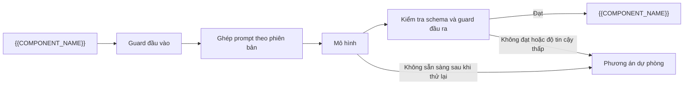
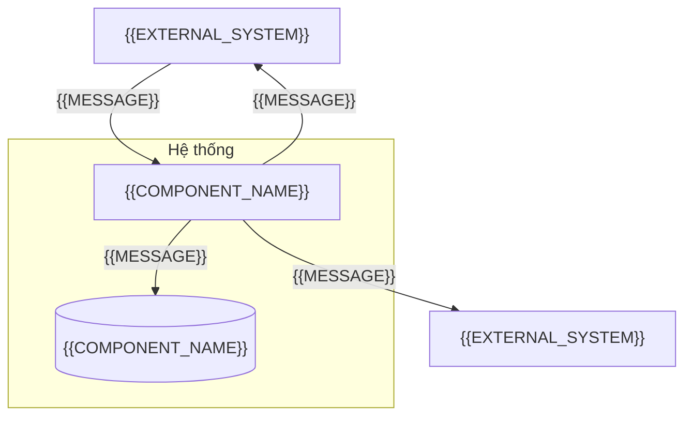
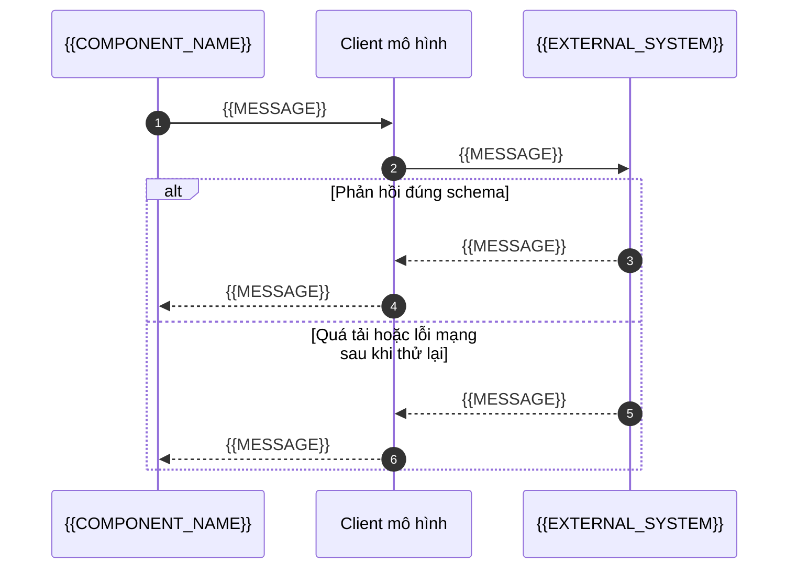

# Overlay ai-llm-app: khối cho ARCHITECTURE

<!-- SLOT-CONTENT: arch.views -->
### Pipeline xử lý (Processing Pipeline)

<!-- fill: Mỗi tác vụ gọi mô hình đi qua các bước dưới; bỏ bước không áp dụng và ghi lý do ở §13. -->

### C4 Level 2: vùng chứa (Container)

<!-- fill: Thành phần gọi mô hình, nhà cung cấp mô hình, nơi lưu nhật ký, hệ thống nguồn và đích của dữ liệu. Cạnh ghi giao thức. -->

### Luồng một lời gọi mô hình (Model Call Flow)

### Góc nhìn triển khai (Deployment View)

| Môi trường | Nơi chạy | Mô hình và khóa API | Dữ liệu | Hạn mức chi tiêu |
| --- | --- | --- | --- | --- |
| dev | <!-- fill --> | <!-- fill: cùng ID mô hình với production; khóa riêng --> | Dữ liệu tổng hợp | <!-- fill --> |
| staging | <!-- fill --> | <!-- fill --> | <!-- fill: dữ liệu tổng hợp hoặc đã ẩn danh; MUST NOT dùng dữ liệu cá nhân thật --> | <!-- fill --> |
| production | <!-- fill --> | <!-- fill --> | Dữ liệu thật | <!-- fill --> |
<!-- /SLOT-CONTENT -->

<!-- SLOT-CONTENT: arch.layout -->
### Quy tắc tầng trong cây thư mục (Layering Rules)

- Prompt nằm trong thư mục riêng, mỗi prompt một module có hằng phiên bản trùng `version` của Prompt Spec; MUST NOT viết prompt rải rác trong mã nghiệp vụ.
- Client mô hình là module duy nhất gọi SDK của nhà cung cấp: đặt tham số mô hình, đầu ra có cấu trúc, thời gian chờ, số lần thử lại, và trả kết quả đã phân loại thành công hay lỗi.
- Guard đầu vào và guard đầu ra là hàm thuần, test được không cần mạng.
- Logic nghiệp vụ nhận kết quả đã kiểm tra, quyết định dùng hay chuyển phương án dự phòng; MUST NOT tin đầu ra của mô hình khi chưa qua schema.
- Bộ dữ liệu đánh giá nằm trong thư mục riêng của repo, định dạng JSON Lines; test `EVAL`, `INJ`, `COST` nằm trong project test riêng, không chạy cùng unit test.
- Chỉ module cấu hình đọc biến môi trường; khóa API không đi qua log hay thông báo lỗi.

<!-- PROFILE-SLOT: arch.layout -->
<!-- /SLOT-CONTENT -->

<!-- SLOT-CONTENT: arch.schema -->
### Schema của đầu ra và nhật ký (Output & Log Schemas)

- Mỗi tác vụ có một schema đầu ra; schema trong mã là nguồn của định dạng đầu ra có cấu trúc gửi tới nhà cung cấp, và Prompt Spec §5 mô tả cùng các trường.
- Miền giá trị liệt kê (nhãn, loại) viết đủ trong schema; đầu ra ngoài miền là không hợp lệ.
- Bản ghi nhật ký lời gọi theo SRS §4.1; đầu vào trong nhật ký là bản đã che dữ liệu cá nhân, hoặc chỉ mã băm. Token của mọi lời gọi có phản hồi được ghi, kể cả khi đầu ra không dùng được, vì lời gọi đó vẫn tính tiền.
- Bộ dữ liệu đánh giá mỗi dòng một đối tượng JSON gồm ID mẫu, đầu vào và đầu ra mong đợi.

| Tác vụ | Schema đầu ra | Trường | Prompt Spec |
| --- | --- | --- | --- |
| {{FEATURE_NAME}} | <!-- fill: tên schema trong mã --> | <!-- fill: trường và miền giá trị --> | `PROMPT-{{MODULE_CODE}}-001` |

<!-- PROFILE-SLOT: arch.schema -->
<!-- /SLOT-CONTENT -->

<!-- SLOT-CONTENT: arch.conventions -->
### Quy ước prompt và mô hình (Prompt & Model Conventions)

| Hạng mục | Quy ước |
| --- | --- |
| Phiên bản prompt | Prompt Spec và mã dùng cùng phiên bản SemVer. Đổi nội dung prompt, ví dụ mẫu, schema đầu ra hay tham số là thay đổi Prompt Spec theo PLAYBOOK mục 8: tăng phiên bản, duyệt lại, chạy lại cổng đánh giá. Ghi kết quả đánh giá vào Prompt Spec không đổi prompt nên không tăng phiên bản |
| Mô hình | Một ID mô hình chính xác cho mỗi tác vụ, ghi ở §2.1; không dùng bí danh trỏ tới "bản mới nhất" |
| Tham số | `temperature` 0 cho tác vụ phân loại và trích xuất; giá trị khác cần lý do trong Prompt Spec; `max_tokens` đặt theo độ dài đầu ra tối đa |
| Đầu ra có cấu trúc | Mọi tác vụ dùng đầu ra có cấu trúc theo schema; không tách JSON từ văn bản tự do. Nhà cung cấp có thể chỉ ép hình dạng của đầu ra; giới hạn giá trị (miền liệt kê, khoảng số, độ dài) luôn được kiểm lại bằng schema ở phía hệ thống |
| Nội dung không tin cậy | Đầu vào của người dùng hay hệ thống ngoài đặt trong cặp thẻ phân cách mà prompt hệ thống khai báo là dữ liệu; không ghép nội dung không tin cậy vào phần chỉ dẫn |
| Dữ liệu cá nhân | Che trước khi gửi, trừ trường mà SRS §2.5 cho phép; không đưa secret vào prompt |

### Guardrail, lỗi và dự phòng (Guardrails, Errors & Fallback)

- Guard đầu vào: cắt đoạn thô có giới hạn (chuẩn hóa Unicode có thể làm chuỗi dài ra nhiều lần), chuẩn hóa, bỏ ký tự điều khiển và mọi ký tự không hiển thị (ký tự định dạng vô hình và ký tự mặc định không hiển thị như bộ chọn biến thể), thay dấu ngoặc nhọn để nội dung không thể mở hay đóng thẻ phân cách, che dữ liệu cá nhân trên toàn văn bản đã chuẩn hóa bằng mẫu chạy tuyến tính theo độ dài, rồi mới cắt theo ranh giới ký tự (code point) để không còn nửa cặp surrogate. Ngoài lần cắt thô, không cắt trước khi che: một lần cắt như vậy tách đôi email hay số điện thoại và để lọt phần còn lại. Lần cắt thô cũng tách được một địa chỉ nằm ở ranh giới của nó; mảnh đó chỉ lọt vào phần gửi đi khi gần hết đoạn thô trước nó bị bỏ (ticket độn ký tự vô hình), và Prompt Spec §7 ghi rủi ro còn lại này.
- Guard đầu ra: kiểm tra schema, rồi quy tắc nghiệp vụ (miền giá trị, ngưỡng độ tin cậy); không đạt thì dùng phương án dự phòng ở SRS §2.5, không thử lại cùng đầu vào để "đoán" kết quả khác.
- Lỗi của nhà cung cấp: thử lại lỗi quá tải, giới hạn tần suất và lỗi mạng với số lần tối đa và một hạn chót cho toàn bộ lời gọi, vì nhà cung cấp có thể yêu cầu chờ lâu qua `retry-after`; lỗi yêu cầu sai, khóa API sai, hết hạn mức thanh toán hoặc mô hình không tồn tại không thử lại và được báo như lỗi cấu hình.
- Xử lý nhiều bản ghi trong một lượt: lọc bản ghi ở hệ thống nguồn và đọc theo trang tới một trần mỗi lượt, để bản ghi bị bỏ qua không che bản ghi mới; lỗi riêng của một bản ghi (dữ liệu nguồn sai schema, hệ thống đích từ chối vĩnh viễn) được ghi nhật ký và bỏ qua; quyết định của mô hình được nhớ theo bản ghi và phiên bản, để lần ghi lỗi hay bản ghi bị từ chối không làm gọi lại mô hình; lời gọi mô hình được ghi nhật ký trước khi lượt dừng vì lỗi. Chỉ lỗi tạm thời của hệ thống ngoài dừng lượt; hệ thống ngoài từ chối xác thực hay phân quyền của tài khoản dịch vụ là lỗi cấu hình.
- Ghi kết quả: không xóa dữ liệu khác của bản ghi đích (thêm tag, không thay danh sách tag) và không ghi đè kết quả do người đặt; bản ghi đã có kết quả của người không được xử lý lại.
- Ngân sách: `max_tokens` giới hạn mỗi lời gọi; tổng token theo ngày, gồm token của lời gọi có đầu ra không dùng được, được theo dõi và cảnh báo theo §8.
- Công cụ có tác dụng phụ: mô hình chỉ đề xuất; server kiểm tra quyền và, với thao tác không đảo ngược, cần người dùng xác nhận.

### Ánh xạ mã lỗi (Error Code Mapping)

Phần AI/LLM App của cột "Ánh xạ theo bề mặt" ở §7.1 ghi hành vi của hệ thống khi gặp mã; mã lỗi nội bộ của bề mặt này không trả thẳng cho người dùng cuối.

<!-- fill: Ghi mã mà dự án dùng; tên dưới là tên gợi ý, đổi theo quy ước của dự án. -->

| Mã | Khi nào | Hành vi |
| --- | --- | --- |
| `OUTPUT_INVALID` | Đầu ra không khớp schema hoặc quy tắc nghiệp vụ | Phương án dự phòng; ghi nhật ký kèm phiên bản prompt |
| `MODEL_UNAVAILABLE` | Nhà cung cấp quá tải, lỗi mạng hoặc hết thời gian chờ sau khi đã thử lại | Phương án dự phòng; cảnh báo khi tỉ lệ vượt ngưỡng ở §8 |
| `LOW_CONFIDENCE` | Độ tin cậy dưới ngưỡng của Prompt Spec | Chuyển người xem lại |

### Cổng đánh giá (Evaluation Gate)

- Chạy test `EVAL`, `INJ`, `COST` khi đổi prompt, ví dụ mẫu, schema, guard đầu vào, client mô hình, mô hình hoặc tham số, và theo lịch để phát hiện thay đổi từ phía nhà cung cấp. Test đánh giá chạy trong job riêng của CI có khóa API của môi trường đánh giá, không chạy trong vòng commit của coding agent.
- Mỗi lần chạy đánh giá lặp bộ dữ liệu nhiều lần theo Prompt Spec; mọi lần đều phải đạt ngưỡng, không lấy lần tốt nhất. 20 mẫu là mức tối thiểu: với ngưỡng gần tỉ lệ đúng thật, cổng lúc đạt lúc không, nên khi trượt xem các mẫu sai trước khi sửa prompt, và mở rộng bộ dữ liệu khi có mẫu thật đã ẩn danh.
- Kết quả đánh giá (phiên bản prompt, mô hình, chỉ số, chi phí) ghi vào Prompt Spec trước khi phát hành phiên bản prompt mới.

<!-- PROFILE-SLOT: arch.conventions -->
<!-- /SLOT-CONTENT -->

<!-- SLOT-CONTENT: arch.deployment -->
### Khóa, hạn mức và giám sát (Keys, Limits & Monitoring)

| Hạng mục | Quyết định |
| --- | --- |
| Khóa API | Mỗi môi trường một khóa, trong kho secret; xoay vòng <!-- fill: chu kỳ -->; MUST NOT commit hay ghi vào log |
| Hạn mức chi tiêu | Đặt ở bảng điều khiển của nhà cung cấp cho từng khóa: <!-- fill: hạn mức mỗi tháng của từng môi trường --> |
| Giám sát | Token vào, token ra, chi phí, độ trễ p95, tỉ lệ lỗi theo mã ở §7, tỉ lệ chuyển người xem lại |
| Cảnh báo | <!-- fill: ngưỡng chi phí theo ngày, tỉ lệ `MODEL_UNAVAILABLE`, tỉ lệ `OUTPUT_INVALID`, tỉ lệ chuyển người xem lại tăng bất thường --> |

### Phát hành và quay lui (Release & Rollback)

| Hạng mục | Quyết định |
| --- | --- |
| Phát hành prompt mới | Sau khi cổng đánh giá đạt; <!-- fill: chọn một: bật cho toàn bộ \| chạy song song không dùng kết quả (shadow) rồi bật \| bật theo tỉ lệ; nêu lý do --> |
| Nâng mô hình | ADR mới, chạy lại cổng đánh giá với mô hình mới, cập nhật §2.1 và Prompt Spec |
| Công tắc tắt AI | <!-- fill: cờ hoặc cấu hình chuyển mọi yêu cầu sang phương án dự phòng mà không cần triển khai lại --> |
| Quay lui | Triển khai lại phiên bản prompt hoặc mô hình trước; kết quả AI đã ghi giữ nguyên, có phiên bản prompt trong nhật ký để truy vết |
<!-- /SLOT-CONTENT -->
