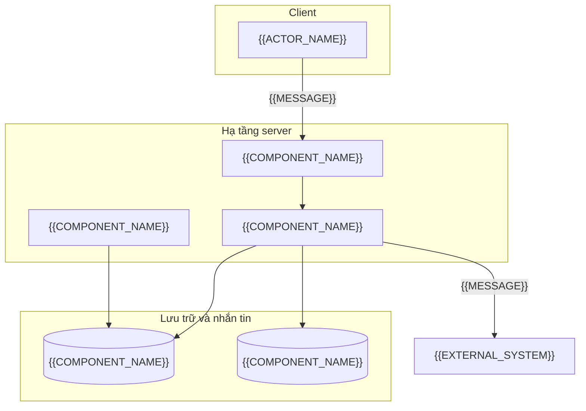
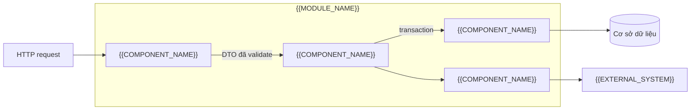

# Overlay backend-api: khối cho ARCHITECTURE

<!-- SLOT-CONTENT: arch.views -->
### C4 Level 2: vùng chứa (Container)

<!-- fill: Mỗi container là một đơn vị chạy hoặc lưu trữ độc lập. Xóa container không dùng (worker, cache, broker) và ghi lý do ở §13 nếu xóa. Cạnh ghi giao thức. -->

### C4 Level 3: thành phần của một phân hệ (Component)

<!-- fill: Vẽ cho phân hệ có luồng phức tạp nhất; các phân hệ khác theo cùng khuôn tầng ở §4. -->

### Góc nhìn triển khai (Deployment View)

| Môi trường | Nơi chạy | Số instance API | Cơ sở dữ liệu | Dữ liệu | Ai được truy cập |
| --- | --- | --- | --- | --- | --- |
| dev | <!-- fill --> | <!-- fill --> | <!-- fill --> | Dữ liệu giả | <!-- fill --> |
| staging | <!-- fill --> | <!-- fill --> | <!-- fill --> | <!-- fill: dữ liệu giả hoặc đã ẩn danh; MUST NOT dùng dữ liệu cá nhân thật --> | <!-- fill --> |
| production | <!-- fill --> | <!-- fill: tối thiểu 2 nếu NFR-RELI yêu cầu sẵn sàng cao --> | <!-- fill --> | Dữ liệu thật | <!-- fill --> |
<!-- /SLOT-CONTENT -->

<!-- SLOT-CONTENT: arch.layout -->
### Quy tắc tầng trong cây thư mục (Layering Rules)

- Mỗi phân hệ ở §4.1 là một thư mục module chứa đủ: tầng giao tiếp (controller hoặc route handler), tầng nghiệp vụ (service), tầng truy cập dữ liệu (repository), DTO và schema validate, kiểu miền (entity), test của module.
- Mã dùng chung không thuộc nghiệp vụ nằm trong thư mục shared: hằng số, lỗi, bộ lọc lỗi, guard, interceptor, tiện ích thuần.
- Kết nối hạ tầng (cơ sở dữ liệu, cache, email, storage, client của API ngoài) nằm trong thư mục infrastructure, được inject vào repository hoặc adapter.
- Module chỉ import module khác qua interface công khai của module đó; MUST NOT import repository hay file nội bộ của module khác.
- Chỉ module cấu hình đọc biến môi trường.

<!-- PROFILE-SLOT: arch.layout -->
<!-- /SLOT-CONTENT -->

<!-- SLOT-CONTENT: arch.schema -->
### Quy tắc schema vật lý (Physical Schema Rules)

- Kiểu cụ thể cho mọi cột: UUID, chuỗi có độ dài tối đa, số thập phân có precision và scale, timestamp có múi giờ; không dùng kiểu chung chung.
- Khóa chính kiểu `{{ID_FORMAT}}` sinh ở server hoặc cơ sở dữ liệu, không nhận từ client.
- Mọi khóa ngoại có quy tắc xóa tường minh; dữ liệu có ràng buộc tài chính hoặc pháp lý dùng `Restrict`.
- Index cho mọi khóa ngoại và mọi cột dùng để lọc hoặc sắp xếp trong truy vấn thường gặp; ràng buộc duy nhất (kể cả duy nhất ghép) khớp SRS §4.2.
- Enum khớp SRS §4.2 và SRS §10.1; thêm giá trị enum là thay đổi schema, cần migration.
- Mọi bảng có `created_at`, bảng cho phép sửa có `updated_at`; bảng xóa mềm có `deleted_at`.
- Tên bảng và cột `snake_case`, tên bảng số nhiều.
- Ràng buộc kiểm tra (check constraint) cho quy tắc số học đơn giản, ví dụ số lượng lớn hơn 0.
- Migration sinh bằng công cụ của stack, đi một chiều, không chứa logic nghiệp vụ.

<!-- PROFILE-SLOT: arch.schema -->

### Schema của dự án (Project Schema)

<!-- fill: Toàn bộ schema vật lý của dự án trong một khối code theo DSL của stack profile: mọi bảng, cột, khóa, index, enum, quan hệ. Schema MUST migrate được ngay và khớp SRS §4. -->
<!-- /SLOT-CONTENT -->

<!-- SLOT-CONTENT: arch.conventions -->
### Quy ước API HTTP (HTTP API Conventions)

| Hạng mục | Quy ước |
| --- | --- |
| Phiên bản | Phiên bản major trong path: `/api/v1/...`; thay đổi phá tương thích tăng major |
| Đặt tên tài nguyên | Danh từ số nhiều `kebab-case`, lồng tối đa một cấp, ví dụ `/api/v1/{{RESOURCE_PATH}}/{id}` |
| Phương thức | `GET` đọc, `POST` tạo hoặc hành động, `PATCH` sửa một phần, `PUT` thay toàn bộ, `DELETE` xóa |
| Envelope | Theo §6.2 cho mọi phản hồi |
| Định dạng ngày giờ | ISO 8601 UTC, ví dụ `2026-01-01T00:00:00.000Z` |
| ID tài nguyên | `{{ID_FORMAT}}` |
| Phân trang | `{{PAGINATION_STYLE}}`. Offset: tham số `page`, `limit`; `meta` gồm `page`, `limit`, `totalItems`, `totalPages`. Cursor: tham số `cursor`, `limit`; `meta` gồm `nextCursor`, `limit`, `hasMore`. <!-- fill: giữ câu của kiểu đã chọn, xóa câu còn lại --> |
| Lọc và sắp xếp | Lọc bằng query theo tên trường, ví dụ `?status=ACTIVE`; sắp xếp `?sort=-createdAt,name` (dấu trừ là giảm dần); chỉ nhận trường có trong danh sách cho phép của endpoint |
| Giới hạn tần suất | Đếm theo người dùng trên route đã xác thực, theo IP client thật (qua proxy tin cậy, gồm cả server của bề mặt khác gọi API thay mặt người dùng) trên route công khai; header `RateLimit-Limit`, `RateLimit-Remaining`, `RateLimit-Reset`; phản hồi `429` có `Retry-After`; cách cấu hình theo stack ở cuối mục này |
| Idempotency | Thao tác ghi không idempotent tự nhiên nhận header `Idempotency-Key` (chuỗi do client sinh, phạm vi theo người dùng); cơ chế lưu và thời gian giữ khóa ghi ở ADR |
| Kích thước request | <!-- fill: giới hạn body tối đa --> |
| Tài liệu OpenAPI | Một tài liệu OpenAPI 3.1 đầy đủ tại `openapi/openapi.yaml`: có `info` (tiêu đề, phiên bản, license) và `servers` của từng môi trường, cộng fragment ở SPEC §3 của mọi SPEC đã hiện thực; là nguồn sinh client của bề mặt khác và của contract test |
| CORS cho client trình duyệt | Chỉ origin ở §9.1; cho phép header `Authorization`, `Content-Type`, `Idempotency-Key`; khai báo `Access-Control-Expose-Headers` cho `Retry-After` và header giới hạn tần suất để trình duyệt ở origin khác đọc được |

### Ánh xạ mã lỗi sang HTTP (Error Code to HTTP Mapping)

Phần Backend API của cột "Ánh xạ theo bề mặt" ở §7.1 ghi HTTP status theo bảng này.

| Nhóm lỗi | HTTP status | Mã lỗi |
| --- | --- | --- |
| Input sai schema hoặc quy tắc validate | `400` | `VALIDATION_ERROR` |
| Thiếu, hết hạn hoặc sai token | `401` | `UNAUTHENTICATED` |
| Không đủ quyền | `403` | `FORBIDDEN` |
| Tài nguyên không tồn tại | `404` | Mã dạng `*_NOT_FOUND` theo tên tài nguyên, có trong §7.1 |
| Xung đột trạng thái hoặc vi phạm quy tắc nghiệp vụ | `409` | Mã nghiệp vụ trong §7.1 |
| Vượt giới hạn tần suất | `429` | `RATE_LIMITED` |
| Lỗi không lường trước | `500` | `INTERNAL_ERROR` |

### Transaction

- Ranh giới transaction đặt ở tầng service; controller và repository không tự mở transaction.
- Mức isolation mặc định: `{{ISOLATION_LEVEL}}`. SPEC nêu rõ khi dùng mức cao hơn hoặc khóa dòng.
- Bất biến chịu thao tác đồng thời được giữ ở cơ sở dữ liệu: cập nhật nguyên tử có điều kiện, ràng buộc duy nhất, hoặc khóa (khóa dòng, khóa advisory) lấy trong transaction trước bước kiểm tra. Không kiểm tra rồi ghi (check-then-write) ở tầng ứng dụng khi chưa giữ khóa đó.
- Sự kiện và lời gọi hệ thống ngoài phát sau khi transaction commit.

<!-- PROFILE-SLOT: arch.conventions -->
<!-- /SLOT-CONTENT -->

<!-- SLOT-CONTENT: arch.deployment -->
### Đóng gói và chạy (Packaging & Runtime)

| Hạng mục | Quyết định |
| --- | --- |
| Đơn vị triển khai | Container image; tiến trình chạy bằng user không phải root |
| Cấu hình | Biến môi trường theo §6.4; secret lấy từ secret manager lúc khởi động |
| Health check | `GET /health/live` (tiến trình sống) và `GET /health/ready` (kết nối được cơ sở dữ liệu và phụ thuộc bắt buộc) |
| Tắt an toàn | Nhận tín hiệu dừng, ngừng nhận request mới, hoàn tất request đang xử lý trong <!-- fill: số giây --> |

### Migration khi triển khai (Migrations on Deploy)

- Bước phát hành chạy `{{MIGRATION_DEPLOY_CMD}}` trước khi phiên bản mới nhận traffic.
- Migration theo kiểu mở rộng rồi thu hẹp (expand and contract): phiên bản cũ và mới cùng chạy được trên schema mới; xóa cột hoặc bảng ở một lần phát hành sau.

### Phát hành và quay lui (Release & Rollback)

| Hạng mục | Quyết định |
| --- | --- |
| Chiến lược phát hành | <!-- fill: chọn một: rolling update \| blue-green; nêu lý do theo NFR-RELI --> |
| Quay lui | Triển khai lại image của phiên bản trước; schema không cần đảo ngược nhờ expand and contract |
| Bản sao cơ sở dữ liệu | <!-- fill: replica đọc hoặc standby, hoặc Không kèm lý do --> |
| Sao lưu | Theo §8.2 |
<!-- /SLOT-CONTENT -->
