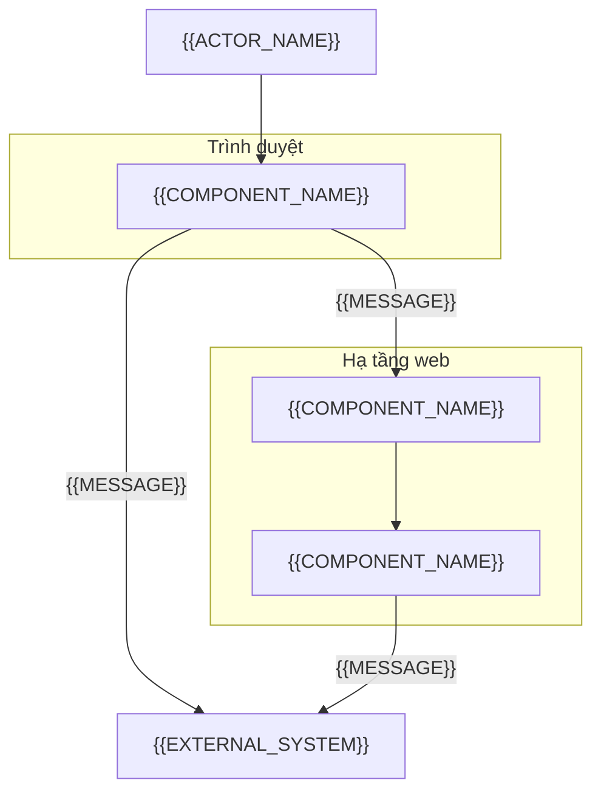
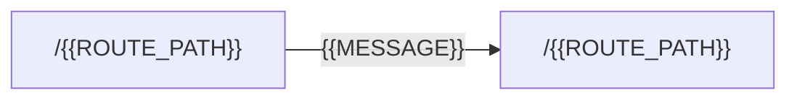
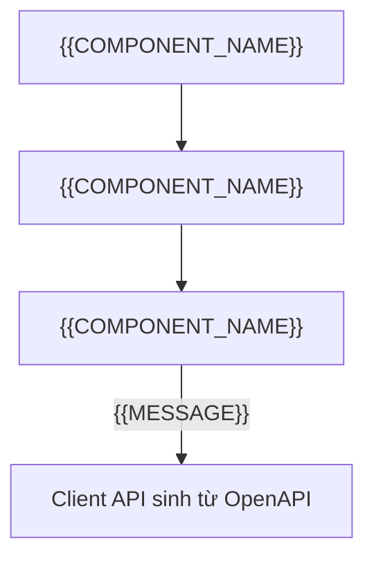

# Overlay frontend-web: khối cho ARCHITECTURE

<!-- SLOT-CONTENT: arch.views -->
### C4 Level 2: vùng chứa (Container)

<!-- fill: Trình duyệt, ứng dụng web (server render nếu có), API backend và dịch vụ ngoài mà trình duyệt gọi trực tiếp. Xóa container không dùng và ghi lý do ở §13. Cạnh ghi giao thức. -->

### Bản đồ route (Route Map)

<!-- fill: Mọi route của ứng dụng, cạnh là điều hướng chính; route cần đăng nhập ghi rõ. -->

<!-- fill: Bảng route: một hàng cho mỗi route. Có Giai đoạn 1W: cột SCR ID ghi màn hình mà route hiển thị; mỗi SCR-* của chỉ mục wireframe có ít nhất một hàng (Gate 2); route không hiển thị màn hình của chỉ mục (ví dụ route chuyển hướng, trang lỗi chung) ghi N/A kèm lý do. Dự án có Intake cũ hơn 1.3.0 hoặc không có Giai đoạn 1W: bỏ cột SCR ID. -->

| Route | SCR ID | Cần đăng nhập | Ghi chú |
| --- | --- | :---: | --- |
| `/{{ROUTE_PATH}}` | {{SCR_ID}} | <!-- fill: chọn một: Có \| Không --> | <!-- fill --> |

### Cây thành phần của một màn hình (Component Tree)

<!-- fill: Vẽ cho màn hình phức tạp nhất; ghi thành phần nào render ở server, thành phần nào chạy ở client, và nơi gọi API. -->

### Góc nhìn triển khai (Deployment View)

| Môi trường | Nơi chạy | API gọi tới | Dữ liệu | Ai được truy cập |
| --- | --- | --- | --- | --- |
| dev | <!-- fill --> | <!-- fill: API dev hoặc API giả lập --> | Dữ liệu giả | <!-- fill --> |
| staging | <!-- fill --> | <!-- fill --> | <!-- fill: dữ liệu giả hoặc đã ẩn danh; MUST NOT dùng dữ liệu cá nhân thật --> | <!-- fill --> |
| production | <!-- fill --> | <!-- fill --> | Dữ liệu thật | <!-- fill --> |
<!-- /SLOT-CONTENT -->

<!-- SLOT-CONTENT: arch.layout -->
### Quy tắc tầng trong cây thư mục (Layering Rules)

- Tầng route (trang, layout, màn hình tải, màn hình lỗi của từng route) chỉ lấy dữ liệu ban đầu và ghép thành phần của tính năng; MUST NOT chứa logic nghiệp vụ hiển thị hay gọi API trực tiếp bằng URL.
- Mỗi phân hệ ở §4.1 là một thư mục tính năng chứa: thành phần của tính năng, hook, schema form, lời gọi API qua client dùng chung, chuỗi hiển thị theo khóa, test của tính năng.
- Thành phần giao diện dùng chung (nút, trường nhập, hộp thoại) nằm trong thư mục design system; không chứa nghiệp vụ, không gọi API.
- Client API sinh từ tài liệu OpenAPI và tiện ích dùng chung nằm trong thư mục lib; mọi lời gọi API đi qua client này.
- Tính năng chỉ import tính năng khác qua file xuất công khai của tính năng đó; MUST NOT import file nội bộ của tính năng khác.
- Chỉ module cấu hình đọc biến môi trường; biến gửi xuống trình duyệt là công khai và MUST NOT chứa secret.

<!-- PROFILE-SLOT: arch.layout -->
<!-- /SLOT-CONTENT -->

<!-- SLOT-CONTENT: arch.schema -->
### Kiểu dữ liệu phía client (Client Data Types)

Bề mặt này không có schema lưu trữ vật lý; dữ liệu nghiệp vụ thuộc API. Mục này chốt nguồn của mọi kiểu dữ liệu phía client.

- Kiểu request và response của API sinh tự động từ tài liệu OpenAPI của API; MUST NOT viết tay kiểu response. Bản tài liệu OpenAPI dùng để sinh kiểu được ghi rõ nguồn và phiên bản ở bảng dưới.
- Schema validate form chép ràng buộc (bắt buộc, độ dài, khoảng giá trị, định dạng) từ DTO request trong SPEC của API; mỗi ràng buộc có test biên. Form không thêm trường mà API không nhận.
- Dữ liệu từ server giữ ở đúng một nơi theo quy ước của stack (dữ liệu render ở server hoặc cache truy vấn ở trình duyệt); không chép sang state cục bộ.
- Lưu trữ trình duyệt chỉ dùng cho dữ liệu không nhạy cảm ở bảng dưới; token và dữ liệu cá nhân theo ARCHITECTURE §6.1 và §9.1.

| Hạng mục | Quyết định |
| --- | --- |
| Tài liệu OpenAPI nguồn | <!-- fill: đường dẫn bản sao trong repo hoặc URL, kèm phiên bản API --> |
| Cách cập nhật khi API đổi contract | <!-- fill: ai cập nhật bản sao, chạy lệnh sinh mã nào, SPEC nào ghi thay đổi --> |
| Lưu trữ trình duyệt được dùng | <!-- fill: khóa, nội dung, thời hạn; ghi Không nếu không dùng --> |

<!-- PROFILE-SLOT: arch.schema -->
<!-- /SLOT-CONTENT -->

<!-- SLOT-CONTENT: arch.conventions -->
### Quy ước giao diện (UI Conventions)

| Hạng mục | Quy ước |
| --- | --- |
| Design token | Màu, khoảng cách, cỡ chữ, bo góc lấy từ token; không dùng giá trị rời trong thành phần. Nguồn token: <!-- fill: docs/design-guidelines.md nếu dự án có, hoặc file token của design system --> |
| Đặt tên thành phần | Tên thành phần `PascalCase`, tên file `kebab-case`; một thành phần xuất ra mỗi file |
| Trợ năng | Mức WCAG ở NFR-USAB; dùng thẻ ngữ nghĩa trước ARIA; mọi thao tác làm được bằng bàn phím; focus hiển thị rõ; tiêu chí đầy đủ ở `specflow/CONVENTIONS.md` mục 10.2 |
| Chuỗi hiển thị | Khóa gồm tên tính năng và tên phần tử nối bằng dấu chấm, theo `camelCase`, ví dụ `{{MODULE_SLUG}}.submit`; không ghép chuỗi hiển thị bằng nối chuỗi |
| Định dạng số, tiền, thời gian | Dùng API định dạng theo locale của nền tảng; tiền nhận dạng chuỗi từ API, không chuyển sang số dấu phẩy động để tính toán |
| Màn hình tải và màn hình lỗi | Mỗi route có trạng thái `Loading` dạng khung (skeleton) và ranh giới lỗi hiển thị trạng thái `Error` kèm cách thử lại |

### Năm trạng thái giao diện (Five UI States)

| Trạng thái | Khi nào | Yêu cầu hiển thị |
| --- | --- | --- |
| `Initial` | Trước khi người dùng thao tác hoặc trước khi tải | Nội dung mặc định, không có thông báo lỗi |
| `Loading` | Đang tải hoặc đang gửi | Khung chờ hoặc chỉ báo tiến trình; khóa thao tác ghi đang chạy |
| `Empty` | Tải xong nhưng không có dữ liệu | Giải thích và hành động tiếp theo |
| `Success` | Có dữ liệu hoặc thao tác thành công | Kết quả, thông báo được trình đọc màn hình đọc |
| `Error` | Lỗi mạng hoặc lỗi từ API | Thông báo theo bảng ánh xạ bên dưới, giữ dữ liệu người dùng đã nhập, cách khắc phục |

### Ánh xạ mã lỗi sang giao diện (Error Code to UI Mapping)

Phần Frontend Web của cột "Ánh xạ theo bề mặt" ở §7.1 ghi khóa chuỗi hiển thị và hành vi theo bảng này; §7.1 có mọi mã mà giao diện xử lý.

<!-- fill: API thuộc dự án khác: mã của API chép nguyên tên từ registry của API, cột Phân hệ sở hữu bắt đầu bằng API rồi tên của API. API cùng dự án: mã do phân hệ backend sở hữu như mọi hàng khác. Mã chỉ có ở phía web (lỗi mạng) ghi Phân hệ sở hữu là phân hệ của web hoặc Dùng chung. Tên mã và cấu trúc lỗi (error.details, correlationId) ở bảng dưới theo quy ước của overlay backend-api; API khác thì thay bằng tên và cấu trúc của API đó. -->

| Nhóm lỗi | Hành vi hiển thị |
| --- | --- |
| `VALIDATION_ERROR` | Hiện lỗi dưới từng trường theo `error.details`, focus vào trường lỗi đầu tiên |
| `UNAUTHENTICATED` | Chuyển tới màn hình đăng nhập, quay lại màn hình cũ sau khi đăng nhập |
| `FORBIDDEN` | Thông báo không có quyền, không thử lại |
| Mã nghiệp vụ của API | Thông báo riêng theo khóa chuỗi của mã, giữ dữ liệu đã nhập |
| `RATE_LIMITED` | Thông báo chờ, cho thử lại sau thời gian ở header `Retry-After` |
| Lỗi mạng, hết thời gian chờ | Mã phía client `NETWORK_ERROR`; thông báo mất kết nối, cho thử lại với cùng `Idempotency-Key` |
| `INTERNAL_ERROR` và mã chưa biết | Thông báo chung kèm `correlationId` để báo hỗ trợ |

### Gọi API (API Calls)

- Mọi lời gọi đi qua client sinh từ OpenAPI; base URL lấy từ cấu hình, không viết cứng.
- Thao tác ghi không idempotent tự nhiên sinh `Idempotency-Key` một lần cho mỗi nội dung người dùng gửi; một khóa không bao giờ đi với nội dung khác.
- Sau lỗi mạng, hết thời gian chờ hoặc `5xx`, kết quả chưa rõ: form khóa sửa, người dùng chỉ được gửi lại đúng nội dung đó với cùng khóa, tới khi nhận phản hồi xác định. Phản hồi xác định là thành công, hoặc lỗi mà API chỉ trả sau khi đã tra khóa idempotency (liệt kê theo SPEC của API). Sau phản hồi xác định, form mở lại và lần gửi mới dùng khóa mới.
- Lỗi trả về khi chưa có lần gửi nào chưa rõ kết quả (ví dụ lỗi validate ở lần gửi đầu) cho phép sửa ngay; lần gửi sau dùng khóa mới.
- Khóa thao tác ghi trong lúc đang gửi; lần kích hoạt thứ hai trong lúc đó không tạo request mới.
- Mỗi lời gọi có thời gian chờ tối đa <!-- fill: số giây -->; thử lại tự động chỉ cho request đọc.
- Lời gọi API chạy ở server của web thay mặt người dùng (render trang, route handler) gửi kèm `X-Forwarded-For` chỉ gồm một địa chỉ: địa chỉ client do load balancer của web ghi (phần tử cuối của header nhận được), không chuyển nguyên header mà client tự gửi. Server web chỉ nhận request đi qua load balancer đó. Nhờ vậy API giới hạn tần suất theo người dùng thật mà client không giả được địa chỉ.
- API ở origin khác: API cho phép origin của web, các header request mà giao diện gửi (`Authorization`, `Content-Type`, `Idempotency-Key`) và khai báo `Access-Control-Expose-Headers` cho header mà giao diện đọc (ví dụ `Retry-After`); ghi phụ thuộc này ở §9.1.

<!-- PROFILE-SLOT: arch.conventions -->
<!-- /SLOT-CONTENT -->

<!-- SLOT-CONTENT: arch.deployment -->
### Đóng gói và chạy (Packaging & Runtime)

| Hạng mục | Quyết định |
| --- | --- |
| Đơn vị triển khai | <!-- fill: chọn một: container chạy server render \| file tĩnh trên CDN; nêu lý do --> |
| Cấu hình | Biến môi trường theo §6.4; biến công khai được nhúng lúc build, đổi giá trị cần build lại; secret chỉ dùng ở server |
| Tài nguyên tĩnh | Phục vụ qua CDN với tên file có mã băm và cache dài hạn; trang HTML không cache dài hạn |
| Header bảo mật | Content-Security-Policy, HSTS, `X-Content-Type-Options: nosniff`, `Referrer-Policy` theo §9.1 |
| Health check | <!-- fill: đường dẫn kiểm tra khi chạy server render; N/A với file tĩnh --> |

### Phát hành và quay lui (Release & Rollback)

| Hạng mục | Quyết định |
| --- | --- |
| Thứ tự phát hành với API | Giao diện dùng contract mới chỉ phát hành sau khi API hỗ trợ contract đó ở môi trường đích |
| Chiến lược phát hành | <!-- fill: chọn một: rolling update \| blue-green \| chuyển phiên bản trên CDN; nêu lý do --> |
| Quay lui | Triển khai lại bản build trước; tài nguyên tĩnh của bản trước giữ lại tới khi phiên người dùng cũ kết thúc |
<!-- /SLOT-CONTENT -->
