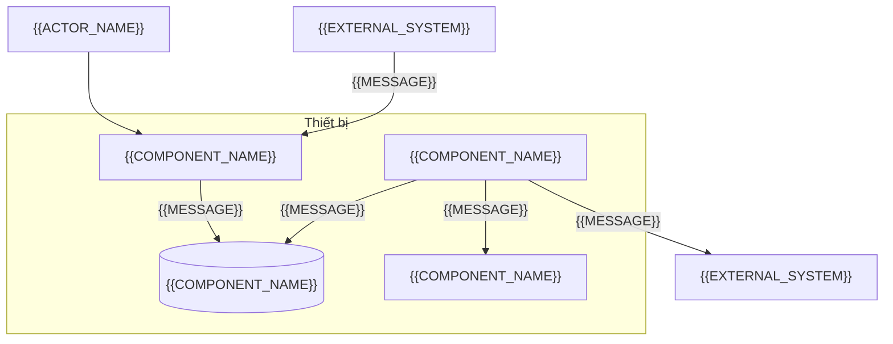
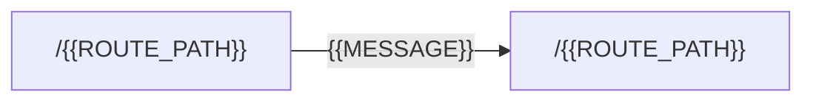
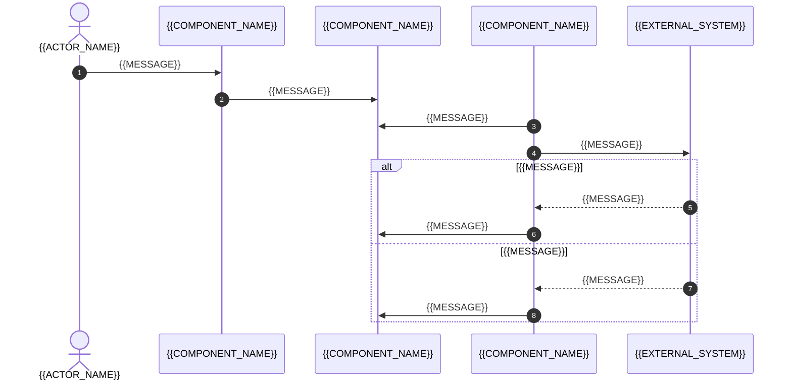

# Overlay mobile-app: khối cho ARCHITECTURE

<!-- SLOT-CONTENT: arch.views -->
### C4 Level 2: vùng chứa (Container)

<!-- fill: Ứng dụng trên thiết bị gồm giao diện, cơ sở dữ liệu cục bộ, bộ máy đồng bộ, kho khóa của hệ điều hành; bên ngoài gồm API, dịch vụ thông báo đẩy, dịch vụ cập nhật qua mạng nếu dùng. Xóa container không dùng và ghi lý do ở §13. Cạnh ghi giao thức. -->

### Bản đồ điều hướng (Navigation Map)

<!-- fill: Mọi màn hình của ứng dụng, cạnh là điều hướng chính; màn hình cần đăng nhập và màn hình mở được bằng deep link ghi rõ. -->

<!-- fill: Bảng điều hướng: một hàng cho mỗi màn hình trong navigator. Có Giai đoạn 1W: cột SCR ID ghi màn hình tương ứng ở chỉ mục wireframe; mỗi SCR-* của chỉ mục có ít nhất một hàng (Gate 2); màn hình kỹ thuật không có ở chỉ mục (ví dụ màn hình chờ khởi động) ghi N/A kèm lý do. Dự án có Intake cũ hơn 1.3.0 hoặc không có Giai đoạn 1W: bỏ cột SCR ID. -->

| Route | SCR ID | Nhóm trong navigator | Deep link | Cần đăng nhập |
| --- | --- | --- | --- | :---: |
| `/{{ROUTE_PATH}}` | {{SCR_ID}} | <!-- fill: chọn một: stack \| tab \| modal --> | <!-- fill: đường dẫn deep link, hoặc Không --> | <!-- fill: chọn một: Có \| Không --> |

### Luồng đồng bộ (Sync Flow)

<!-- fill: Luồng của một thay đổi từ lúc người dùng lưu trên máy tới khi API xác nhận, gồm nhánh xung đột; khớp quy ước đồng bộ ở §7. -->

### Góc nhìn build và phân phối (Build & Distribution View)

| Kênh | Bản build | API gọi tới | Dữ liệu | Ai được cài |
| --- | --- | --- | --- | --- |
| Phát triển | <!-- fill: bản build phát triển trên máy ảo hoặc thiết bị của lập trình viên --> | <!-- fill: API dev hoặc API giả lập --> | Dữ liệu giả | Lập trình viên |
| Thử nội bộ | <!-- fill: TestFlight, Google Play internal testing --> | <!-- fill: API staging --> | <!-- fill: dữ liệu giả hoặc đã ẩn danh; MUST NOT dùng dữ liệu cá nhân thật --> | <!-- fill --> |
| Production | <!-- fill: App Store, Google Play --> | <!-- fill --> | Dữ liệu thật | Người dùng |
<!-- /SLOT-CONTENT -->

<!-- SLOT-CONTENT: arch.layout -->
### Quy tắc tầng trong cây thư mục (Layering Rules)

- Tầng màn hình (file route và layout điều hướng) chỉ ghép thành phần của tính năng và đọc tham số điều hướng; MUST NOT truy vấn cơ sở dữ liệu cục bộ hay gọi API trực tiếp.
- Mỗi phân hệ ở §4.1 là một thư mục tính năng chứa: thành phần, hook đọc dữ liệu từ cơ sở dữ liệu cục bộ, thao tác ghi cục bộ, schema form, chuỗi hiển thị theo khóa, test của tính năng.
- Cơ sở dữ liệu cục bộ chỉ được truy cập qua cổng truy vấn dùng chung (một interface nhỏ cho câu lệnh, truy vấn, transaction) để test chạy được trên engine SQL của máy chạy test; migration nằm cùng thư mục với cổng này.
- Bộ máy đồng bộ là mã duy nhất gọi endpoint ghi của API cho dữ liệu đồng bộ; màn hình ghi vào cơ sở dữ liệu cục bộ và hàng đợi thay đổi, không chờ API.
- Client API sinh từ tài liệu OpenAPI và tiện ích dùng chung nằm trong thư mục lib; mọi lời gọi API đi qua client này.
- Tính năng chỉ import tính năng khác qua file xuất công khai; mã riêng theo nền tảng đặt trong file có hậu tố nền tảng, không rẽ nhánh theo nền tảng rải rác trong mã.
- Chỉ module cấu hình đọc biến môi trường; mọi giá trị nhúng vào bản build là công khai và MUST NOT chứa secret.

<!-- PROFILE-SLOT: arch.layout -->
<!-- /SLOT-CONTENT -->

<!-- SLOT-CONTENT: arch.schema -->
### Schema cục bộ (On-device Schema)

Nguồn chân lý của dữ liệu nghiệp vụ là API; schema cục bộ giữ bản sao cộng dữ liệu chỉ có trên máy để làm việc khi mất mạng.

- Migration của cơ sở dữ liệu cục bộ chạy khi mở ứng dụng, trước truy vấn đầu tiên; migration đã phát hành không sửa, không gộp, không xóa, chỉ thêm migration mới. Ứng dụng mở được cơ sở dữ liệu tạo bởi mọi phiên bản đã phát hành, kể cả phiên bản dưới mức tối thiểu: người dùng bị chặn vẫn cập nhật khi còn thay đổi chờ trên máy.
- Mỗi bảng đồng bộ có cột khóa chính trùng ID của API, cột phiên bản do API cấp mà giá trị trên máy dựa vào, cột trạng thái đồng bộ của bản ghi (`SYNCED`, `QUEUED`, `CONFLICT`, `REJECTED`).
- Bảng hàng đợi thay đổi (outbox) giữ mỗi thay đổi chờ gửi: ID thay đổi (cũng là khóa idempotency), bản ghi đích, nội dung, phiên bản gốc, số lần gửi, thời điểm được gửi lại, mã lỗi cuối. Thay đổi chưa gửi lần nào được gộp với thay đổi mới của cùng bản ghi. Trước khi request rời máy, thay đổi được đọc và đánh dấu đã gửi (tăng số lần gửi) trong cùng một transaction; từ đó nó giữ nguyên nội dung và khóa, và lần sửa mới của cùng bản ghi, kể cả trong lúc request đang chạy, thành thay đổi mới xếp sau.
- Bảng xung đột giữ bản của API khi API báo xung đột, để người dùng so sánh và chọn.
- Cột giữ giá trị liệt kê do API sở hữu (trạng thái, kết quả) chỉ đặt ràng buộc `CHECK` miền giá trị khi contract của API cam kết thêm giá trị mới cùng lúc nâng phiên bản tối thiểu của ứng dụng; ngược lại cột không có `CHECK` và giao diện hiển thị giá trị lạ bằng nhãn dự phòng. Cột do ứng dụng sở hữu (trạng thái đồng bộ, trạng thái hàng đợi) luôn có `CHECK`.
- Kiểu dữ liệu request và response sinh tự động từ tài liệu OpenAPI của API; bảng dưới ánh xạ bảng cục bộ sang DTO.
- Dữ liệu cá nhân trên máy chỉ gồm trường ở SRS §4 có cột "Chứa dữ liệu cá nhân" là Có; xóa theo SRS §4.3.

| Bảng cục bộ | DTO của API | Trường chỉ có trên máy | Ghi chú |
| --- | --- | --- | --- |
| <!-- fill --> | <!-- fill: tên schema trong OpenAPI --> | <!-- fill: ví dụ server_version, sync_status --> | <!-- fill --> |

| Hạng mục | Quyết định |
| --- | --- |
| Tài liệu OpenAPI nguồn | <!-- fill: đường dẫn bản sao trong repo hoặc URL, kèm phiên bản API --> |
| Cách cập nhật khi API đổi contract | <!-- fill: ai cập nhật bản sao, chạy lệnh sinh mã nào, SPEC nào ghi thay đổi, migration cục bộ nào đi kèm --> |
| Mã hóa dữ liệu trên máy | <!-- fill: dựa vào mã hóa của hệ điều hành, hoặc mã hóa cơ sở dữ liệu với khóa trong kho khóa; nêu lý do --> |

<!-- PROFILE-SLOT: arch.schema -->
<!-- /SLOT-CONTENT -->

<!-- SLOT-CONTENT: arch.conventions -->
### Quy tắc làm việc khi mất mạng (Offline-first Rules)

| Hạng mục | Quy tắc |
| --- | --- |
| Đọc | Màn hình đọc từ cơ sở dữ liệu cục bộ; kết quả đồng bộ cập nhật cơ sở dữ liệu cục bộ rồi màn hình tự hiển thị lại |
| Ghi | Thao tác ghi cập nhật bản ghi cục bộ và thêm thay đổi vào hàng đợi trong cùng một transaction; giao diện báo "đã lưu trên máy" ngay, không chờ API |
| Mất dữ liệu | Không thay đổi nào bị bỏ mà người dùng không biết: đăng xuất, xóa dữ liệu, gặp xung đột hay bị từ chối đều hiển thị cho người dùng trước |
| Thời gian | Thời điểm trên thiết bị chỉ để hiển thị; thứ tự và phân xử dùng phiên bản do API cấp |

### Quy ước đồng bộ (Sync Conventions)

- Kích hoạt: khi mở ứng dụng, có mạng lại, ứng dụng trở lại tiền cảnh, kéo để làm mới, sau mỗi thao tác ghi, và khi ứng dụng đang mở, tới lúc có thể gửi tiếp: hết thời gian chờ `429` của thiết bị khi chưa có lượt nào chạy sau thời điểm đó (lượt đầu tiên chạy sau khi hết thời gian chờ xóa nó, kể cả khi `Retry-After` là 0), nếu không thì giờ hẹn gửi lại gần nhất. Bộ hẹn giờ đặt khi lượt vừa kết thúc, kể cả tới giờ hẹn đã qua trong lúc lượt đó chạy (khi đó dùng độ trễ tối thiểu một giây thay vì bỏ qua giờ hẹn), trừ khi lượt kết thúc bằng `auth-required` hoặc `failed`, vì khi đó thử lại ngay chỉ lặp lại cùng kết quả; thời gian chờ `429` đã có lượt chạy sau nó không còn là lý do để đặt bộ hẹn giờ. Khi mở ứng dụng, có mạng lại, trở lại tiền cảnh và kéo để làm mới, giờ hẹn của backoff bị bỏ để gửi ngay, kể cả giờ hẹn sau một `5xx` có `Retry-After`; chỉ thời gian chờ `429` của thiết bị được giữ. Chỉ một lượt đồng bộ chạy tại một thời điểm; kích hoạt đến trong lúc lượt đang chạy kết thúc `done` hoặc `offline` thì gộp thành đúng một lượt chạy tiếp theo, vì lượt đang chạy có thể đã lỗi ở một request gửi trước lúc thiết bị có mạng lại; kết thúc bằng kết quả khác thì không chạy thêm, vì chạy lại chỉ lặp lại cùng kết quả (sau `429`, bộ hẹn giờ thử lại khi hết thời gian chờ). Nếu kích hoạt đã bỏ giờ hẹn của backoff trong lúc một thay đổi vẫn đang gửi mà thay đổi đó vẫn lỗi, thay đổi được hẹn gửi lại ngắn hơn backoff mà số lần đã gửi của nó lẽ ra tính ra.
- Một lượt: gửi thay đổi chờ trước, rồi nhận thay đổi mới từ API theo con trỏ (cursor) đã lưu.
- Gửi: mỗi vòng, trong một transaction, đọc thay đổi cũ nhất có thể gửi (thay đổi chờ đầu tiên của bản ghi, đã tới giờ hẹn gửi lại) và đánh dấu nó đã gửi; sau khi commit mới gửi request với đúng nội dung đã đọc, kèm khóa idempotency là ID thay đổi và phiên bản gốc. MUST NOT gửi thay đổi sau của một bản ghi vượt thay đổi trước của bản ghi đó; thay đổi của bản ghi khác không phải chờ.
- Phản hồi xác định: thành công thì xóa thay đổi khỏi hàng đợi, cập nhật phiên bản của bản ghi và đặt phiên bản gốc của các thay đổi sau cùng bản ghi bằng phiên bản mới; xung đột phiên bản thì lưu bản của API vào bảng xung đột, bỏ các thay đổi chờ của bản ghi (giá trị của người dùng vẫn nằm trên bản ghi cục bộ) và đặt trạng thái `CONFLICT`; mọi phản hồi `4xx` khác, trừ `401`, `408`, `429` và phản hồi báo khóa idempotency đang được xử lý (gửi lại cũng nhận cùng kết quả: dữ liệu sai, không có quyền, không tìm thấy, đã khóa, mã chưa biết), thì đặt `REJECTED` kèm mã lỗi.
- Phản hồi chưa rõ (lỗi mạng, hết thời gian chờ, `408`, `5xx`, phản hồi báo khóa idempotency đang được xử lý): giữ thay đổi với đúng khóa và nội dung, hẹn gửi lại theo backoff lũy thừa có trần, ghi mã lỗi do máy chọn (không lấy mã trong body của phản hồi). Lỗi mạng, hết thời gian chờ, và các mã `5xx` cho biết cả dịch vụ đang sập (`502`, `503`, `504`) hoặc tự nêu thời gian chờ qua `Retry-After` dừng phần gửi (giờ hẹn vẫn theo backoff, không theo giá trị của header), vì gửi tiếp mục khác lúc đó chỉ tạo thêm request vào một dịch vụ khó có khả năng trả lời; `408` và các mã `5xx` còn lại (không có `Retry-After`) cho gửi tiếp thay đổi của bản ghi khác, để một thay đổi lỗi mãi không giữ cả hàng đợi. Contract của API ghi rõ cách nó báo khóa idempotency đang được xử lý.
- `401` dừng lượt đồng bộ và làm mới phiên; `429` của bất kỳ request nào, ghi hay đọc, dừng mọi request tới API cho cả thiết bị (không riêng thay đổi vừa nhận mã này) tới hết thời gian chờ theo header `Retry-After`.
- Nhận: chỉ bản ghi ở trạng thái `SYNCED` được bản của API mới hơn ghi đè; bản ghi đang `QUEUED` giữ giá trị trên máy (lần gửi sau phát hiện xung đột nếu có); bản ghi đang `CONFLICT` cập nhật bản của API trong bảng xung đột nếu bản mới hơn.
- Lượt đồng bộ gặp lỗi không tự hết (một trang nhận về không lưu được, phản hồi `4xx` khi đọc trừ `401`, `408`, `429`): giữ con trỏ, kết thúc lượt với kết quả lỗi và hiển thị trên chỉ báo đồng bộ cho tới lượt thành công sau; MUST NOT bỏ qua trang lỗi rồi lưu con trỏ mới.

### Trạng thái giao diện (UI States)

| Trạng thái | Khi nào | Yêu cầu hiển thị |
| --- | --- | --- |
| `Initial` | Trước khi người dùng thao tác hoặc trước khi tải | Nội dung mặc định, không có thông báo lỗi |
| `Loading` | Máy chưa có dữ liệu và đang tải lần đầu | Khung chờ hoặc chỉ báo tiến trình |
| `Empty` | Máy đã có dữ liệu mới nhất nhưng danh sách rỗng | Giải thích và hành động tiếp theo |
| `Success` | Có dữ liệu trên máy | Dữ liệu kèm thời điểm đồng bộ gần nhất và trạng thái đồng bộ của từng bản ghi |
| `Error` | Không đọc được dữ liệu trên máy, hoặc tải lần đầu thất bại | Thông báo theo bảng ánh xạ bên dưới, cách khắc phục |

| Trạng thái đồng bộ | Hiển thị | Hành động của người dùng |
| --- | --- | --- |
| `Synced` | Không có chỉ báo, hoặc dấu đã đồng bộ | Sửa bình thường |
| `Queued` | Chỉ báo "đã lưu trên máy, chờ đồng bộ" | Sửa tiếp; thay đổi được gộp theo quy ước đồng bộ |
| `Conflict` | Chỉ báo cần chọn; màn hình so sánh bản trên máy và bản của API | Chọn một bản theo chiến lược ở ADR; chưa chọn thì không sửa tiếp |
| `Rejected` | Chỉ báo bị từ chối kèm lý do theo mã lỗi | Xem lý do, bỏ thay đổi hoặc liên hệ người phụ trách |

Lượt đồng bộ kết thúc với lỗi không tự hết hiện trên chỉ báo đồng bộ chung, trước số thay đổi chờ, cho tới lượt thành công sau.

### Ánh xạ mã lỗi sang giao diện (Error Code to UI Mapping)

Phần Mobile App của cột "Ánh xạ theo bề mặt" ở §7.1 ghi khóa chuỗi và hành vi theo bảng này, kể cả trạng thái đồng bộ mà mã lỗi dẫn tới; §7.1 có mọi mã mà ứng dụng xử lý.

<!-- fill: API thuộc dự án khác: mã của API chép nguyên tên từ registry của API, cột Phân hệ sở hữu bắt đầu bằng API rồi tên của API. Mã chỉ có ở ứng dụng (lỗi mạng) ghi Phân hệ sở hữu là phân hệ của ứng dụng hoặc Dùng chung. Tên mã và cấu trúc lỗi ở bảng dưới theo quy ước của overlay backend-api; API khác thì thay bằng tên và cấu trúc của API đó. -->

| Nhóm lỗi | Hành vi khi gọi trực tiếp (đăng nhập, tải lần đầu) | Hành vi khi đồng bộ |
| --- | --- | --- |
| `VALIDATION_ERROR` | Lỗi dưới từng trường theo `error.details` | Thay đổi thành `Rejected`; lỗi này cho thấy validate trên máy lệch với API |
| `UNAUTHENTICATED` | Chuyển tới đăng nhập | Dừng đồng bộ, làm mới phiên; thay đổi chờ giữ nguyên |
| `FORBIDDEN` | Thông báo không có quyền | Thay đổi thành `Rejected` |
| Mã xung đột phiên bản của API | Không áp dụng | Bản ghi thành `Conflict` |
| Mã `4xx` khác của API, kể cả mã chưa biết, trừ mã báo khóa idempotency đang được xử lý | Thông báo riêng theo khóa chuỗi của mã; mã chưa biết dùng thông báo chung | Thay đổi thành `Rejected` kèm thông báo của mã; không gửi lại. Mã báo khóa idempotency đang được xử lý không rơi vào hàng này: xem như phản hồi chưa rõ, thay đổi giữ `Queued` và gửi lại với cùng khóa |
| `RATE_LIMITED` | Thông báo chờ theo `Retry-After` | Dừng mọi request tới API cho cả thiết bị, không riêng thay đổi vừa nhận mã này, tới hết thời gian chờ theo `Retry-After` |
| Lỗi mạng, hết thời gian chờ, `502`, `503`, `504`, mọi `5xx` khác có `Retry-After` | Mã phía client `NETWORK_ERROR`; dùng dữ liệu đã có trên máy | Thay đổi giữ `Queued`, dừng phần gửi, gửi lại với cùng khóa |
| `408`, `5xx` khác không có `Retry-After` | Mã phía client `INTERNAL_ERROR`; thông báo chung kèm `correlationId` | Thay đổi giữ `Queued`, gửi lại với cùng khóa, gửi tiếp thay đổi của bản ghi khác |

### Quyền hệ điều hành và hiệu năng (Permissions & Performance)

- Xin quyền ngay trước lần đầu dùng tính năng cần quyền, kèm màn hình giải thích lý do; bị từ chối thì dùng hành vi ở SRS §3 và cho mở cài đặt hệ thống, không hỏi lại liên tục.
- Danh sách dài dùng danh sách ảo hóa; truy vấn cục bộ có chỉ mục theo cột lọc và sắp xếp.
- Thời gian mở ứng dụng tới màn hình đầu tiên có dữ liệu và kích thước bản build theo NFR-PERF; tác vụ nặng (đồng bộ, nén ảnh) không chạy trên luồng giao diện.
- Token và secret chỉ lưu trong kho khóa của hệ điều hành; log và báo cáo crash không chứa token hay dữ liệu cá nhân.

<!-- PROFILE-SLOT: arch.conventions -->
<!-- /SLOT-CONTENT -->

<!-- SLOT-CONTENT: arch.deployment -->
### Phiên bản, ký và phân phối (Versioning, Signing & Distribution)

| Hạng mục | Quyết định |
| --- | --- |
| Phiên bản ứng dụng | Phiên bản hiển thị theo SemVer; số build tăng đơn điệu cho mỗi bản gửi lên cửa hàng |
| Khóa ký | Chứng chỉ iOS và keystore Android giữ trong dịch vụ build hoặc kho secret của CI; MUST NOT commit vào repo |
| Build | <!-- fill: dịch vụ build trên cloud hoặc máy build của CI; profile build cho phát triển, thử nội bộ, production --> |
| Kênh thử nội bộ | <!-- fill: TestFlight, Google Play internal testing; ai duyệt trước khi lên production --> |
| Thông tin trên cửa hàng | Mô tả, ảnh chụp màn hình, khai báo quyền riêng tư và dữ liệu thu thập khớp SRS §4 và §2.4 |

### Phát hành, cập nhật và quay lui (Release, Updates & Rollback)

| Hạng mục | Quyết định |
| --- | --- |
| Phát hành theo tỉ lệ | <!-- fill: phased release của App Store, staged rollout của Google Play; tỉ lệ từng bước và chỉ số dừng (tỉ lệ crash, lỗi đồng bộ) --> |
| Cập nhật qua mạng (OTA) | <!-- fill: chọn một: không dùng \| chỉ cho thay đổi mã và tài nguyên không đổi phần native; kèm kênh, chính sách runtimeVersion, cách quay lui. Bản cập nhật qua mạng không chứa migration cục bộ: quay lui nó sẽ chạy mã cũ trên cơ sở dữ liệu đã nâng cấp --> |
| Phiên bản tối thiểu | <!-- fill: nơi khai báo, cách ứng dụng cũ nhận biết và dẫn người dùng tới cửa hàng --> |
| Tương thích với API | API giữ contract cho mọi phiên bản ứng dụng từ phiên bản tối thiểu trở lên; đổi contract phá vỡ thì nâng phiên bản tối thiểu sau khi tỉ lệ người dùng bản cũ dưới <!-- fill: ngưỡng phần trăm --> |
| Migration cục bộ | Chạy khi mở ứng dụng; bản build mới đọc được cơ sở dữ liệu của mọi bản build đã phát hành, kể cả bản dưới phiên bản tối thiểu; chỉ đi trong bản build gửi lên cửa hàng |
| Quay lui | Cửa hàng không cho gỡ bản đã cài: dừng phát hành theo tỉ lệ, sửa và phát hành bản mới với số build lớn hơn, hoặc quay lui bản cập nhật qua mạng (không chứa migration) |
<!-- /SLOT-CONTENT -->
