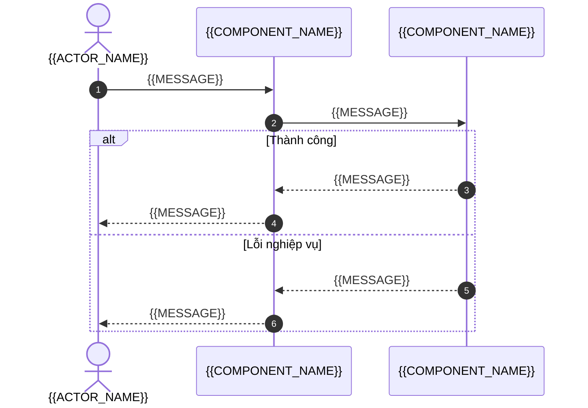
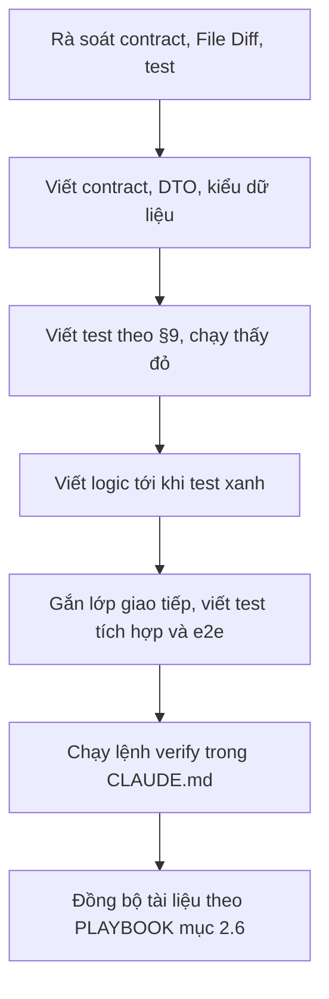

# Đặc tả kỹ thuật (Technical Specification): {{FEATURE_NAME}}

<!-- fill: Chép thành docs/specs/SPEC_<FEATURE_KEY>.md. Thêm vào parent phần SRS chứa FR của tính năng (SRS.md hoặc SRS_MODULE_<NAME>.md) và các ADR liên quan. release là nhãn đợt ở cột Bản phát hành của SRS §6.1; mọi FR ở §1.5 có Bản phát hành bằng release (CONVENTIONS mục 3, PLAYBOOK mục 2.4). Dự án có Intake cũ hơn 1.3.0 xóa dòng release. Từ khóa MUST, MUST NOT, SHOULD, MAY theo RFC 2119 và RFC 8174. Mục không áp dụng giữ heading, ghi N/A kèm lý do, không xóa. Spec là hợp đồng thực thi: coding agent chỉ làm những gì ghi ở đây. Frontmatter assembled_from ghi nguồn theo CONVENTIONS mục 3. -->

## 1. Mục tiêu và phạm vi (Goal & Bounded Context)

### 1.1. Mục tiêu kỹ thuật (Technical Objective)

- SPEC ID: `{{SPEC_ID}}`
- Mục tiêu: <!-- fill: tính năng làm gì, cho ai, trong 2 đến 4 câu; nêu FR chính. -->

### 1.2. Bất biến cốt lõi (Core Invariants)

<!-- fill: Điều MUST luôn đúng trong mọi điều kiện, kể cả thao tác đồng thời hoặc xen kẽ. Mỗi bất biến có ít nhất một test CONC ở §9. -->

| ID | Bất biến | Test chứng minh |
| --- | --- | --- |
| INV-01 | <!-- fill: phát biểu kiểm chứng được --> | TC-{{MODULE_CODE}}-CONC-01 |

### 1.3. Ngoài phạm vi của tính năng (Out of Scope)

<!-- fill: những gì người đọc có thể tưởng thuộc tính năng này nhưng không làm ở đây; mỗi dòng một mục, nêu SPEC hoặc phiên bản sẽ làm nếu có. -->

### 1.4. Phụ thuộc (Dependencies)

| Loại | Phụ thuộc | Ghi chú |
| --- | --- | --- |
| Thành phần nội bộ | {{COMPONENT_NAME}} | <!-- fill: dùng interface nào --> |
| Hệ thống ngoài | {{EXTERNAL_SYSTEM}} | <!-- fill: hoặc "Không có" --> |
| Dữ liệu bị tác động | <!-- fill: bảng, collection, file theo ARCHITECTURE §5 --> | <!-- fill: đọc hay ghi --> |
| SPEC phụ thuộc | <!-- fill: SPEC ID phải xong trước, hoặc "Không có" --> | <!-- fill --> |

### 1.5. Yêu cầu được đáp ứng (Requirements Satisfied)

| FR ID | AC ID | BR ID | NFR ID |
| --- | --- | --- | --- |
| FR-{{MODULE_CODE}}-001 | AC-{{MODULE_CODE}}-01 | <!-- fill: hoặc "Không có" --> | <!-- fill: hoặc "Không có" --> |

## 2. Kiểm soát thay đổi file (File Diff & Impact Tracking)

> Coding agent MUST chỉ sửa hoặc tạo file có trong mục này. Cần file khác thì dừng và đề xuất sửa SPEC (PLAYBOOK mục 7). Đường dẫn khớp cây thư mục ở ARCHITECTURE §4.

### 2.1. File sửa (Modified Files)

| Đường dẫn | Thay đổi |
| --- | --- |
| <!-- fill: đường dẫn trong inline code --> | <!-- fill: hàm, lớp hoặc mục cần thêm hay sửa --> |

### 2.2. File tạo mới (New Files)

| Đường dẫn | Loại | Trách nhiệm |
| --- | --- | --- |
| <!-- fill: đường dẫn trong inline code --> | <!-- fill: chọn một: source \| test \| migration \| config \| docs --> | <!-- fill --> |

### 2.3. Không được chạm (MUST NOT Touch)

| Đường dẫn hoặc phạm vi | Lý do |
| --- | --- |
| <!-- fill: file hoặc thư mục dễ bị sửa nhầm, ví dụ phân hệ khác, cấu hình dùng chung, migration đã chạy --> | <!-- fill --> |

## 3. Hợp đồng dữ liệu và giao tiếp (Contract)

Hình dạng contract phụ thuộc bề mặt. Mọi mã lỗi dùng trong mục này MUST có trong ARCHITECTURE §7.1.

### Endpoint

<!-- fill: Một bảng cho mỗi endpoint của tính năng. -->

| Hạng mục | Giá trị |
| --- | --- |
| Method và path | <!-- fill: chọn một: GET \| POST \| PATCH \| PUT \| DELETE --> `/api/v1/{{RESOURCE_PATH}}` |
| Xác thực | <!-- fill: Bearer token theo ARCHITECTURE §6.1, hoặc "Không" cho endpoint công khai --> |
| Phân quyền | <!-- fill: vai trò được phép, khớp §6 --> |
| Header bắt buộc | `Content-Type: application/json`<!-- fill: thêm `Idempotency-Key` nếu thao tác ghi không idempotent tự nhiên --> |
| Giới hạn tần suất | <!-- fill: giới hạn theo ARCHITECTURE §9.1 --> |
| Mã thành công | <!-- fill: ví dụ 201 khi tạo mới, 200 khi phát lại cùng Idempotency-Key --> |

### DTO request và response (Request & Response DTO)

- Request được validate tại biên bằng schema runtime trước khi vào service; trường lạ bị từ chối; lỗi validate trả `VALIDATION_ERROR` kèm danh sách trường ở `error.details`.
- Giá trị tính toán (giá, tổng tiền, quyền) không nhận từ request; service tính từ nguồn chân lý.
- Response chỉ chứa trường đã khai báo; MUST NOT trả trường nội bộ (hash, khóa ngoại không cần thiết, dữ liệu cá nhân không cần cho client).

<!-- PROFILE-SLOT: spec.contract -->

<!-- fill: Viết schema request và kiểu response thật của endpoint theo khuôn ở trên. -->

### Phản hồi thành công (Success Response)

<!-- fill: Một ví dụ JSON trong envelope ARCHITECTURE §6.2, giá trị ví dụ khớp DTO. -->

### Ma trận lỗi (Error Matrix)

| HTTP status | `error.code` | Kịch bản kích hoạt | `error.details` |
| --- | --- | --- | --- |
| `400` | `VALIDATION_ERROR` | Request sai schema | Danh sách `{ field, issue }` |
| `401` | `UNAUTHENTICATED` | Thiếu token, token hết hạn hoặc sai chữ ký | Không có |
| `403` | `FORBIDDEN` | Đã xác thực nhưng vai trò không được phép | Không có |
| `429` | `RATE_LIMITED` | Vượt giới hạn tần suất | Không có; header `Retry-After` |
| <!-- fill: status theo ARCHITECTURE §7 --> | <!-- fill: mã nghiệp vụ có trong ARCHITECTURE §7.1 --> | <!-- fill --> | <!-- fill --> |

### Fragment OpenAPI 3.1 (OpenAPI Fragment)

<!-- fill: Fragment đủ để sinh client và chạy contract test: path, method đúng với bảng Endpoint, operationId camelCase, security, requestBody với schema thật, mọi response trong ma trận lỗi, response thành công và response lỗi có schema của envelope (khai báo trong components), mỗi loại phần tử của `error.details` có thuộc tính khai báo rõ để client sinh được kiểu. Khi hiện thực, SPEC gộp fragment vào openapi/openapi.yaml, file này nằm trong File Diff. -->

```yaml
openapi: 3.1.0
paths:
  /api/v1/{{RESOURCE_PATH}}:
    post:
      security:
        - bearerAuth: []
      requestBody:
        required: true
        content:
          application/json:
            schema: {}
      responses:
        "201":
          description: "Tạo thành công"
          content:
            application/json:
              schema: {}
        "400":
          description: VALIDATION_ERROR
        "401":
          description: UNAUTHENTICATED
        "403":
          description: FORBIDDEN
        "429":
          description: RATE_LIMITED
```

## 4. Migration và dữ liệu (Migration & Data)

| Hạng mục | Nội dung |
| --- | --- |
| Cần migration | <!-- fill: chọn một: Có \| Không; nếu Không, các hàng dưới ghi N/A --> |
| File migration | <!-- fill: đường dẫn, phải có trong §2.2 --> |
| Thay đổi (forward) | <!-- fill: bảng, cột, index, ràng buộc thêm hoặc đổi --> |
| Rollback | <!-- fill: cách đảo ngược, dữ liệu có mất không --> |
| Backfill dữ liệu cũ | <!-- fill: cách điền dữ liệu cho bản ghi đã có, chạy lúc nào, idempotent ra sao --> |
| Tương thích khi triển khai dần | <!-- fill: phiên bản code cũ và mới cùng chạy được với schema mới hay không --> |

## 5. Thuật toán và luồng thực thi (Algorithm & Execution Flow)

### 5.1. Sơ đồ tuần tự (Sequence Diagram)

<!-- fill: Thể hiện luồng chính và nhánh lỗi quan trọng; participant là thành phần thật ở ARCHITECTURE §3 và §4. -->



### 5.2. Các bước xử lý (Processing Steps)

<!-- fill: Các bước đánh số, mỗi bước một hành động kiểm chứng được. Bước nào có thể thất bại thì nêu điều kiện, mã lỗi và trạng thái dữ liệu sau thất bại. -->

### 5.3. Ranh giới transaction và đồng thời (Transaction Boundary & Concurrency)

| Hạng mục | Quyết định |
| --- | --- |
| Ranh giới transaction | <!-- fill: bước nào nằm trong cùng một transaction; "Không dùng transaction" kèm lý do nếu vậy --> |
| Mức isolation | <!-- fill: mức mặc định ghi trong quy ước của bề mặt ở ARCHITECTURE §7; dùng mức khác thì ghi lý do --> |
| Kiểm soát đồng thời | <!-- fill: cách giữ bất biến §1.2 khi có thao tác song song, ví dụ cập nhật nguyên tử có điều kiện, khóa dòng, khóa lạc quan theo version --> |
| Idempotency | <!-- fill: khóa idempotency lấy từ đâu, lưu ở đâu, phản hồi khi trùng khóa; một cơ chế duy nhất --> |
| Tác vụ sau commit | <!-- fill: sự kiện hoặc tác vụ chỉ chạy sau khi transaction thành công --> |

## 6. Ma trận phân quyền (Authorization Matrix)

| Tác nhân | Hành động | Kết quả mong đợi | Mã lỗi khi bị chặn | Test |
| --- | --- | --- | --- | --- |
| `ACT_{{ROLE_CODE}}` | <!-- fill --> | <!-- fill: chọn một: Cho phép \| Từ chối --> | <!-- fill: mã trong ARCHITECTURE §7.1, hoặc N/A --> | <!-- fill: TC ID --> |

## 7. Hợp đồng sự kiện (Event Contract)

| Sự kiện | Payload (schema) | Phát khi | Consumer | Đảm bảo giao nhận | Phiên bản |
| --- | --- | --- | --- | --- | --- |
| `{{EVENT_NAME}}` | <!-- fill: tên trường, kiểu, bắt buộc; không chứa dữ liệu cá nhân nhạy cảm --> | <!-- fill --> | <!-- fill --> | <!-- fill: chọn một: at-most-once \| at-least-once kèm consumer idempotent --> | <!-- fill: ví dụ v1 --> |

## 8. Quan sát (Observability)

| Loại | Tên | Nội dung | Mức hoặc ngưỡng |
| --- | --- | --- | --- |
| Log | <!-- fill: tên sự kiện log --> | <!-- fill: trường ghi kèm, không có dữ liệu cấm ghi --> | <!-- fill: mức log --> |
| Metric | <!-- fill --> | <!-- fill --> | <!-- fill --> |
| Audit | <!-- fill: hành động cần dấu vết kiểm toán, hoặc N/A --> | <!-- fill: ai, làm gì, lúc nào, trên dữ liệu nào --> | <!-- fill --> |
| Cảnh báo | <!-- fill: hoặc N/A --> | <!-- fill --> | <!-- fill --> |

## 9. Kiểm thử (Tests)

> Coding agent MUST viết test theo bảng này trước khi viết logic (TDD). Mỗi AC ở §1.5 có ít nhất một TC; mỗi bất biến ở §1.2 có ít nhất một TC loại `CONC`; mỗi NFR ở §1.5 mà SRS §8 kiểm bằng Test có TC ghi NFR đó ở cột "AC hoặc INV", trừ khi TC của nó đã nằm ở SPEC khác. TC đánh số tiếp sau số lớn nhất đã có ở SRS §8 và các SPEC khác (CONVENTIONS mục 4); sau khi chốt, cập nhật SRS §8 theo bảng này. Bảng ghi đúng file và tên của từng test; tên test mô tả hành vi bằng tiếng Anh, không chứa TC ID (CONVENTIONS mục 4).

### 9.1. Danh sách test bắt buộc (Required Tests)

| TC ID | AC hoặc INV | Loại | Kịch bản (Given-When-Then) | File test | Tên test |
| --- | --- | --- | --- | --- | --- |
| TC-{{MODULE_CODE}}-UNIT-01 | AC-{{MODULE_CODE}}-01 | Unit | **Given:** <!-- fill --><br>**When:** <!-- fill --><br>**Then:** <!-- fill --> | <!-- fill: đường dẫn, phải có trong §2 --> | <!-- fill: tên test mô tả hành vi --> |
| TC-{{MODULE_CODE}}-CONC-01 | INV-01 | Concurrency | **Given:** <!-- fill --><br>**When:** <!-- fill: thao tác đồng thời hoặc xen kẽ --><br>**Then:** <!-- fill: bất biến vẫn đúng, đo được --> | <!-- fill --> | <!-- fill --> |

### Loại test của bề mặt (Surface Test Types)

| Loại | TYPE trong TC ID | Phạm vi | Dữ liệu | Bắt buộc |
| --- | --- | --- | --- | :---: |
| Unit | `UNIT` | Service với repository và adapter được mock | Trong bộ nhớ | Có |
| Integration | `INT` | Repository và truy vấn trên cơ sở dữ liệu thật chạy cô lập | Cơ sở dữ liệu tạo riêng cho lần chạy | Có khi SPEC có truy vấn mới |
| E2E | `E2E` | Request HTTP qua toàn bộ ứng dụng tới cơ sở dữ liệu | Cơ sở dữ liệu tạo riêng cho lần chạy | Có |
| Contract | `CTR` | Response thật so với fragment OpenAPI ở §3 | Như E2E | Có khi endpoint được client khác dùng |
| Concurrency | `CONC` | Bất biến ở §1.2 dưới request song song | Cơ sở dữ liệu thật | Có, mỗi bất biến ở §1.2 một test |
| Load smoke | `LOAD` | Đo nhanh độ trễ so với NFR-PERF | Môi trường staging | Khi SPEC chạm đường nóng của NFR-PERF |

### Dạng test CONC của bề mặt (Concurrency Test Pattern)

1. Chuẩn bị trạng thái giới hạn tài nguyên (ví dụ số lượng còn lại nhỏ hơn số request).
2. Gửi N request song song (N ≥ 10) tới cùng tài nguyên, chờ tất cả kết thúc.
3. Đếm phản hồi theo mã và truy vấn cơ sở dữ liệu để khẳng định bất biến (không âm, không trùng, tổng khớp).
4. Không dùng mock cho tầng lưu trữ; không dùng sleep để sắp thứ tự.

<!-- PROFILE-SLOT: spec.test-types -->

## 10. Triển khai dần (Rollout)

| Hạng mục | Quyết định |
| --- | --- |
| Cờ tính năng | <!-- fill: tên flag theo ARCHITECTURE §6.7, hoặc "Không dùng" kèm lý do --> |
| Tương thích ngược | <!-- fill: client hoặc phiên bản cũ bị ảnh hưởng thế nào --> |
| Kế hoạch tắt hoặc quay lui | <!-- fill: cách tắt tính năng khi có sự cố, dữ liệu xử lý ra sao --> |

## 11. Giả định và câu hỏi mở (Assumptions & Open Questions)

| ID | Loại | Nội dung | Lý do hoặc ảnh hưởng | BLOCKING | Người trả lời |
| --- | --- | --- | --- | :---: | --- |
| AQ-01 | <!-- fill: chọn một: Giả định \| Câu hỏi --> | <!-- fill --> | <!-- fill --> | <!-- fill: chọn một: Có \| Không --> | <!-- fill --> |

## 12. Quy trình thực thi và Definition of Done (Execution Workflow & DoD)



Definition of Done của SPEC:

- [ ] Mọi lệnh verify trong `CLAUDE.md` đạt điều kiện pass của bảng lệnh verify (PLAYBOOK mục 11).
- [ ] 100% test ở §9 pass, đúng file và tên ghi trong bảng.
- [ ] Mã nguồn chỉ thay đổi trong các file ở §2; ngoài ra chỉ có tài liệu và plan được cập nhật theo PLAYBOOK mục 2.6.
- [ ] Không có dependency mới ngoài ARCHITECTURE §2 hoặc ADR `accepted`.
- [ ] Mọi lỗi trả về theo envelope ARCHITECTURE §6.2 với mã trong §7.1 (bề mặt có request/response).
- [ ] SPEC chuyển status `implemented`, bảng §9 ghi đúng file test và tên test, checkbox của plan đã đồng bộ.

## 13. Lịch sử phiên bản (Version History)

| Phiên bản | Ngày | Người sửa | Nội dung thay đổi | Lý do và người yêu cầu | Người duyệt |
| --- | --- | --- | --- | --- | --- |
| 0.1.0 | {{DATE}} | {{AUTHOR}} | Bản khởi tạo | Khởi tạo theo pipeline | Chưa duyệt |
