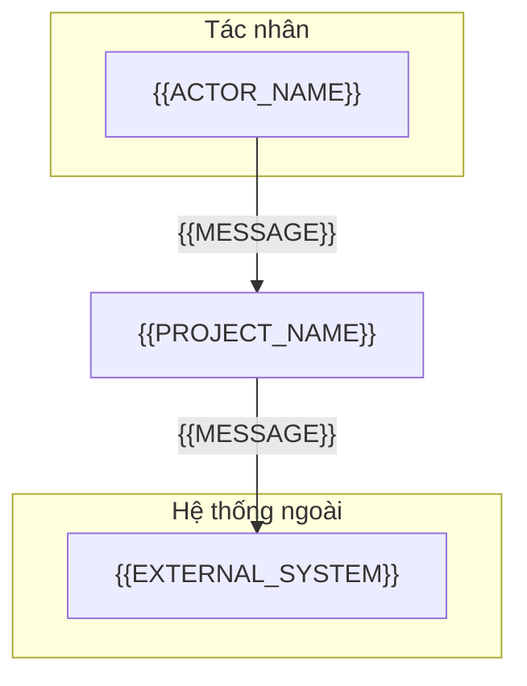
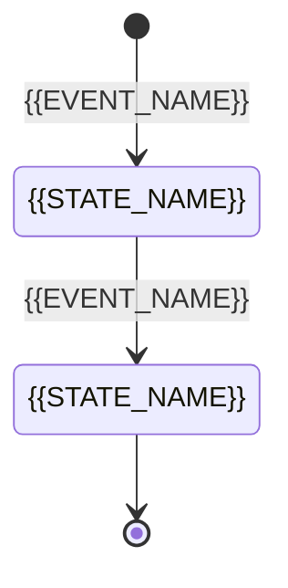

# Đặc tả yêu cầu phần mềm (Software Requirements Specification): {{PROJECT_NAME}}

<!-- fill: Chép thành docs/srs/SRS.md (docs_mode monolithic) hoặc docs/srs/00_SRS_MASTER.md (modular). Chế độ modular: master giữ §1 đến §5, §7, §9, §10 và mô hình dữ liệu chung; mỗi phân hệ một file docs/srs/SRS_MODULE_<NAME>.md giữ §6 và §8 của phân hệ đó, cùng §9 và §10.2 riêng, frontmatter doc_type srs-module, parent trỏ về master. Frontmatter assembled_from ghi nguồn theo CONVENTIONS mục 3. Chuẩn tham chiếu: ISO/IEC/IEEE 29148:2018 cho bố cục và cách viết yêu cầu (đối chiếu ở §10.3), ISO/IEC 25010:2023 cho nhóm NFR; quy tắc viết yêu cầu ở CONVENTIONS mục 8. SRS trả lời WHAT, không chọn công nghệ; lựa chọn công nghệ thuộc ARCHITECTURE. -->

## 1. Giới thiệu (Introduction)

### 1.1. Mục đích tài liệu (Purpose)

Tài liệu xác định toàn bộ yêu cầu chức năng (FR), yêu cầu phi chức năng (NFR), mô hình dữ liệu logic, giao diện ngoài và ràng buộc của {{PROJECT_NAME}}. Đây là nguồn chân lý (Single Source of Truth) cho ARCHITECTURE, SPEC, Implementation Plan, mã nguồn và bộ test.

### 1.2. Phạm vi sản phẩm (Scope)

- Mục tiêu cốt lõi: <!-- fill: 2 đến 3 câu về bài toán và giá trị, nhất quán với Intake mục 2 -->
- Phân hệ trong phạm vi (In-scope):

| Module ID | Mã phân hệ | Tên phân hệ | Năng lực chính | Bề mặt |
| --- | --- | --- | --- | --- |
| {{MODULE_ID}} | `{{MODULE_CODE}}` | {{MODULE_NAME}} | <!-- fill --> | <!-- fill: overlay phục vụ phân hệ --> |

- Ngoài phạm vi (Out-of-scope) của phiên bản này: <!-- fill: mỗi dòng một năng lực hoặc tích hợp không làm, kèm lý do ngắn -->

### 1.3. Thuật ngữ và từ viết tắt (Definitions & Abbreviations)

| Thuật ngữ | Tên đầy đủ | Giải thích trong ngữ cảnh dự án |
| --- | --- | --- |
| `PII` | Personally Identifiable Information | Dữ liệu cá nhân theo luật áp dụng ở Intake mục 7 |
| `SLA` | Service Level Agreement | Cam kết chất lượng dịch vụ vận hành (uptime, thời gian xử lý) |
| `RPO`, `RTO` | Recovery Point Objective, Recovery Time Objective | Lượng dữ liệu tối đa được mất và thời gian tối đa để khôi phục sau sự cố |
| <!-- fill: thuật ngữ nghiệp vụ hoặc kỹ thuật dễ hiểu sai; xóa hàng chung ở trên nếu không dùng --> | <!-- fill --> | <!-- fill --> |

### 1.4. Tài liệu tham khảo (References)

1. ISO/IEC/IEEE 29148:2018, Systems and software engineering, Life cycle processes, Requirements engineering.
2. ISO/IEC 25010:2023, Systems and software engineering, Systems and software Quality Requirements and Evaluation (SQuaRE), Product quality model.
3. `docs/intake/PROJECT_INTAKE.md`.
4. <!-- fill: chuẩn ở §2.7, tài liệu nghiệp vụ, quy định pháp lý, hợp đồng liên quan; ghi đường dẫn hoặc URL -->

### 1.5. Các bên liên quan (Stakeholders)

| Vai trò | Mối quan tâm chính | Quyền phê duyệt |
| --- | --- | --- |
| <!-- fill --> | <!-- fill --> | <!-- fill: gate nào, lấy từ Intake mục 9; "Không" nếu không duyệt --> |

## 2. Mô tả tổng thể (Overall Description)

### 2.1. Vị trí của hệ thống (System Perspective)

<!-- fill: hệ thống độc lập hay thành phần của hệ thống lớn hơn; ranh giới hệ thống. Sơ đồ thể hiện mọi tác nhân ở §2.2 và mọi hệ thống ngoài ở Intake mục 8, không vẽ thành phần bên trong hệ thống. -->



### 2.2. Tác nhân và phân quyền (User Classes & Characteristics)

| Actor ID | Tên vai trò | Trình độ | Tần suất dùng | Quyền hạn nghiệp vụ |
| --- | --- | --- | --- | --- |
| `ACT_{{ROLE_CODE}}` | {{ACTOR_NAME}} | <!-- fill --> | <!-- fill --> | <!-- fill: được làm gì, không được làm gì --> |

### 2.3. Môi trường vận hành (Operating Environment)

<!-- fill: người dùng truy cập từ đâu và bằng gì, hệ thống chạy ở đâu, điều kiện mạng, múi giờ và ngôn ngữ người dùng. Chi tiết kỹ thuật của từng bề mặt nằm ở §2.5. -->

### 2.4. Ràng buộc nghiệp vụ, pháp lý và vận hành (Business, Legal & Operational Constraints)

| Loại | Ràng buộc | Nguồn |
| --- | --- | --- |
| Nghiệp vụ | <!-- fill: quy trình, chính sách giá, giờ hoạt động --> | <!-- fill --> |
| Pháp lý | <!-- fill: từ Intake mục 7 --> | <!-- fill --> |
| Vận hành (Operations) | <!-- fill: chế độ vận hành thường, bảo trì, suy giảm khi phụ thuộc lỗi; sao lưu và khôi phục do ai làm, khi nào; cửa sổ bảo trì, đội vận hành --> | <!-- fill --> |
| Bộ nhớ và lưu trữ (Memory Constraints) | <!-- fill: giới hạn bộ nhớ và dung lượng lưu trữ trên thiết bị người dùng hoặc máy chủ; N/A kèm lý do nếu không có giới hạn đáng kể --> | <!-- fill --> |
| Thích ứng nơi triển khai (Site Adaptation) | <!-- fill: cấu hình khác nhau theo môi trường, khách hàng, vùng dữ liệu hoặc ngôn ngữ; N/A kèm lý do nếu chỉ có một nơi triển khai --> | <!-- fill --> |

### 2.5. Ràng buộc kỹ thuật (Technical Constraints)

Ràng buộc kỹ thuật theo bề mặt. Công nghệ và phiên bản cụ thể không thuộc SRS; chúng được chốt ở ARCHITECTURE.

| Ràng buộc | Nội dung |
| --- | --- |
| Stack | Theo stack profile `{{STACK_PROFILE}}` đã chốt ở Intake mục 14; phiên bản cụ thể ở ARCHITECTURE §2 |
| Kiểu dữ liệu nghiêm ngặt | Ngôn ngữ có kiểm tra kiểu tĩnh, bật chế độ nghiêm ngặt; quy tắc cụ thể ở ARCHITECTURE và `.claude/rules/` |
| Toàn vẹn giao dịch | Mọi thao tác nghiệp vụ thay đổi trạng thái từ hai bản ghi liên quan trở lên chạy trong một database transaction; mức isolation mặc định chốt ở ARCHITECTURE §7; SPEC nêu rõ khi cần mức cao hơn hoặc khóa dòng |
| Giao thức | API chỉ phục vụ qua HTTPS; <!-- fill: phiên bản TLS tối thiểu, ví dụ TLS 1.2 --> |
| Thời gian | Lưu và truyền theo UTC, định dạng ISO 8601 |
| Tiền tệ | <!-- fill: đơn vị tiền tệ và biểu diễn chính xác; ghi N/A nếu hệ thống không xử lý tiền --> |

### 2.6. Phụ thuộc (Dependencies)

| Phụ thuộc | Loại | Cam kết cần có (SLA) | Ảnh hưởng khi không sẵn sàng |
| --- | --- | --- | --- |
| {{EXTERNAL_SYSTEM}} | <!-- fill: chọn một: dịch vụ ngoài \| hệ thống nội bộ \| dữ liệu \| con người --> | <!-- fill --> | <!-- fill --> |

### 2.7. Chuẩn phải tuân thủ (Standards Compliance)

<!-- fill: Chuẩn kỹ thuật, chuẩn ngành hoặc chuẩn hợp đồng mà sản phẩm MUST đạt, ví dụ OWASP ASVS 5.0 (mức L1, L2 hoặc L3) cho bảo mật, WCAG 2.2 (mức A, AA hoặc AAA) cho trợ năng, PCI DSS khi xử lý thẻ thanh toán. Luật và quy định pháp lý ghi ở §2.4 và NFR-LEGAL. NFR tương ứng ở §7 dẫn về hàng ở đây. Ghi một hàng N/A kèm lý do nếu không có chuẩn nào. -->

| Chuẩn | Phạm vi áp dụng | Mức hoặc phiên bản | Cách kiểm chứng | NFR liên quan |
| --- | --- | --- | --- | --- |
| <!-- fill --> | <!-- fill: phân hệ hoặc bề mặt --> | <!-- fill --> | <!-- fill: chọn một: Test \| Inspection \| Demo \| Analysis --> | <!-- fill: NFR ID --> |

## 3. Giao diện bên ngoài (External Interface Requirements)

Các loại giao diện ngoài theo ISO/IEC/IEEE 29148 §9.6.4. Loại không áp dụng ghi N/A kèm lý do; loại áp dụng có mục chi tiết ngay dưới bảng.

| Loại giao diện | Áp dụng | Tóm tắt |
| --- | --- | --- |
| Giao diện hệ thống (System Interfaces) | <!-- fill: chọn một: Có \| N/A: lý do. Có khi sản phẩm là một phần của hệ thống lớn hơn; nêu hệ thống đó và phần việc mỗi bên đảm nhận --> | <!-- fill --> |
| Giao diện người dùng (User Interfaces) | <!-- fill: chọn một: Có \| N/A: lý do --> | <!-- fill --> |
| Giao diện phần cứng (Hardware Interfaces) | <!-- fill: chọn một: Có \| N/A: lý do --> | <!-- fill --> |
| Giao diện phần mềm (Software Interfaces) | <!-- fill: chọn một: Có \| N/A: lý do --> | <!-- fill --> |
| Giao diện truyền thông (Communications Interfaces) | <!-- fill: chọn một: Có \| N/A: lý do --> | <!-- fill --> |
| Giao diện với dịch vụ (Interfaces with Services) | <!-- fill: chọn một: Có \| N/A: lý do. Dịch vụ dùng chung mà sản phẩm dựa vào, ví dụ định danh, thông báo, thanh toán, lưu trữ tệp --> | <!-- fill --> |

### Giao diện phần mềm (Software Interfaces)

<!-- fill: Giữ hàng áp dụng, ghi "Không" ở cột Áp dụng cho hàng còn lại thay vì xóa. -->

| Hệ thống | Mục đích | Giao thức và định dạng | Xác thực và an toàn | Áp dụng |
| --- | --- | --- | --- | :---: |
| Client của API (ứng dụng web, mobile, hệ thống khác) | Gọi nghiệp vụ của hệ thống | REST, JSON, HTTPS | Bearer token theo ARCHITECTURE §6.1 | <!-- fill: chọn một: Có \| Không --> |
| API của bên thứ ba (ngoài email, SMS và định danh ở các hàng dưới) | <!-- fill: dịch vụ nào, làm gì --> | <!-- fill --> | <!-- fill: API key, OAuth client credentials --> | <!-- fill: chọn một: Có \| Không --> |
| Webhook nhận vào | <!-- fill: bên gửi, sự kiện --> | HTTPS POST, JSON | Xác thực chữ ký (ví dụ HMAC-SHA256 trên raw body), chống phát lại bằng timestamp, xử lý idempotent theo ID sự kiện của bên gửi | <!-- fill: chọn một: Có \| Không --> |
| Object storage | <!-- fill: file nào được lưu --> | API tương thích S3, pre-signed URL có thời hạn | Bucket riêng tư, URL ký có thời hạn ngắn | <!-- fill: chọn một: Có \| Không --> |
| Email hoặc SMS | <!-- fill: thông báo nào --> | API của nhà cung cấp | API key trong secret manager | <!-- fill: chọn một: Có \| Không --> |
| Nhà cung cấp định danh (identity provider) | Đăng nhập liên kết | OpenID Connect trên OAuth 2.0, Authorization Code kèm PKCE | Kiểm tra `state`, `nonce`, audience | <!-- fill: chọn một: Có \| Không --> |

### Giao diện truyền thông (Communications Interfaces)

| Kênh | Quy ước | Áp dụng |
| --- | --- | :---: |
| REST API | JSON UTF-8, URI chữ thường `kebab-case`, phiên bản major trong path; chi tiết ở ARCHITECTURE §7 | Có |
| Thời gian thực | WebSocket trên TLS (WSS) có heartbeat ping/pong và client tự kết nối lại với backoff lũy thừa | <!-- fill: chọn một: Có \| Không --> |
| Hàng đợi hoặc event bus | <!-- fill: dùng cho sự kiện nội bộ hay tích hợp; ghi Không nếu không dùng --> | <!-- fill: chọn một: Có \| Không --> |

Giao diện người dùng (User Interfaces) và giao diện phần cứng (Hardware Interfaces): N/A cho bề mặt `backend-api`; giao diện người dùng thuộc overlay của bề mặt client nếu dự án có.

## 4. Yêu cầu dữ liệu (Data Requirements)

### 4.1. Mô hình dữ liệu logic (Logical Data Model)

#### Sơ đồ thực thể liên kết logic (Logical ERD)

<!-- fill: Mọi thực thể nghiệp vụ và quan hệ, ký hiệu Crow's foot; tên thực thể UPPER_SNAKE số ít, thuộc tính snake_case. Chỉ ghi thuộc tính cốt lõi, kiểu logic (uuid, string, decimal, int, timestamp, enum) và vai trò khóa (PK, FK, UK). Tên và tập giá trị enum MUST khớp §4.2 và §10.1. -->

```mermaid
erDiagram
    {{ENTITY_NAME}} ||--o{ {{ENTITY_NAME}} : "{{MESSAGE}}"
    {{ENTITY_NAME}} {
        uuid id PK "Khóa chính"
        timestamp created_at "Thời điểm tạo, UTC"
        timestamp updated_at "Thời điểm cập nhật cuối, UTC"
    }
```

<!-- fill: Khi điền §4.2 và §4.3, xét đủ và ghi quyết định vào đúng mục: bảng lịch sử, tài chính, nhật ký kiểm toán là append-only; thực thể có dữ liệu con mang ràng buộc tài chính hoặc pháp lý xóa mềm bằng cột deleted_at, cấm xóa cứng, nêu hành vi truy vấn mặc định với bản ghi đã xóa mềm; giá trị phụ thuộc thời điểm (giá, tỉ lệ, cấu hình) được chụp lại vào bản ghi giao dịch; quy tắc số học viết trong inline code, khớp tên cột; khóa tự nhiên duy nhất và khóa duy nhất ghép; miền giá trị hữu hạn liệt kê đủ, thực thể có vòng đời có state machine ở §10.1. -->

### 4.2. Từ điển dữ liệu (Data Dictionary)

| Thực thể | Diễn giải nghiệp vụ | Thuộc tính cốt lõi | Ràng buộc và toàn vẹn | Phân loại dữ liệu |
| --- | --- | --- | --- | --- |
| <!-- fill: tên thực thể, khớp mô hình ở §4.1 --> | <!-- fill --> | <!-- fill: tên thuộc tính tiếng Anh snake_case --> | <!-- fill: khóa, duy nhất, miền giá trị, quy tắc xóa --> | <!-- fill: chọn một: công khai \| nội bộ \| dữ liệu cá nhân \| dữ liệu cá nhân nhạy cảm \| tài chính --> |

### 4.3. Quy tắc toàn vẹn dữ liệu (Data Integrity Rules)

<!-- fill: mỗi quy tắc một dòng đánh số, có tên và nội dung kiểm chứng được. Xem xét tối thiểu: dữ liệu bất biến sau khi ghi (lịch sử, tài chính, nhật ký kiểm toán); chính sách xóa (xóa mềm hay xóa cứng, dữ liệu con khi xóa dữ liệu cha); quy tắc số học viết trong inline code, ví dụ `total = Σ line_amount`; tính duy nhất nghiệp vụ; múi giờ và định dạng thời gian. -->

## 5. Quy tắc nghiệp vụ (Business Rules)

| BR ID | Quy tắc | Nguồn | FR liên quan | Cách kiểm chứng |
| --- | --- | --- | --- | --- |
| BR-001 | <!-- fill: phát biểu một quy tắc, đo được, không mơ hồ --> | <!-- fill: người, văn bản hoặc luật đặt ra quy tắc --> | FR-{{MODULE_CODE}}-001 | <!-- fill: chọn một: Test \| Inspection \| Demo \| Analysis --> |

## 6. Yêu cầu chức năng (Functional Requirements)

### 6.1. Danh mục yêu cầu chức năng (Functional Requirements Catalog)

<!-- fill: Bảng danh mục giữ phát biểu yêu cầu; bảng thuộc tính ngay dưới giữ thuộc tính theo ISO/IEC/IEEE 29148 §5.2.8, cùng thứ tự FR ID. Mỗi phát biểu theo một mẫu EARS ở CONVENTIONS mục 8: chủ ngữ là hệ thống hoặc phân hệ, đúng một MUST hoặc MUST NOT, một hành vi kiểm chứng được, không dùng từ mơ hồ ở CONVENTIONS mục 8. Hành vi phụ đưa vào use case §6.2 hoặc Business Rule §5. Bản phát hành phân bổ yêu cầu theo 29148 §9.6.9. -->

| FR ID | Phân hệ | Tên chức năng | Phát biểu yêu cầu (Requirement Statement) | Tác nhân chính | Ưu tiên (MoSCoW) | Bản phát hành | Cách kiểm chứng (Verification) |
| --- | --- | --- | --- | --- | --- | --- | --- |
| FR-{{MODULE_CODE}}-001 | {{MODULE_ID}} | <!-- fill: tên ngắn --> | <!-- fill: một câu theo mẫu EARS --> | `ACT_{{ROLE_CODE}}` | <!-- fill: chọn một: Must \| Should \| Could \| Won't --> | <!-- fill: nhãn bản phát hành, ví dụ R1 --> | <!-- fill: chọn một: Test \| Inspection \| Demo \| Analysis --> |

| FR ID | Tiên quyết | Lý do (Rationale) | Nguồn (Source) | Rủi ro |
| --- | --- | --- | --- | --- |
| FR-{{MODULE_CODE}}-001 | <!-- fill: FR ID khác hoặc Không --> | <!-- fill: vì sao cần --> | <!-- fill: GOAL-NN của Intake mà FR phục vụ; stakeholder hoặc tài liệu khi FR không phục vụ trực tiếp mục tiêu nào --> | <!-- fill: chọn một: Cao \| Trung bình \| Thấp --> |

### 6.2. Đặc tả use case (Use Case Specification)

<!-- fill: Mỗi FR mức Must có một use case theo khung dưới; FR khác có thể chỉ có dòng ở §6.1. Chép khung cho từng use case, giữ đủ 7 mục. -->

#### Use case FR-{{MODULE_CODE}}-001: {{FEATURE_NAME}}

- Tác nhân chính: `ACT_{{ROLE_CODE}}`
- Mục tiêu nghiệp vụ: <!-- fill -->
- Quy tắc nghiệp vụ áp dụng: <!-- fill: BR ID -->

1. Điều kiện tiên quyết (Pre-conditions): <!-- fill: trạng thái hệ thống và quyền của tác nhân trước khi bắt đầu -->
2. Luồng chính (Main Flow): <!-- fill: các bước đánh số; mỗi bước một hành động của tác nhân hoặc một phản hồi của hệ thống; không mô tả công nghệ -->
3. Luồng thay thế (Alternative Flows): <!-- fill: đánh số theo bước rẽ nhánh, ví dụ "3a"; ghi N/A nếu không có -->
4. Luồng ngoại lệ (Exception Flows): <!-- fill: mỗi ngoại lệ gồm bước phát sinh, điều kiện, phản hồi của hệ thống, mã lỗi dạng {{HTTP_OR_DOMAIN_ERROR}}, trạng thái dữ liệu sau lỗi. Dùng mã chung VALIDATION_ERROR, UNAUTHENTICATED, FORBIDDEN, RATE_LIMITED, INTERNAL_ERROR khi đúng nghĩa; mã nghiệp vụ mới đặt tên UPPER_SNAKE và ghi vào §6.3. Giai đoạn 2 đưa mọi mã lỗi của SRS vào Error Code Registry ở ARCHITECTURE §7.1 -->
5. Điều kiện sau (Post-conditions): <!-- fill: trạng thái dữ liệu và hệ thống khi thành công -->
6. Yêu cầu phi chức năng liên quan: <!-- fill: NFR ID -->
7. Tiêu chí nghiệm thu: xem §8.

### 6.3. Mã lỗi dùng trong SRS (Error Codes Used)

<!-- fill: Liệt kê mọi mã lỗi xuất hiện trong các use case ở §6.2. Giai đoạn 2 đưa toàn bộ bảng này vào Error Code Registry ở ARCHITECTURE §7.1. -->

| Mã lỗi | Ý nghĩa | Use case |
| --- | --- | --- |
| <!-- fill: UPPER_SNAKE --> | <!-- fill --> | FR-{{MODULE_CODE}}-001 |

## 7. Yêu cầu phi chức năng (Non-Functional Requirements)

<!-- fill: Mỗi nhóm có ít nhất một NFR hoặc một dòng N/A: ô Yêu cầu bắt đầu bằng "N/A:" kèm lý do, các ô đo ghi N/A. Ô Yêu cầu là nhãn ngắn; mỗi NFR áp dụng có chỉ số, cách đo và ngưỡng bằng con số, không dùng từ mơ hồ ở CONVENTIONS mục 8, và có một dòng ở bảng NFR của §8. Nhóm ánh xạ sang ISO/IEC 25010:2023 theo CONVENTIONS mục 8; thêm NFR trong nhóm dùng số kế tiếp. Cột Nguồn dẫn GOAL-NN khi NFR phục vụ một mục tiêu của Intake. -->

| NFR ID | Nhóm | Yêu cầu | Chỉ số | Cách đo | Ngưỡng | Cách kiểm chứng | Ưu tiên | Nguồn |
| --- | --- | --- | --- | --- | --- | --- | --- | --- |
| NFR-PERF-01 | Hiệu năng | <!-- fill: độ trễ, thông lượng, mức dùng tài nguyên --> | <!-- fill --> | <!-- fill --> | <!-- fill: ví dụ p95 ≤ con số + đơn vị --> | <!-- fill: chọn một: Test \| Inspection \| Demo \| Analysis --> | <!-- fill: chọn một: Must \| Should \| Could --> | <!-- fill --> |
| NFR-PERF-02 | Hiệu năng | Dung lượng (capacity) <!-- fill: người dùng đồng thời, khối lượng dữ liệu, lấy từ Intake mục 5; cột Nguồn dẫn GOAL-NN nếu có mục tiêu về tải --> | <!-- fill --> | <!-- fill --> | <!-- fill --> | <!-- fill: chọn một: Test \| Inspection \| Demo \| Analysis --> | <!-- fill: chọn một: Must \| Should \| Could --> | Intake mục 5 |
| NFR-SEC-01 | Bảo mật | <!-- fill: bảo vệ thông tin xác thực, phân quyền, giới hạn tần suất, chống injection; dẫn mức chuẩn ở §2.7 nếu có. Thuật toán và tham số cụ thể thuộc ARCHITECTURE --> | <!-- fill --> | <!-- fill --> | <!-- fill --> | <!-- fill: chọn một: Test \| Inspection \| Demo \| Analysis --> | <!-- fill: chọn một: Must \| Should \| Could --> | <!-- fill --> |
| NFR-RELI-01 | Độ tin cậy | <!-- fill: uptime, RPO, RTO --> | <!-- fill --> | <!-- fill --> | <!-- fill --> | <!-- fill: chọn một: Test \| Inspection \| Demo \| Analysis --> | <!-- fill: chọn một: Must \| Should \| Could --> | <!-- fill --> |
| NFR-MAINT-01 | Khả năng bảo trì | Độ phủ test của phần logic nghiệp vụ | Tỉ lệ dòng được test phủ | Báo cáo coverage trong CI | ≥ {{COVERAGE_THRESHOLD}}% | <!-- fill: chọn một: Test \| Inspection \| Demo \| Analysis --> | <!-- fill: chọn một: Must \| Should \| Could --> | <!-- fill --> |
| NFR-USAB-01 | Khả năng tương tác và trợ năng (Interaction Capability) | Tuân thủ WCAG 2.2 mức {{WCAG_LEVEL}} <!-- fill: ghi N/A kèm lý do nếu không có giao diện người dùng --> | <!-- fill --> | <!-- fill --> | <!-- fill --> | <!-- fill: chọn một: Test \| Inspection \| Demo \| Analysis --> | <!-- fill: chọn một: Must \| Should \| Could --> | <!-- fill --> |
| NFR-FLEX-01 | Khả năng thích ứng (Flexibility) | <!-- fill: khả năng mở rộng theo tải, cài đặt và cấu hình lại ở môi trường khác, thay thế thành phần; N/A kèm lý do nếu không có yêu cầu --> | <!-- fill --> | <!-- fill --> | <!-- fill --> | <!-- fill: chọn một: Test \| Inspection \| Demo \| Analysis --> | <!-- fill: chọn một: Must \| Should \| Could --> | <!-- fill --> |
| NFR-SAFE-01 | An toàn (Safety) | <!-- fill: hành vi an toàn khi lỗi (fail-safe), cảnh báo nguy cơ, giới hạn thao tác có thể gây hại cho người hoặc dữ liệu; N/A kèm lý do nếu không có nguy cơ --> | <!-- fill --> | <!-- fill --> | <!-- fill --> | <!-- fill: chọn một: Test \| Inspection \| Demo \| Analysis --> | <!-- fill: chọn một: Must \| Should \| Could --> | <!-- fill --> |
| NFR-I18N-01 | Quốc tế hóa | <!-- fill: ngôn ngữ, định dạng số, tiền, ngày --> | <!-- fill --> | <!-- fill --> | <!-- fill --> | <!-- fill: chọn một: Test \| Inspection \| Demo \| Analysis --> | <!-- fill: chọn một: Must \| Should \| Could --> | <!-- fill --> |
| NFR-LEGAL-01 | Pháp lý | <!-- fill: từ Intake mục 7 --> | <!-- fill --> | <!-- fill --> | <!-- fill --> | <!-- fill: chọn một: Test \| Inspection \| Demo \| Analysis --> | <!-- fill: chọn một: Must \| Should \| Could --> | <!-- fill --> |
| NFR-OBS-01 | Quan sát và kiểm toán | <!-- fill: log, audit trail, thời gian lưu --> | <!-- fill --> | <!-- fill --> | <!-- fill --> | <!-- fill: chọn một: Test \| Inspection \| Demo \| Analysis --> | <!-- fill: chọn một: Must \| Should \| Could --> | <!-- fill --> |
| NFR-DATA-01 | Dữ liệu | <!-- fill: thời gian lưu giữ, xóa theo yêu cầu, sao lưu --> | <!-- fill --> | <!-- fill --> | <!-- fill --> | <!-- fill: chọn một: Test \| Inspection \| Demo \| Analysis --> | <!-- fill: chọn một: Must \| Should \| Could --> | <!-- fill --> |
| NFR-COMPAT-01 | Tương thích | <!-- fill: phiên bản client, API cũ, nền tảng --> | <!-- fill --> | <!-- fill --> | <!-- fill --> | <!-- fill: chọn một: Test \| Inspection \| Demo \| Analysis --> | <!-- fill: chọn một: Must \| Should \| Could --> | <!-- fill --> |
| NFR-COST-01 | Chi phí vận hành | <!-- fill: ngân sách hạ tầng hoặc chi phí theo lượt dùng; N/A nếu không ràng buộc --> | <!-- fill --> | <!-- fill --> | <!-- fill --> | <!-- fill: chọn một: Test \| Inspection \| Demo \| Analysis --> | <!-- fill: chọn một: Must \| Should \| Could --> | <!-- fill --> |

## 8. Truy xuất nguồn gốc và nghiệm thu (Traceability & Acceptance Matrix)

<!-- fill: Bảng thứ nhất: mỗi FR có ít nhất một AC. TC không ghi ở đây: TC nằm ở SPEC §9, bảng tra AC tới TC ở docs/INDEX.md mục 5 (CONVENTIONS mục 4). Ngoại lệ quan trọng của use case cần AC riêng. Bảng thứ hai: mỗi NFR áp dụng ở §7 có một dòng; cột cuối ghi bằng chứng và nơi lưu khi kiểm bằng Inspection, Demo, Analysis, và ghi `Test ở SPEC §9` khi kiểm bằng Test. -->

| FR ID | AC ID | Kịch bản nghiệm thu (Given-When-Then) |
| --- | --- | --- |
| FR-{{MODULE_CODE}}-001 | AC-{{MODULE_CODE}}-01 | **Given:** <!-- fill --><br>**When:** <!-- fill --><br>**Then:** <!-- fill: kết quả đo được, gồm trạng thái dữ liệu --> |

| NFR ID | Cách kiểm chứng | Bằng chứng |
| --- | --- | --- |
| NFR-PERF-01 | <!-- fill: khớp cột Cách kiểm chứng ở §7 --> | <!-- fill: bằng chứng và nơi lưu, hoặc `Test ở SPEC §9` --> |

## 9. Giả định và câu hỏi mở (Assumptions & Open Questions)

<!-- fill: Khi duyệt Gate 1, tập yêu cầu đầy đủ theo ISO/IEC/IEEE 29148 §5.2.6: không còn câu hỏi BLOCKING, không còn chỗ TBD trong FR, NFR, BR; giả định còn lại ghi rõ ảnh hưởng nếu sai. -->

| ID | Loại | Nội dung | Lý do hoặc ảnh hưởng | BLOCKING | Người trả lời |
| --- | --- | --- | --- | :---: | --- |
| AQ-01 | <!-- fill: chọn một: Giả định \| Câu hỏi --> | <!-- fill --> | <!-- fill --> | <!-- fill: chọn một: Có \| Không --> | <!-- fill --> |

## 10. Phụ lục (Appendices)

### 10.1. Sơ đồ chuyển trạng thái (State Machine)

<!-- fill: Một sơ đồ cho mỗi thực thể có vòng đời; tập trạng thái MUST khớp miền giá trị ở §4.2 và schema ở ARCHITECTURE §5. Ghi N/A nếu không thực thể nào có vòng đời. -->



### 10.2. Lịch sử phiên bản (Version History)

| Phiên bản | Ngày | Người sửa | Nội dung thay đổi | Lý do và người yêu cầu | Người duyệt |
| --- | --- | --- | --- | --- | --- |
| 0.1.0 | {{DATE}} | {{AUTHOR}} | Bản khởi tạo | Khởi tạo theo pipeline | Chưa duyệt |

### 10.3. Đối chiếu ISO/IEC/IEEE 29148 (Standards Mapping)

Bảng đối chiếu mục của ISO/IEC/IEEE 29148:2018 §9.6 với tài liệu này. Mục nào dự án không áp dụng ghi N/A kèm lý do ngay tại mục tương ứng của tài liệu, không xóa hàng ở đây.

| 29148:2018 | Nội dung | Mục trong SRS |
| --- | --- | --- |
| 9.6.2, 9.6.3 | Purpose, Scope | §1.1, §1.2 |
| 9.6.4 | Product perspective | §2.1 |
| 9.6.4.1 đến 9.6.4.5, 9.6.4.9 | System, User, Hardware, Software, Communications Interfaces, Interfaces with Services | §3 |
| 9.6.4.6 | Memory constraints | §2.4 |
| 9.6.4.7 | Operations | §2.4 |
| 9.6.4.8 | Site adaptation requirements | §2.4 |
| 9.6.5 | Product functions | §1.2, §6.1 |
| 9.6.6 | User characteristics | §2.2 |
| 9.6.7 | Limitations | §2.4, §2.5 |
| 9.6.8 | Assumptions and dependencies | §2.6, §9 |
| 9.6.9 | Apportioning of requirements | §6.1, cột Bản phát hành |
| 9.6.10 | Specified requirements: yêu cầu có ID duy nhất, tham chiếu chéo được, đạt đặc tính của 29148 §5.2 | §4 đến §7; cách viết theo CONVENTIONS mục 8 |
| 9.6.11 | External interfaces | §3 |
| 9.6.12 | Functions | §5, §6 |
| 9.6.13 | Usability requirements | §7, NFR-USAB |
| 9.6.14 | Performance requirements | §7, NFR-PERF |
| 9.6.15 | Logical database requirements | §4 |
| 9.6.16 | Design constraints | §2.5 |
| 9.6.17 | Standards compliance | §2.7 |
| 9.6.18 | Software system attributes | §7, nhóm RELI, SEC, MAINT, FLEX, SAFE, COMPAT |
| 9.6.19 | Verification | Cột Cách kiểm chứng ở §5, §6.1, §7; §8 |
| 9.6.20 | Supporting information | §10 |
