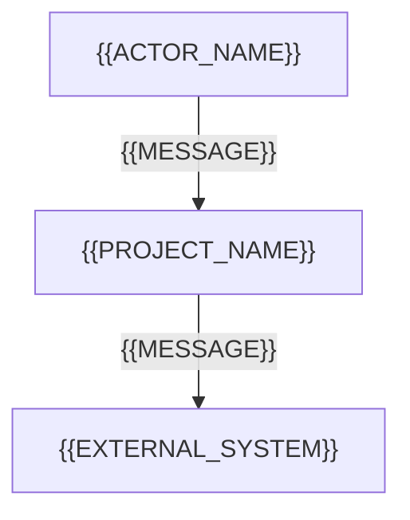
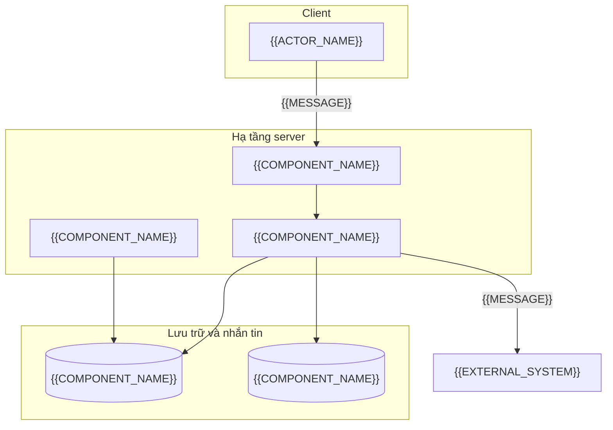
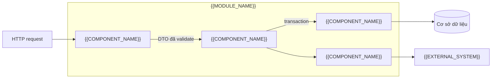
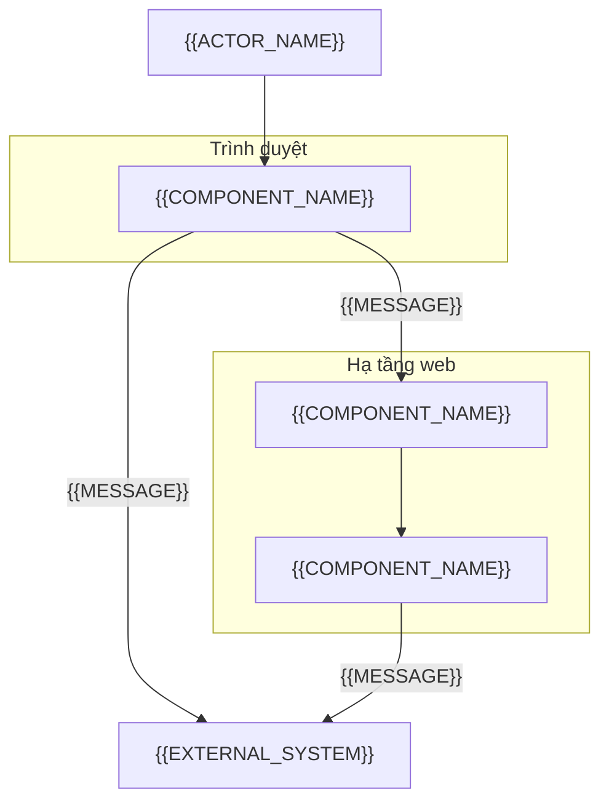
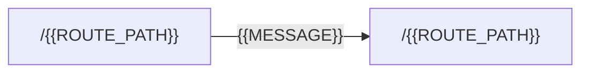
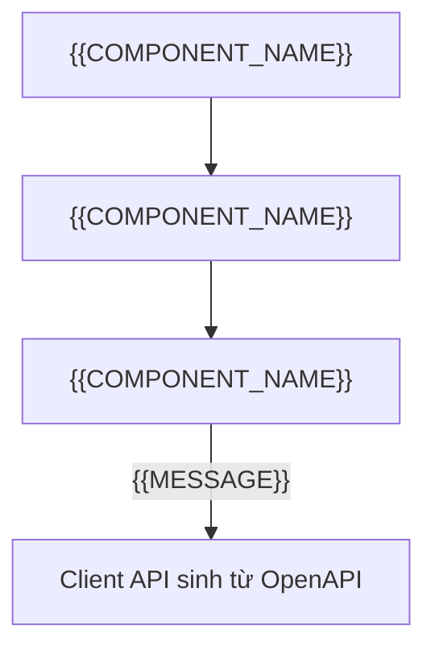

# Tài liệu kiến trúc hệ thống (System Architecture Document): {{PROJECT_NAME}}

<!-- fill: Chép thành docs/ARCHITECTURE.md. Thêm SRS đã duyệt vào parent (docs/srs/SRS.md hoặc docs/srs/00_SRS_MASTER.md). Tham khảo ISO/IEC/IEEE 42010:2022 (khái niệm view, rationale ghi bằng ADR; không tuyên bố tuân thủ) và dùng mô hình C4. Tài liệu trả lời WHERE và HOW; mọi lựa chọn trong tài liệu là một giá trị duy nhất, không để "A hoặc B". Quyết định then chốt có ADR theo PLAYBOOK mục 2.3 và được liệt kê ở §12; lựa chọn đánh dấu "có ADR" MUST có ADR bao phủ. Frontmatter assembled_from ghi nguồn theo CONVENTIONS mục 3. -->

## 1. Mục tiêu và nguyên tắc kiến trúc (Architectural Goals & Principles)

### 1.1. Thuộc tính chất lượng (Quality Attributes)

| Thuộc tính | NFR liên quan | Cách đạt (tóm tắt, chi tiết ở §8.1) |
| --- | --- | --- |
| <!-- fill: ví dụ khả năng mở rộng, độ tin cậy, bảo mật, khả năng bảo trì --> | <!-- fill: NFR ID trong SRS §7 --> | <!-- fill --> |

### 1.2. Nguyên tắc bắt buộc cho coding agent (Golden Rules)

1. Tách tầng (Layer Isolation). Tầng giao tiếp (route handler, controller, màn hình, command handler) chỉ nhận input, validate và map output; MUST NOT chứa logic nghiệp vụ hay truy cập lưu trữ trực tiếp. Tầng nghiệp vụ (service, use case) xử lý nghiệp vụ và điều phối transaction. Tầng truy cập dữ liệu (repository, gateway, adapter) đóng gói truy vấn và lời gọi hệ thống ngoài.
2. Không phụ thuộc vòng (No Circular Dependencies). Phân hệ A phụ thuộc phân hệ B thì B MUST NOT phụ thuộc ngược lại A; giao tiếp qua interface công khai hoặc sự kiện.
3. Kiểu nghiêm ngặt (Strict Typing). Mọi payload, entity và chữ ký hàm có kiểu tường minh; MUST NOT dùng cơ chế thoát kiểm tra kiểu của ngôn ngữ. Quy tắc cụ thể theo ngôn ngữ nằm trong rule của bề mặt ở `.claude/rules/`.
4. Không hardcode secret. Secret chỉ đi qua cơ chế ở §6.4 và §9.1.
5. Ghi log qua logger có cấu trúc (§6.3); MUST NOT in trực tiếp ra stdout hoặc stderr ngoài logger.
6. Chỉ module cấu hình đọc biến môi trường; nơi khác nhận cấu hình qua tham số hoặc dependency injection.
7. Tiền tệ dùng một biểu diễn chính xác duy nhất cho toàn hệ thống: <!-- fill: chọn một: kiểu thập phân chính xác \| số nguyên theo đơn vị tiền nhỏ nhất; ghi N/A nếu hệ thống không xử lý tiền -->; MUST NOT dùng số dấu phẩy động.
8. Thời gian lưu và truyền theo UTC, định dạng ISO 8601; chuyển múi giờ chỉ ở tầng hiển thị.
9. Validate tại biên (input người dùng, hệ thống ngoài, file, hàng đợi); dữ liệu đã qua biên được tin cậy bên trong. Giá trị do client tính (giá, số tiền, quyền, trạng thái) MUST NOT được tin: server tính lại hoặc kiểm tra lại từ nguồn chân lý.
10. Migration chỉ đổi cấu trúc và dữ liệu, MUST NOT chứa logic nghiệp vụ; migration đi một chiều (forward-only) và có kế hoạch rollback trong SPEC.
11. <!-- fill: quy tắc riêng của dự án, hoặc xóa dòng này nếu không có -->

### 1.3. Kiểu kiến trúc (Architectural Style)

| Hạng mục | Quyết định |
| --- | --- |
| Kiểu kiến trúc | <!-- fill: chọn một, có ADR: modular monolith \| microservices \| serverless \| kiểu khác nêu rõ --> |
| Ranh giới phân hệ | <!-- fill: cách các phân hệ ở §4.1 giao tiếp với nhau: gọi interface trong tiến trình, sự kiện, gọi qua mạng --> |
| ADR | <!-- fill: ADR ID --> |

## 2. Tech stack cố định (Fixed Tech Stack)

### 2.1. Bảng công nghệ (Technology Table)

<!-- fill: Mỗi bề mặt một nhóm hàng, chép từ mục có heading chứa (Tech Stack) của stack profile đã chọn trong Intake mục 14. Phiên bản ghi chính xác (không dùng khoảng hay dấu ^). Mọi lệch so với profile có ADR. Coding agent MUST chỉ dùng thư viện có trong bảng này. -->

| Bề mặt | Lớp (Layer) | Công nghệ | Phiên bản chính xác | Vai trò | ADR |
| --- | --- | --- | --- | --- | --- |
| <!-- fill --> | <!-- fill: ví dụ ngôn ngữ, runtime, framework, lưu trữ, cache, validation, test --> | <!-- fill --> | <!-- fill --> | <!-- fill --> | <!-- fill: ADR ID hoặc "theo profile" --> |

### 2.2. Chính sách dependency (Dependency Policy)

| Quy tắc | Nội dung |
| --- | --- |
| Thêm thư viện mới | Cần ADR `accepted` trước khi cài; ADR nêu lý do, phương án không dùng thư viện, license |
| License cho phép | <!-- fill: danh sách license chấp nhận; license khác cần ADR --> |
| Nguồn package | <!-- fill: registry chính thức hoặc registry nội bộ --> |
| Nâng phiên bản | <!-- fill: mức patch được nâng khi qua cổng verify; mức minor và major cần ADR --> |
| Lockfile | Lockfile được commit; build dùng đúng phiên bản trong lockfile |
| Kiểm tra lỗ hổng | Chạy trong CI (§11); lỗ hổng mức high hoặc critical chặn merge trừ khi có ADR chấp nhận rủi ro |

## 3. Các góc nhìn kiến trúc theo C4 (C4 Architecture Views)

### 3.1. C4 Level 1: bối cảnh hệ thống (System Context)

<!-- fill: Tác nhân và hệ thống ngoài khớp SRS §2.1 và §2.2. Mỗi cạnh ghi mục đích và giao thức. -->



### Backend API

#### C4 Level 2: vùng chứa (Container)

<!-- fill: Mỗi container là một đơn vị chạy hoặc lưu trữ độc lập. Xóa container không dùng (worker, cache, broker) và ghi lý do ở §13 nếu xóa. Cạnh ghi giao thức. -->



#### C4 Level 3: thành phần của một phân hệ (Component)

<!-- fill: Vẽ cho phân hệ có luồng phức tạp nhất; các phân hệ khác theo cùng khuôn tầng ở §4. -->



#### Góc nhìn triển khai (Deployment View)

| Môi trường | Nơi chạy | Số instance API | Cơ sở dữ liệu | Dữ liệu | Ai được truy cập |
| --- | --- | --- | --- | --- | --- |
| dev | <!-- fill --> | <!-- fill --> | <!-- fill --> | Dữ liệu giả | <!-- fill --> |
| staging | <!-- fill --> | <!-- fill --> | <!-- fill --> | <!-- fill: dữ liệu giả hoặc đã ẩn danh; MUST NOT dùng dữ liệu cá nhân thật --> | <!-- fill --> |
| production | <!-- fill --> | <!-- fill: tối thiểu 2 nếu NFR-RELI yêu cầu sẵn sàng cao --> | <!-- fill --> | Dữ liệu thật | <!-- fill --> |

### Frontend Web

#### C4 Level 2: vùng chứa (Container)

<!-- fill: Trình duyệt, ứng dụng web (server render nếu có), API backend và dịch vụ ngoài mà trình duyệt gọi trực tiếp. Xóa container không dùng và ghi lý do ở §13. Cạnh ghi giao thức. -->



#### Bản đồ route (Route Map)

<!-- fill: Mọi route của ứng dụng, cạnh là điều hướng chính; route cần đăng nhập ghi rõ. -->



<!-- fill: Bảng route: một hàng cho mỗi route. Có Giai đoạn 1W: cột SCR ID ghi màn hình mà route hiển thị; mỗi SCR-* của chỉ mục wireframe có ít nhất một hàng (Gate 2); route không hiển thị màn hình của chỉ mục (ví dụ route chuyển hướng, trang lỗi chung) ghi N/A kèm lý do. Dự án có Intake cũ hơn 1.3.0 hoặc không có Giai đoạn 1W: bỏ cột SCR ID. -->

| Route | SCR ID | Cần đăng nhập | Ghi chú |
| --- | --- | :---: | --- |
| `/{{ROUTE_PATH}}` | {{SCR_ID}} | <!-- fill: chọn một: Có \| Không --> | <!-- fill --> |

#### Cây thành phần của một màn hình (Component Tree)

<!-- fill: Vẽ cho màn hình phức tạp nhất; ghi thành phần nào render ở server, thành phần nào chạy ở client, và nơi gọi API. -->



#### Góc nhìn triển khai (Deployment View)

| Môi trường | Nơi chạy | API gọi tới | Dữ liệu | Ai được truy cập |
| --- | --- | --- | --- | --- |
| dev | <!-- fill --> | <!-- fill: API dev hoặc API giả lập --> | Dữ liệu giả | <!-- fill --> |
| staging | <!-- fill --> | <!-- fill --> | <!-- fill: dữ liệu giả hoặc đã ẩn danh; MUST NOT dùng dữ liệu cá nhân thật --> | <!-- fill --> |
| production | <!-- fill --> | <!-- fill --> | Dữ liệu thật | <!-- fill --> |

## 4. Cấu trúc thư mục (Repository Layout)

Coding agent MUST đặt file mới đúng cây thư mục dưới đây và MUST NOT tạo thư mục ngoài quy chuẩn.

### 4.1. Ánh xạ phân hệ (Module Mapping)

| Module ID | Mã | Thành phần (container, component) | Thư mục | Bề mặt |
| --- | --- | --- | --- | --- |
| {{MODULE_ID}} | `{{MODULE_CODE}}` | {{COMPONENT_NAME}} | <!-- fill: đường dẫn trong inline code --> | <!-- fill --> |

### Backend API

#### Quy tắc tầng trong cây thư mục (Layering Rules)

- Mỗi phân hệ ở §4.1 là một thư mục module chứa đủ: tầng giao tiếp (controller hoặc route handler), tầng nghiệp vụ (service), tầng truy cập dữ liệu (repository), DTO và schema validate, kiểu miền (entity), test của module.
- Mã dùng chung không thuộc nghiệp vụ nằm trong thư mục shared: hằng số, lỗi, bộ lọc lỗi, guard, interceptor, tiện ích thuần.
- Kết nối hạ tầng (cơ sở dữ liệu, cache, email, storage, client của API ngoài) nằm trong thư mục infrastructure, được inject vào repository hoặc adapter.
- Module chỉ import module khác qua interface công khai của module đó; MUST NOT import repository hay file nội bộ của module khác.
- Chỉ module cấu hình đọc biến môi trường.

<!-- PROFILE-SLOT: arch.layout -->

### Frontend Web

#### Quy tắc tầng trong cây thư mục (Layering Rules)

- Tầng route (trang, layout, màn hình tải, màn hình lỗi của từng route) chỉ lấy dữ liệu ban đầu và ghép thành phần của tính năng; MUST NOT chứa logic nghiệp vụ hiển thị hay gọi API trực tiếp bằng URL.
- Mỗi phân hệ ở §4.1 là một thư mục tính năng chứa: thành phần của tính năng, hook, schema form, lời gọi API qua client dùng chung, chuỗi hiển thị theo khóa, test của tính năng.
- Thành phần giao diện dùng chung (nút, trường nhập, hộp thoại) nằm trong thư mục design system; không chứa nghiệp vụ, không gọi API.
- Client API sinh từ tài liệu OpenAPI và tiện ích dùng chung nằm trong thư mục lib; mọi lời gọi API đi qua client này.
- Tính năng chỉ import tính năng khác qua file xuất công khai của tính năng đó; MUST NOT import file nội bộ của tính năng khác.
- Chỉ module cấu hình đọc biến môi trường; biến gửi xuống trình duyệt là công khai và MUST NOT chứa secret.

<!-- PROFILE-SLOT: arch.layout -->

## 5. Lược đồ dữ liệu vật lý (Physical Data Schema)

Nguồn chân lý của cấu trúc dữ liệu vật lý. Tên bảng, cột, kiểu và miền giá trị MUST khớp SRS §4 và SRS §10.1; lệch nhau thì sửa theo PLAYBOOK mục 8.

### Backend API

#### Quy tắc schema vật lý (Physical Schema Rules)

- Kiểu cụ thể cho mọi cột: UUID, chuỗi có độ dài tối đa, số thập phân có precision và scale, timestamp có múi giờ; không dùng kiểu chung chung.
- Khóa chính kiểu `{{ID_FORMAT}}` sinh ở server hoặc cơ sở dữ liệu, không nhận từ client.
- Mọi khóa ngoại có quy tắc xóa tường minh; dữ liệu có ràng buộc tài chính hoặc pháp lý dùng `Restrict`.
- Index cho mọi khóa ngoại và mọi cột dùng để lọc hoặc sắp xếp trong truy vấn thường gặp; ràng buộc duy nhất (kể cả duy nhất ghép) khớp SRS §4.2.
- Enum khớp SRS §4.2 và SRS §10.1; thêm giá trị enum là thay đổi schema, cần migration.
- Mọi bảng có `created_at`, bảng cho phép sửa có `updated_at`; bảng xóa mềm có `deleted_at`.
- Tên bảng và cột `snake_case`, tên bảng số nhiều.
- Ràng buộc kiểm tra (check constraint) cho quy tắc số học đơn giản, ví dụ số lượng lớn hơn 0.
- Migration sinh bằng công cụ của stack, đi một chiều, không chứa logic nghiệp vụ.

<!-- PROFILE-SLOT: arch.schema -->

#### Schema của dự án (Project Schema)

<!-- fill: Toàn bộ schema vật lý của dự án trong một khối code theo DSL của stack profile: mọi bảng, cột, khóa, index, enum, quan hệ. Schema MUST migrate được ngay và khớp SRS §4. -->

### Frontend Web

#### Kiểu dữ liệu phía client (Client Data Types)

Bề mặt này không có schema lưu trữ vật lý; dữ liệu nghiệp vụ thuộc API. Mục này chốt nguồn của mọi kiểu dữ liệu phía client.

- Kiểu request và response của API sinh tự động từ tài liệu OpenAPI của API; MUST NOT viết tay kiểu response. Bản tài liệu OpenAPI dùng để sinh kiểu được ghi rõ nguồn và phiên bản ở bảng dưới.
- Schema validate form chép ràng buộc (bắt buộc, độ dài, khoảng giá trị, định dạng) từ DTO request trong SPEC của API; mỗi ràng buộc có test biên. Form không thêm trường mà API không nhận.
- Dữ liệu từ server giữ ở đúng một nơi theo quy ước của stack (dữ liệu render ở server hoặc cache truy vấn ở trình duyệt); không chép sang state cục bộ.
- Lưu trữ trình duyệt chỉ dùng cho dữ liệu không nhạy cảm ở bảng dưới; token và dữ liệu cá nhân theo ARCHITECTURE §6.1 và §9.1.

| Hạng mục | Quyết định |
| --- | --- |
| Tài liệu OpenAPI nguồn | <!-- fill: đường dẫn bản sao trong repo hoặc URL, kèm phiên bản API --> |
| Cách cập nhật khi API đổi contract | <!-- fill: ai cập nhật bản sao, chạy lệnh sinh mã nào, SPEC nào ghi thay đổi --> |
| Lưu trữ trình duyệt được dùng | <!-- fill: khóa, nội dung, thời hạn; ghi Không nếu không dùng --> |

<!-- PROFILE-SLOT: arch.schema -->

## 6. Mối quan tâm xuyên suốt (Cross-cutting Concerns)

<!-- fill: Mục không áp dụng cho dự án ghi N/A kèm lý do, không xóa. -->

### 6.1. Xác thực và phân quyền (Authentication & Authorization)

Ghi N/A kèm lý do nếu hệ thống không có xác thực. Nếu mô hình xác thực không dùng token (ví dụ session lưu phía server), ghi N/A vào các hàng về token và mô tả mô hình thực tế ở hàng cuối. Cột ADR bắt buộc với hàng đánh dấu `có ADR`; hàng khác ghi `Không cần`.

| Hạng mục | Quyết định | ADR |
| --- | --- | --- |
| Định dạng access token (có ADR) | {{TOKEN_FORMAT}} | <!-- fill --> |
| Thuật toán ký (có ADR) | {{SIGNING_ALG}} | <!-- fill --> |
| Thời hạn access token | {{ACCESS_TTL}} | <!-- fill --> |
| Thời hạn refresh token | {{REFRESH_TTL}} | <!-- fill --> |
| Nơi lưu refresh token (có ADR) | {{REFRESH_STORE}} | <!-- fill --> |
| Xoay vòng refresh token (rotation) | <!-- fill: chọn một: Có, token cũ bị thu hồi ngay khi cấp token mới \| Không, ghi lý do --> | <!-- fill --> |
| Thu hồi khi đăng xuất | <!-- fill --> | <!-- fill --> |
| Nội dung token (claims) | <!-- fill: chỉ định danh và vai trò; MUST NOT chứa dữ liệu cá nhân nhạy cảm --> | <!-- fill --> |
| Mô hình phân quyền (có ADR) | <!-- fill: chọn một: RBAC \| ABAC \| ACL; nêu nơi kiểm tra quyền --> | <!-- fill --> |
| Mô hình xác thực khác | <!-- fill: chỉ khi không dùng token; ngược lại ghi N/A --> | <!-- fill --> |

### 6.2. Xử lý lỗi và envelope phản hồi (Error Handling & Response Envelope)

- Mọi lỗi được map về một mã trong Error Code Registry (§7.1) trước khi ra khỏi hệ thống; MUST NOT trả stack trace hay thông điệp nội bộ cho client.
- Mọi phản hồi dạng request/response (API, IPC) bọc trong envelope dưới đây. Bề mặt không có request/response ghi N/A.
- Nội dung `meta` theo quy ước phân trang ở §7; `correlationId` lấy từ §6.3.

Phản hồi thành công:

```json
{
  "success": true,
  "data": {},
  "meta": {},
  "timestamp": "2026-01-01T00:00:00.000Z"
}
```

Phản hồi lỗi:

```json
{
  "success": false,
  "error": {
    "code": "VALIDATION_ERROR",
    "message": "Thông điệp cho người dùng, không lộ chi tiết nội bộ.",
    "details": [{ "field": "fieldName", "issue": "Mô tả vi phạm" }],
    "correlationId": "id-của-request",
    "timestamp": "2026-01-01T00:00:00.000Z"
  }
}
```

### 6.3. Ghi log (Logging)

| Hạng mục | Quyết định |
| --- | --- |
| Định dạng | <!-- fill: chọn một: JSON một dòng mỗi bản ghi \| key-value --> |
| Mức log | <!-- fill: mức dùng ở từng môi trường --> |
| Correlation ID | Sinh ở biên nếu request chưa có, truyền qua mọi lời gọi nội bộ và ngoài, ghi trong mọi bản ghi log |
| Dữ liệu cấm ghi | Secret, token, mật khẩu, dữ liệu thẻ, dữ liệu cá nhân nhạy cảm chưa che |
| Nơi thu thập | <!-- fill --> |
| Thời gian lưu | <!-- fill: khớp NFR-OBS và NFR-DATA --> |

### 6.4. Cấu hình và biến môi trường (Config & Environment Variables)

<!-- fill: Liệt kê đủ mọi biến. File mẫu biến môi trường của dự án chỉ chứa tên biến và giá trị giả, không chứa secret thật. -->

| Tên biến | Kiểu | Bắt buộc | Mặc định | Mô tả | Secret |
| --- | --- | --- | --- | --- | :---: |
| <!-- fill: UPPER_SNAKE --> | <!-- fill --> | <!-- fill: chọn một: Có \| Không --> | <!-- fill: hoặc "Không có" --> | <!-- fill --> | <!-- fill: chọn một: Có \| Không --> |

### 6.5. Quan sát hệ thống (Observability)

| Hạng mục | Quyết định |
| --- | --- |
| Metric | <!-- fill: metric nghiệp vụ và kỹ thuật chính, nơi thu thập --> |
| Trace | <!-- fill: phạm vi trace, tỉ lệ lấy mẫu --> |
| Health check | <!-- fill: kiểm tra liveness và readiness, mỗi loại kiểm tra gì --> |
| Cảnh báo | <!-- fill: điều kiện cảnh báo gắn NFR-RELI và NFR-PERF, người nhận --> |

### 6.6. Quốc tế hóa (Internationalization)

<!-- fill: ngôn ngữ mặc định, ngôn ngữ hỗ trợ, nơi lưu chuỗi hiển thị, định dạng số, tiền, ngày theo locale; khớp NFR-I18N. -->

### 6.7. Cờ tính năng (Feature Flags)

<!-- fill: cơ chế (chọn một: cấu hình tĩnh theo môi trường | dịch vụ flag), quy ước đặt tên, người được bật tắt, thời hạn gỡ flag sau khi ổn định. -->

### 6.8. Tác vụ nền (Background Jobs)

<!-- fill: cơ chế hàng đợi hoặc lập lịch, chính sách retry và backoff, idempotency của job, xử lý job thất bại cuối cùng (dead letter), giám sát. -->

### 6.9. Chính sách cache (Caching Policy)

| Dữ liệu | Nơi cache | TTL | Cách invalidate | Độ cũ chấp nhận được |
| --- | --- | --- | --- | --- |
| <!-- fill --> | <!-- fill --> | <!-- fill --> | <!-- fill --> | <!-- fill --> |

## 7. Quy ước giao tiếp (Conventions)

### 7.1. Sổ đăng ký mã lỗi (Error Code Registry)

Nguồn duy nhất của mã lỗi. Giai đoạn 2 đưa vào bảng này mọi mã ở SRS §6.3 (kể cả SRS module). SPEC chỉ dùng mã có trong bảng; mã mới được thêm ở đây trước khi SPEC dùng. Cột "Ánh xạ theo bề mặt" ghi cách mã lỗi xuất hiện ở từng bề mặt theo quy ước của bề mặt đó bên dưới; dự án nhiều bề mặt ghi mỗi bề mặt một phần trong cùng ô, mở đầu bằng tên hiển thị của bề mặt (CONVENTIONS mục 2) và dấu hai chấm, các phần cách nhau bằng dấu chấm phẩy, ví dụ `Backend API: HTTP 409; Frontend Web: khóa chuỗi và hành vi hiển thị`.

| Mã lỗi | Ý nghĩa | Phân hệ sở hữu | Loại | Ánh xạ theo bề mặt |
| --- | --- | --- | --- | --- |
| `VALIDATION_ERROR` | Input vi phạm schema hoặc quy tắc validate tại biên | Dùng chung | Lỗi phía client | <!-- fill: theo quy ước của từng bề mặt bên dưới --> |
| `UNAUTHENTICATED` | Thiếu, hết hạn hoặc sai thông tin xác thực | Dùng chung | Lỗi phía client | <!-- fill --> |
| `FORBIDDEN` | Đã xác thực nhưng không có quyền | Dùng chung | Lỗi phía client | <!-- fill --> |
| `RATE_LIMITED` | Vượt giới hạn tần suất | Dùng chung | Lỗi phía client | <!-- fill --> |
| `INTERNAL_ERROR` | Lỗi không lường trước; chi tiết chỉ nằm trong log | Dùng chung | Lỗi phía server | <!-- fill --> |
| <!-- fill: mã lỗi nghiệp vụ UPPER_SNAKE --> | <!-- fill --> | {{MODULE_ID}} | <!-- fill: chọn một: Lỗi phía client \| Lỗi phía server --> | <!-- fill --> |

### Backend API

#### Quy ước API HTTP (HTTP API Conventions)

| Hạng mục | Quy ước |
| --- | --- |
| Phiên bản | Phiên bản major trong path: `/api/v1/...`; thay đổi phá tương thích tăng major |
| Đặt tên tài nguyên | Danh từ số nhiều `kebab-case`, lồng tối đa một cấp, ví dụ `/api/v1/{{RESOURCE_PATH}}/{id}` |
| Phương thức | `GET` đọc, `POST` tạo hoặc hành động, `PATCH` sửa một phần, `PUT` thay toàn bộ, `DELETE` xóa |
| Envelope | Theo §6.2 cho mọi phản hồi |
| Định dạng ngày giờ | ISO 8601 UTC, ví dụ `2026-01-01T00:00:00.000Z` |
| ID tài nguyên | `{{ID_FORMAT}}` |
| Phân trang | `{{PAGINATION_STYLE}}`. Offset: tham số `page`, `limit`; `meta` gồm `page`, `limit`, `totalItems`, `totalPages`. Cursor: tham số `cursor`, `limit`; `meta` gồm `nextCursor`, `limit`, `hasMore`. <!-- fill: giữ câu của kiểu đã chọn, xóa câu còn lại --> |
| Lọc và sắp xếp | Lọc bằng query theo tên trường, ví dụ `?status=ACTIVE`; sắp xếp `?sort=-createdAt,name` (dấu trừ là giảm dần); chỉ nhận trường có trong danh sách cho phép của endpoint |
| Giới hạn tần suất | Đếm theo người dùng trên route đã xác thực, theo IP client thật (qua proxy tin cậy, gồm cả server của bề mặt khác gọi API thay mặt người dùng) trên route công khai; header `RateLimit-Limit`, `RateLimit-Remaining`, `RateLimit-Reset`; phản hồi `429` có `Retry-After`; cách cấu hình theo stack ở cuối mục này |
| Idempotency | Thao tác ghi không idempotent tự nhiên nhận header `Idempotency-Key` (chuỗi do client sinh, phạm vi theo người dùng); cơ chế lưu và thời gian giữ khóa ghi ở ADR |
| Kích thước request | <!-- fill: giới hạn body tối đa --> |
| Tài liệu OpenAPI | Một tài liệu OpenAPI 3.1 đầy đủ tại `openapi/openapi.yaml`: có `info` (tiêu đề, phiên bản, license) và `servers` của từng môi trường, cộng fragment ở SPEC §3 của mọi SPEC đã hiện thực; là nguồn sinh client của bề mặt khác và của contract test |
| CORS cho client trình duyệt | Chỉ origin ở §9.1; cho phép header `Authorization`, `Content-Type`, `Idempotency-Key`; khai báo `Access-Control-Expose-Headers` cho `Retry-After` và header giới hạn tần suất để trình duyệt ở origin khác đọc được |

#### Ánh xạ mã lỗi sang HTTP (Error Code to HTTP Mapping)

Phần Backend API của cột "Ánh xạ theo bề mặt" ở §7.1 ghi HTTP status theo bảng này.

| Nhóm lỗi | HTTP status | Mã lỗi |
| --- | --- | --- |
| Input sai schema hoặc quy tắc validate | `400` | `VALIDATION_ERROR` |
| Thiếu, hết hạn hoặc sai token | `401` | `UNAUTHENTICATED` |
| Không đủ quyền | `403` | `FORBIDDEN` |
| Tài nguyên không tồn tại | `404` | Mã dạng `*_NOT_FOUND` theo tên tài nguyên, có trong §7.1 |
| Xung đột trạng thái hoặc vi phạm quy tắc nghiệp vụ | `409` | Mã nghiệp vụ trong §7.1 |
| Vượt giới hạn tần suất | `429` | `RATE_LIMITED` |
| Lỗi không lường trước | `500` | `INTERNAL_ERROR` |

#### Transaction

- Ranh giới transaction đặt ở tầng service; controller và repository không tự mở transaction.
- Mức isolation mặc định: `{{ISOLATION_LEVEL}}`. SPEC nêu rõ khi dùng mức cao hơn hoặc khóa dòng.
- Bất biến chịu thao tác đồng thời được giữ ở cơ sở dữ liệu: cập nhật nguyên tử có điều kiện, ràng buộc duy nhất, hoặc khóa (khóa dòng, khóa advisory) lấy trong transaction trước bước kiểm tra. Không kiểm tra rồi ghi (check-then-write) ở tầng ứng dụng khi chưa giữ khóa đó.
- Sự kiện và lời gọi hệ thống ngoài phát sau khi transaction commit.

<!-- PROFILE-SLOT: arch.conventions -->

### Frontend Web

#### Quy ước giao diện (UI Conventions)

| Hạng mục | Quy ước |
| --- | --- |
| Design token | Màu, khoảng cách, cỡ chữ, bo góc lấy từ token; không dùng giá trị rời trong thành phần. Nguồn token: `docs/design-system/tokens.json`; file ánh xạ trong mã nguồn (biến CSS hoặc theme của thư viện giao diện) theo stack profile là ánh xạ từ `tokens.json`, viết tay theo bảng ánh xạ của profile hoặc sinh bằng công cụ dự án chọn, sửa cùng lúc với `tokens.json` và là nơi duy nhất được chứa giá trị màu, spacing, radius, cỡ chữ thô; theme của thư viện giao diện chỉ đổi qua token |
| Đặt tên thành phần | Tên thành phần `PascalCase`, tên file `kebab-case`; một thành phần xuất ra mỗi file |
| Trợ năng | Mức WCAG ở NFR-USAB; dùng thẻ ngữ nghĩa trước ARIA; mọi thao tác làm được bằng bàn phím; focus hiển thị rõ; tiêu chí đầy đủ ở `specflow/CONVENTIONS.md` mục 10.2 |
| Chuỗi hiển thị | Khóa gồm tên tính năng và tên phần tử nối bằng dấu chấm, theo `camelCase`, ví dụ `{{MODULE_SLUG}}.submit`; không ghép chuỗi hiển thị bằng nối chuỗi |
| Định dạng số, tiền, thời gian | Dùng API định dạng theo locale của nền tảng; tiền nhận dạng chuỗi từ API, không chuyển sang số dấu phẩy động để tính toán |
| Màn hình tải và màn hình lỗi | Mỗi route có trạng thái `Loading` dạng khung (skeleton) và ranh giới lỗi hiển thị trạng thái `Error` kèm cách thử lại |

#### Năm trạng thái giao diện (Five UI States)

| Trạng thái | Khi nào | Yêu cầu hiển thị |
| --- | --- | --- |
| `Initial` | Trước khi người dùng thao tác hoặc trước khi tải | Nội dung mặc định, không có thông báo lỗi |
| `Loading` | Đang tải hoặc đang gửi | Khung chờ hoặc chỉ báo tiến trình; khóa thao tác ghi đang chạy |
| `Empty` | Tải xong nhưng không có dữ liệu | Giải thích và hành động tiếp theo |
| `Success` | Có dữ liệu hoặc thao tác thành công | Kết quả, thông báo được trình đọc màn hình đọc |
| `Error` | Lỗi mạng hoặc lỗi từ API | Thông báo theo bảng ánh xạ bên dưới, giữ dữ liệu người dùng đã nhập, cách khắc phục |

#### Ánh xạ mã lỗi sang giao diện (Error Code to UI Mapping)

Phần Frontend Web của cột "Ánh xạ theo bề mặt" ở §7.1 ghi khóa chuỗi hiển thị và hành vi theo bảng này; §7.1 có mọi mã mà giao diện xử lý.

<!-- fill: API thuộc dự án khác: mã của API chép nguyên tên từ registry của API, cột Phân hệ sở hữu bắt đầu bằng API rồi tên của API. API cùng dự án: mã do phân hệ backend sở hữu như mọi hàng khác. Mã chỉ có ở phía web (lỗi mạng) ghi Phân hệ sở hữu là phân hệ của web hoặc Dùng chung. Tên mã và cấu trúc lỗi (error.details, correlationId) ở bảng dưới theo quy ước của overlay backend-api; API khác thì thay bằng tên và cấu trúc của API đó. -->

| Nhóm lỗi | Hành vi hiển thị |
| --- | --- |
| `VALIDATION_ERROR` | Hiện lỗi dưới từng trường theo `error.details`, focus vào trường lỗi đầu tiên |
| `UNAUTHENTICATED` | Chuyển tới màn hình đăng nhập, quay lại màn hình cũ sau khi đăng nhập |
| `FORBIDDEN` | Thông báo không có quyền, không thử lại |
| Mã nghiệp vụ của API | Thông báo riêng theo khóa chuỗi của mã, giữ dữ liệu đã nhập |
| `RATE_LIMITED` | Thông báo chờ, cho thử lại sau thời gian ở header `Retry-After` |
| Lỗi mạng, hết thời gian chờ | Mã phía client `NETWORK_ERROR`; thông báo mất kết nối, cho thử lại với cùng `Idempotency-Key` |
| `INTERNAL_ERROR` và mã chưa biết | Thông báo chung kèm `correlationId` để báo hỗ trợ |

#### Gọi API (API Calls)

- Mọi lời gọi đi qua client sinh từ OpenAPI; base URL lấy từ cấu hình, không viết cứng.
- Thao tác ghi không idempotent tự nhiên sinh `Idempotency-Key` một lần cho mỗi nội dung người dùng gửi; một khóa không bao giờ đi với nội dung khác.
- Sau lỗi mạng, hết thời gian chờ hoặc `5xx`, kết quả chưa rõ: form khóa sửa, người dùng chỉ được gửi lại đúng nội dung đó với cùng khóa, tới khi nhận phản hồi xác định. Phản hồi xác định là thành công, hoặc lỗi mà API chỉ trả sau khi đã tra khóa idempotency (liệt kê theo SPEC của API). Sau phản hồi xác định, form mở lại và lần gửi mới dùng khóa mới.
- Lỗi trả về khi chưa có lần gửi nào chưa rõ kết quả (ví dụ lỗi validate ở lần gửi đầu) cho phép sửa ngay; lần gửi sau dùng khóa mới.
- Khóa thao tác ghi trong lúc đang gửi; lần kích hoạt thứ hai trong lúc đó không tạo request mới.
- Mỗi lời gọi có thời gian chờ tối đa <!-- fill: số giây -->; thử lại tự động chỉ cho request đọc.
- Lời gọi API chạy ở server của web thay mặt người dùng (render trang, route handler) gửi kèm `X-Forwarded-For` chỉ gồm một địa chỉ: địa chỉ client do load balancer của web ghi (phần tử cuối của header nhận được), không chuyển nguyên header mà client tự gửi. Server web chỉ nhận request đi qua load balancer đó. Nhờ vậy API giới hạn tần suất theo người dùng thật mà client không giả được địa chỉ.
- API ở origin khác: API cho phép origin của web, các header request mà giao diện gửi (`Authorization`, `Content-Type`, `Idempotency-Key`) và khai báo `Access-Control-Expose-Headers` cho header mà giao diện đọc (ví dụ `Retry-After`); ghi phụ thuộc này ở §9.1.

<!-- PROFILE-SLOT: arch.conventions -->

## 8. Triển khai và vận hành (Deployment & Operations)

### 8.1. Từ NFR tới chiến thuật kiến trúc (NFR to Tactic)

| NFR ID | Chiến thuật (tactic) | Thành phần áp dụng | ADR | Cách kiểm chứng |
| --- | --- | --- | --- | --- |
| NFR-PERF-01 | <!-- fill --> | {{COMPONENT_NAME}} | <!-- fill --> | <!-- fill: test tải, giám sát --> |
| NFR-RELI-01 | <!-- fill --> | {{COMPONENT_NAME}} | <!-- fill --> | <!-- fill --> |
| NFR-SEC-01 | <!-- fill --> | {{COMPONENT_NAME}} | <!-- fill --> | <!-- fill --> |

### 8.2. Sao lưu và khôi phục (Backup & Disaster Recovery)

| Hạng mục | Quyết định |
| --- | --- |
| RPO, RTO | <!-- fill: lấy từ NFR-RELI --> |
| Dữ liệu được sao lưu | <!-- fill --> |
| Tần suất và thời gian giữ bản sao lưu | <!-- fill: đủ để đạt RPO --> |
| Kiểm thử khôi phục | <!-- fill: tần suất, người thực hiện, tiêu chí đạt --> |
| Quy trình khôi phục | <!-- fill: các bước chính, thời gian dự kiến so với RTO --> |

### Backend API

#### Đóng gói và chạy (Packaging & Runtime)

| Hạng mục | Quyết định |
| --- | --- |
| Đơn vị triển khai | Container image; tiến trình chạy bằng user không phải root |
| Cấu hình | Biến môi trường theo §6.4; secret lấy từ secret manager lúc khởi động |
| Health check | `GET /health/live` (tiến trình sống) và `GET /health/ready` (kết nối được cơ sở dữ liệu và phụ thuộc bắt buộc) |
| Tắt an toàn | Nhận tín hiệu dừng, ngừng nhận request mới, hoàn tất request đang xử lý trong <!-- fill: số giây --> |

#### Migration khi triển khai (Migrations on Deploy)

- Bước phát hành chạy `{{MIGRATION_DEPLOY_CMD}}` trước khi phiên bản mới nhận traffic.
- Migration theo kiểu mở rộng rồi thu hẹp (expand and contract): phiên bản cũ và mới cùng chạy được trên schema mới; xóa cột hoặc bảng ở một lần phát hành sau.

#### Phát hành và quay lui (Release & Rollback)

| Hạng mục | Quyết định |
| --- | --- |
| Chiến lược phát hành | <!-- fill: chọn một: rolling update \| blue-green; nêu lý do theo NFR-RELI --> |
| Quay lui | Triển khai lại image của phiên bản trước; schema không cần đảo ngược nhờ expand and contract |
| Bản sao cơ sở dữ liệu | <!-- fill: replica đọc hoặc standby, hoặc Không kèm lý do --> |
| Sao lưu | Theo §8.2 |

### Frontend Web

#### Đóng gói và chạy (Packaging & Runtime)

| Hạng mục | Quyết định |
| --- | --- |
| Đơn vị triển khai | <!-- fill: chọn một: container chạy server render \| file tĩnh trên CDN; nêu lý do --> |
| Cấu hình | Biến môi trường theo §6.4; biến công khai được nhúng lúc build, đổi giá trị cần build lại; secret chỉ dùng ở server |
| Tài nguyên tĩnh | Phục vụ qua CDN với tên file có mã băm và cache dài hạn; trang HTML không cache dài hạn |
| Header bảo mật | Content-Security-Policy, HSTS, `X-Content-Type-Options: nosniff`, `Referrer-Policy` theo §9.1 |
| Health check | <!-- fill: đường dẫn kiểm tra khi chạy server render; N/A với file tĩnh --> |

#### Phát hành và quay lui (Release & Rollback)

| Hạng mục | Quyết định |
| --- | --- |
| Thứ tự phát hành với API | Giao diện dùng contract mới chỉ phát hành sau khi API hỗ trợ contract đó ở môi trường đích |
| Chiến lược phát hành | <!-- fill: chọn một: rolling update \| blue-green \| chuyển phiên bản trên CDN; nêu lý do --> |
| Quay lui | Triển khai lại bản build trước; tài nguyên tĩnh của bản trước giữ lại tới khi phiên người dùng cũ kết thúc |

## 9. Kiến trúc bảo mật (Security Architecture)

### 9.1. Biện pháp kiểm soát (Security Controls)

| Kiểm soát | Áp dụng | Thiết kế | NFR |
| --- | --- | --- | --- |
| CORS | <!-- fill: chọn một: Có \| N/A: lý do --> | <!-- fill: danh sách origin được phép, không dùng ký tự đại diện ở môi trường thật --> | <!-- fill --> |
| CSRF | <!-- fill: chọn một: Có \| N/A: lý do --> | <!-- fill --> | <!-- fill --> |
| Security headers | <!-- fill: chọn một: Có \| N/A: lý do --> | <!-- fill: danh sách header và giá trị, gồm HSTS khi có HTTPS --> | <!-- fill --> |
| Quản lý secret | Có | <!-- fill: nơi lưu, người được đọc, chu kỳ xoay vòng --> | <!-- fill --> |
| Mã hóa khi truyền | Có | <!-- fill: phiên bản TLS tối thiểu --> | <!-- fill --> |
| Lưu mật khẩu | <!-- fill: chọn một: Có \| N/A: lý do --> | <!-- fill: hash một chiều có salt và tham số làm chậm (ví dụ Argon2id kèm tham số); MUST NOT lưu dạng khôi phục được --> | <!-- fill --> |
| Chống injection | Có | Truy vấn tham số hóa, không nối chuỗi để tạo truy vấn hay lệnh | <!-- fill --> |
| Mã hóa đầu ra | <!-- fill: chọn một: Có \| N/A: lý do --> | <!-- fill: encode theo ngữ cảnh khi hiển thị dữ liệu người dùng để chống XSS --> | <!-- fill --> |
| Dữ liệu cá nhân khi lưu | <!-- fill: chọn một: Có \| N/A: lý do --> | <!-- fill: mã hóa, che, tách bảng, quyền truy cập --> | <!-- fill --> |
| Nhật ký kiểm toán (audit log) | <!-- fill: chọn một: Có \| N/A: lý do --> | <!-- fill: sự kiện được ghi, tính bất biến, thời gian lưu --> | <!-- fill --> |
| Giới hạn tần suất | <!-- fill: chọn một: Có \| N/A: lý do --> | <!-- fill: giới hạn theo nhóm chức năng --> | <!-- fill --> |
| Quét dependency | Có | Theo §2.2 và §11 | <!-- fill --> |

### 9.2. Mô hình mối đe dọa (Threat Model, STRIDE)

| Loại | Mối đe dọa cụ thể | Biện pháp | Cách kiểm chứng |
| --- | --- | --- | --- |
| Spoofing | <!-- fill --> | <!-- fill --> | <!-- fill --> |
| Tampering | <!-- fill --> | <!-- fill --> | <!-- fill --> |
| Repudiation | <!-- fill --> | <!-- fill --> | <!-- fill --> |
| Information disclosure | <!-- fill --> | <!-- fill --> | <!-- fill --> |
| Denial of service | <!-- fill --> | <!-- fill --> | <!-- fill --> |
| Elevation of privilege | <!-- fill --> | <!-- fill --> | <!-- fill --> |

## 10. Chiến lược kiểm thử (Test Strategy)

### 10.1. Tháp kiểm thử (Test Pyramid)

| Loại test | Phạm vi | Tỉ lệ mục tiêu | Công cụ | Chạy ở |
| --- | --- | --- | --- | --- |
| Unit | <!-- fill --> | <!-- fill --> | <!-- fill: từ stack profile --> | <!-- fill: chọn một: local và CI \| chỉ CI --> |
| Integration | <!-- fill --> | <!-- fill --> | <!-- fill --> | <!-- fill --> |
| E2E | <!-- fill --> | <!-- fill --> | <!-- fill --> | <!-- fill --> |
| Concurrency (`CONC`) | Bất biến cốt lõi của từng SPEC | Mỗi bất biến ở SPEC §1.2 ít nhất một test | <!-- fill --> | <!-- fill --> |

### 10.2. Dữ liệu test (Test Data)

| Hạng mục | Quyết định |
| --- | --- |
| Lưu trữ khi test | <!-- fill: chọn một: bản thật chạy cô lập cho mỗi lần chạy \| bản dùng một lần tạo lúc chạy test \| giả lập trong bộ nhớ; nêu lý do --> |
| Fixture và factory | <!-- fill: nơi đặt, quy ước đặt tên --> |
| Dọn dữ liệu | <!-- fill: cơ chế cô lập giữa các test --> |
| Dữ liệu cá nhân | Test MUST NOT dùng dữ liệu cá nhân thật |

### 10.3. Độ phủ và đặt tên (Coverage & Naming)

- Ngưỡng coverage theo NFR-MAINT, đo trên <!-- fill: phạm vi mã được đo và phần loại trừ -->.
- Tên test mô tả hành vi bằng tiếng Anh, không chứa TC ID; SPEC §9 ghi file và tên test của từng TC (CONVENTIONS mục 4). Vị trí file test theo §4.

## 11. Tích hợp và triển khai liên tục (CI/CD)

| Stage | Nội dung | Điều kiện pass | Chặn merge |
| --- | --- | --- | :---: |
| Lint | Theo lệnh verify trong `CLAUDE.md` | 0 lỗi, 0 cảnh báo | Có |
| Typecheck | Theo lệnh verify trong `CLAUDE.md` | 0 lỗi | Có |
| Test | Unit, integration, e2e | 100% pass, coverage đạt NFR-MAINT | Có |
| Build | Tạo artifact triển khai | Exit code 0 | Có |
| Scan | Kiểm tra lỗ hổng dependency và secret trong mã | Không có mức high hoặc critical chưa có ADR | Có |
| Deploy | <!-- fill: môi trường, điều kiện kích hoạt, người duyệt khi lên môi trường thật --> | <!-- fill --> | <!-- fill: chọn một: Có \| Không --> |

Chiến lược nhánh và merge: <!-- fill: nhánh chính, quy tắc review, commit theo Conventional Commits bằng tiếng Anh -->

## 12. Chỉ mục ADR (ADR Index)

| ADR ID | Tiêu đề | Status | File |
| --- | --- | --- | --- |
| ADR-{{ADR_NUMBER}} | {{ADR_TITLE}} | <!-- fill: chọn một: proposed \| accepted \| deprecated \| superseded --> | <!-- fill: đường dẫn file ADR trong inline code, dạng docs/adr/NNNN-<slug>.md --> |

## 13. Giả định và câu hỏi mở (Assumptions & Open Questions)

| ID | Loại | Nội dung | Lý do hoặc ảnh hưởng | BLOCKING | Người trả lời |
| --- | --- | --- | --- | :---: | --- |
| AQ-01 | <!-- fill: chọn một: Giả định \| Câu hỏi --> | <!-- fill --> | <!-- fill --> | <!-- fill: chọn một: Có \| Không --> | <!-- fill --> |

## 14. Chỉ dẫn cho coding agent (Agent Execution Directive)

Khi đọc tài liệu này để thực thi một task, agent MUST:

1. Dùng đúng tên bảng, cột, kiểu dữ liệu ở §5.
2. Đặt file đúng cây thư mục ở §4; MUST NOT tạo thư mục ngoài quy chuẩn.
3. Tuân thủ Golden Rules ở §1.2, đặc biệt tách tầng.
4. Map mọi lỗi về envelope §6.2 với mã trong §7.1.
5. Chỉ dùng thư viện trong §2.1; cần thư viện mới thì đề xuất ADR và dừng.
6. Khi tài liệu này mâu thuẫn với SPEC hoặc mã hiện có: dừng và báo theo PLAYBOOK mục 7.

## 15. Lịch sử phiên bản (Version History)

| Phiên bản | Ngày | Người sửa | Nội dung thay đổi | Lý do và người yêu cầu | Người duyệt |
| --- | --- | --- | --- | --- | --- |
| 0.1.0 | {{DATE}} | {{AUTHOR}} | Bản khởi tạo | Khởi tạo theo pipeline | Chưa duyệt |
