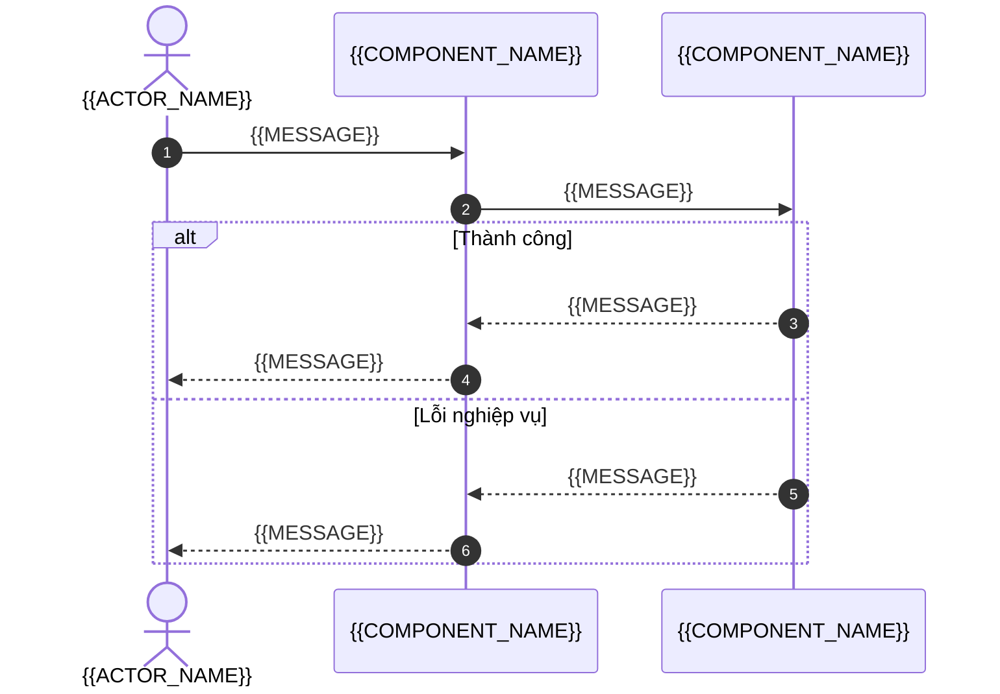
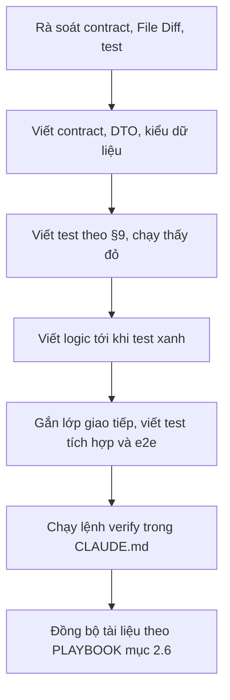

# Đặc tả kỹ thuật (Technical Specification): {{FEATURE_NAME}}

<!-- fill: Chép thành docs/specs/SPEC_<FEATURE_KEY>.md. Thêm vào parent phần SRS chứa FR của tính năng (SRS.md hoặc SRS_MODULE_<NAME>.md) và các ADR liên quan. release là nhãn đợt ở cột Bản phát hành của SRS §6.1; mọi FR ở §1.5 có Bản phát hành bằng release (CONVENTIONS mục 3, PLAYBOOK mục 2.4). Dự án có Intake cũ hơn 1.3.0 xóa dòng release. Từ khóa MUST, MUST NOT, SHOULD, MAY theo RFC 2119 và RFC 8174. Mục không áp dụng giữ heading, ghi N/A kèm lý do, không xóa. Spec là hợp đồng thực thi: coding agent chỉ làm những gì ghi ở đây. Frontmatter assembled_from ghi nguồn theo CONVENTIONS mục 3. -->

## 1. Mục tiêu và phạm vi (Goal & Bounded Context)

### 1.1. Mục tiêu kỹ thuật (Technical Objective)

- SPEC ID: `{{SPEC_ID}}`
- Mục tiêu: <!-- fill: tính năng làm gì, cho ai, trong 2 đến 4 câu; nêu FR chính. -->

### 1.2. Bất biến cốt lõi (Core Invariants)

<!-- fill: Điều MUST luôn đúng trong mọi điều kiện, kể cả thao tác đồng thời hoặc xen kẽ. Mỗi bất biến có ít nhất một test CONC ở §9. -->

| ID | Bất biến | Test chứng minh |
| --- | --- | --- |
| INV-01 | <!-- fill: phát biểu kiểm chứng được --> | TC-{{MODULE_CODE}}-CONC-01 |

### 1.3. Ngoài phạm vi của tính năng (Out of Scope)

<!-- fill: những gì người đọc có thể tưởng thuộc tính năng này nhưng không làm ở đây; mỗi dòng một mục, nêu SPEC hoặc phiên bản sẽ làm nếu có. -->

### 1.4. Phụ thuộc (Dependencies)

| Loại | Phụ thuộc | Ghi chú |
| --- | --- | --- |
| Thành phần nội bộ | {{COMPONENT_NAME}} | <!-- fill: dùng interface nào --> |
| Hệ thống ngoài | {{EXTERNAL_SYSTEM}} | <!-- fill: hoặc "Không có" --> |
| Dữ liệu bị tác động | <!-- fill: bảng, collection, file theo ARCHITECTURE §5 --> | <!-- fill: đọc hay ghi --> |
| SPEC phụ thuộc | <!-- fill: SPEC ID phải xong trước, hoặc "Không có" --> | <!-- fill --> |

### 1.5. Yêu cầu được đáp ứng (Requirements Satisfied)

| FR ID | AC ID | BR ID | NFR ID |
| --- | --- | --- | --- |
| FR-{{MODULE_CODE}}-001 | AC-{{MODULE_CODE}}-01 | <!-- fill: hoặc "Không có" --> | <!-- fill: hoặc "Không có" --> |

## 2. Kiểm soát thay đổi file (File Diff & Impact Tracking)

> Coding agent MUST chỉ sửa hoặc tạo file có trong mục này. Cần file khác thì dừng và đề xuất sửa SPEC (PLAYBOOK mục 7). Đường dẫn khớp cây thư mục ở ARCHITECTURE §4.

### 2.1. File sửa (Modified Files)

| Đường dẫn | Thay đổi |
| --- | --- |
| <!-- fill: đường dẫn trong inline code --> | <!-- fill: hàm, lớp hoặc mục cần thêm hay sửa --> |

### 2.2. File tạo mới (New Files)

| Đường dẫn | Loại | Trách nhiệm |
| --- | --- | --- |
| <!-- fill: đường dẫn trong inline code --> | <!-- fill: chọn một: source \| test \| migration \| config \| docs --> | <!-- fill --> |

### 2.3. Không được chạm (MUST NOT Touch)

| Đường dẫn hoặc phạm vi | Lý do |
| --- | --- |
| <!-- fill: file hoặc thư mục dễ bị sửa nhầm, ví dụ phân hệ khác, cấu hình dùng chung, migration đã chạy --> | <!-- fill --> |

## 3. Hợp đồng dữ liệu và giao tiếp (Contract)

Hình dạng contract phụ thuộc bề mặt. Mọi mã lỗi dùng trong mục này MUST có trong ARCHITECTURE §7.1.

### Màn hình (Screen)

<!-- fill: Một bảng cho mỗi màn hình của tính năng. Có Giai đoạn 1W: hàng SCR ID dẫn đúng ID ở chỉ mục wireframe và hàng Trang wireframe dẫn trang của màn hình; SPEC chỉ dẫn SCR-*, không định nghĩa lại màn hình, bố cục hay thành phần đã có ở trang wireframe, bảng năm trạng thái dưới khớp bảng trạng thái của trang và thêm hành vi thực thi. Dự án có Intake cũ hơn 1.3.0 hoặc không có Giai đoạn 1W: bỏ hai hàng này. -->

| Hạng mục | Giá trị |
| --- | --- |
| SCR ID | {{SCR_ID}} |
| Trang wireframe | `docs/wireframes/{{SCR_ID}}.md` |
| Route | `/{{ROUTE_PATH}}` |
| Tác nhân và điều kiện truy cập | <!-- fill: vai trò được vào; hành vi khi chưa đăng nhập hoặc không đủ quyền --> |
| Tiêu đề trang | Khóa chuỗi <!-- fill --> |
| Điều hướng vào | <!-- fill: từ màn hình nào, kèm tham số gì --> |
| Điều hướng ra | <!-- fill: sau khi thành công, khi hủy --> |
| Lập chỉ mục tìm kiếm | <!-- fill: chọn một: cho phép \| không cho phép (noindex) --> |

### Thành phần và props (Components & Props)

| Thành phần | Chạy ở | Props (tên: kiểu) | Trách nhiệm |
| --- | --- | --- | --- |
| {{COMPONENT_NAME}} | <!-- fill: chọn một: server \| client --> | <!-- fill --> | <!-- fill --> |

### Năm trạng thái giao diện (UI States)

<!-- fill: Đủ năm hàng cho mỗi màn hình hoặc vùng dữ liệu độc lập; trạng thái không áp dụng ghi N/A kèm lý do ở cột Hiển thị. Cột AC trỏ tiêu chí nghiệm thu ở SRS §8. -->

| Trạng thái | Điều kiện vào | Hiển thị | Hành động người dùng | AC |
| --- | --- | --- | --- | --- |
| `Initial` | <!-- fill --> | <!-- fill --> | <!-- fill --> | AC-{{MODULE_CODE}}-01 |
| `Loading` | <!-- fill --> | <!-- fill --> | <!-- fill --> | AC-{{MODULE_CODE}}-01 |
| `Empty` | <!-- fill --> | <!-- fill --> | <!-- fill --> | AC-{{MODULE_CODE}}-01 |
| `Success` | <!-- fill --> | <!-- fill --> | <!-- fill --> | AC-{{MODULE_CODE}}-01 |
| `Error` | <!-- fill --> | <!-- fill --> | <!-- fill --> | AC-{{MODULE_CODE}}-01 |

### Trạng thái tương tác (Interaction States)

| Phần tử | Trạng thái | Quy tắc |
| --- | --- | --- |
| Nút gửi | Đang gửi | Khóa và đổi nhãn; lần bấm thứ hai không tạo request mới |
| Form | Kết quả chưa rõ (lỗi mạng, hết thời gian chờ, `5xx`) | Các trường chỉ đọc; chỉ có hành động gửi lại cùng nội dung và cùng khóa tới khi có phản hồi xác định |
| Trường nhập | Có lỗi | Viền lỗi, thông báo gắn với trường bằng thuộc tính trợ năng, focus về trường lỗi đầu tiên khi gửi (tiêu chí ở `specflow/CONVENTIONS.md` mục 10.2) |
| <!-- fill --> | <!-- fill --> | <!-- fill --> |

### Form và validation (Form & Validation)

<!-- fill: Mỗi trường một hàng; ràng buộc chép từ DTO request trong SPEC của API và ghi SPEC nguồn ở cột cuối. -->

| Trường | Kiểu | Ràng buộc | Khóa chuỗi thông báo lỗi | Nguồn ràng buộc |
| --- | --- | --- | --- | --- |
| <!-- fill --> | <!-- fill --> | <!-- fill --> | <!-- fill --> | <!-- fill: SPEC ID của API, mục §3 --> |

<!-- PROFILE-SLOT: spec.contract -->

### Lời gọi API (API Calls)

| Thời điểm gọi | Method và path | Contract nguồn | Header đặc biệt | Xử lý thành công | Xử lý lỗi |
| --- | --- | --- | --- | --- | --- |
| <!-- fill --> | <!-- fill: chọn một: GET \| POST \| PATCH \| PUT \| DELETE; đường dẫn đúng như contract nguồn --> `/api/v1/{{RESOURCE_PATH}}` | <!-- fill: SPEC ID và operationId trong OpenAPI --> | <!-- fill: ví dụ Idempotency-Key sinh một lần cho mỗi lần gửi --> | <!-- fill --> | Theo bảng ánh xạ lỗi dưới đây |

### Ánh xạ lỗi sang giao diện (Error to UI Mapping)

<!-- fill: Mọi mã lỗi mà lời gọi ở trên có thể trả (theo ma trận lỗi của SPEC nguồn) và mã phía client; mã có trong ARCHITECTURE §7.1. -->

| `error.code` | Trạng thái giao diện | Khóa chuỗi thông báo | Hành vi |
| --- | --- | --- | --- |
| `VALIDATION_ERROR` | `Error` | <!-- fill --> | Lỗi dưới từng trường theo `error.details` |
| `UNAUTHENTICATED` | `Error` | <!-- fill --> | Chuyển tới đăng nhập rồi quay lại |
| `NETWORK_ERROR` | `Error` | <!-- fill --> | Cho thử lại với cùng `Idempotency-Key` |
| <!-- fill: mã nghiệp vụ của API --> | `Error` | <!-- fill --> | <!-- fill --> |

### Chuỗi hiển thị (i18n Keys)

| Khóa | Nội dung theo locale mặc định |
| --- | --- |
| <!-- fill: dạng tính năng.phần tử --> | <!-- fill --> |

## 4. Migration và dữ liệu (Migration & Data)

| Hạng mục | Nội dung |
| --- | --- |
| Cần migration | <!-- fill: chọn một: Có \| Không; nếu Không, các hàng dưới ghi N/A --> |
| File migration | <!-- fill: đường dẫn, phải có trong §2.2 --> |
| Thay đổi (forward) | <!-- fill: bảng, cột, index, ràng buộc thêm hoặc đổi --> |
| Rollback | <!-- fill: cách đảo ngược, dữ liệu có mất không --> |
| Backfill dữ liệu cũ | <!-- fill: cách điền dữ liệu cho bản ghi đã có, chạy lúc nào, idempotent ra sao --> |
| Tương thích khi triển khai dần | <!-- fill: phiên bản code cũ và mới cùng chạy được với schema mới hay không --> |

## 5. Thuật toán và luồng thực thi (Algorithm & Execution Flow)

### 5.1. Sơ đồ tuần tự (Sequence Diagram)

<!-- fill: Thể hiện luồng chính và nhánh lỗi quan trọng; participant là thành phần thật ở ARCHITECTURE §3 và §4. -->

### 5.2. Các bước xử lý (Processing Steps)

<!-- fill: Các bước đánh số, mỗi bước một hành động kiểm chứng được. Bước nào có thể thất bại thì nêu điều kiện, mã lỗi và trạng thái dữ liệu sau thất bại. -->

### 5.3. Ranh giới transaction và đồng thời (Transaction Boundary & Concurrency)

| Hạng mục | Quyết định |
| --- | --- |
| Ranh giới transaction | <!-- fill: bước nào nằm trong cùng một transaction; "Không dùng transaction" kèm lý do nếu vậy --> |
| Mức isolation | <!-- fill: mức mặc định ghi trong quy ước của bề mặt ở ARCHITECTURE §7; dùng mức khác thì ghi lý do --> |
| Kiểm soát đồng thời | <!-- fill: cách giữ bất biến §1.2 khi có thao tác song song, ví dụ cập nhật nguyên tử có điều kiện, khóa dòng, khóa lạc quan theo version --> |
| Idempotency | <!-- fill: khóa idempotency lấy từ đâu, lưu ở đâu, phản hồi khi trùng khóa; một cơ chế duy nhất --> |
| Tác vụ sau commit | <!-- fill: sự kiện hoặc tác vụ chỉ chạy sau khi transaction thành công --> |

## 6. Ma trận phân quyền (Authorization Matrix)

| Tác nhân | Hành động | Kết quả mong đợi | Mã lỗi khi bị chặn | Test |
| --- | --- | --- | --- | --- |
| `ACT_{{ROLE_CODE}}` | <!-- fill --> | <!-- fill: chọn một: Cho phép \| Từ chối --> | <!-- fill: mã trong ARCHITECTURE §7.1, hoặc N/A --> | <!-- fill: TC ID --> |

## 7. Hợp đồng sự kiện (Event Contract)

| Sự kiện | Payload (schema) | Phát khi | Consumer | Đảm bảo giao nhận | Phiên bản |
| --- | --- | --- | --- | --- | --- |
| `{{EVENT_NAME}}` | <!-- fill: tên trường, kiểu, bắt buộc; không chứa dữ liệu cá nhân nhạy cảm --> | <!-- fill --> | <!-- fill --> | <!-- fill: chọn một: at-most-once \| at-least-once kèm consumer idempotent --> | <!-- fill: ví dụ v1 --> |

## 8. Quan sát (Observability)

| Loại | Tên | Nội dung | Mức hoặc ngưỡng |
| --- | --- | --- | --- |
| Log | <!-- fill: tên sự kiện log --> | <!-- fill: trường ghi kèm, không có dữ liệu cấm ghi --> | <!-- fill: mức log --> |
| Metric | <!-- fill --> | <!-- fill --> | <!-- fill --> |
| Audit | <!-- fill: hành động cần dấu vết kiểm toán, hoặc N/A --> | <!-- fill: ai, làm gì, lúc nào, trên dữ liệu nào --> | <!-- fill --> |
| Cảnh báo | <!-- fill: hoặc N/A --> | <!-- fill --> | <!-- fill --> |

## 9. Kiểm thử (Tests)

> Coding agent MUST viết test theo bảng này trước khi viết logic (TDD). Mỗi AC ở §1.5 có ít nhất một TC; mỗi bất biến ở §1.2 có ít nhất một TC loại `CONC`; mỗi NFR ở §1.5 mà SRS §8 kiểm bằng Test có TC ghi NFR đó ở cột "AC hoặc INV", trừ khi TC của nó đã nằm ở SPEC khác. TC đánh số tiếp sau số lớn nhất đã có ở SRS §8 và các SPEC khác (CONVENTIONS mục 4); sau khi chốt, cập nhật SRS §8 theo bảng này. Bảng ghi đúng file và tên của từng test; tên test mô tả hành vi bằng tiếng Anh, không chứa TC ID (CONVENTIONS mục 4).

### 9.1. Danh sách test bắt buộc (Required Tests)

| TC ID | AC hoặc INV | Loại | Kịch bản (Given-When-Then) | File test | Tên test |
| --- | --- | --- | --- | --- | --- |
| TC-{{MODULE_CODE}}-UNIT-01 | AC-{{MODULE_CODE}}-01 | Unit | **Given:** <!-- fill --> **When:** <!-- fill --> **Then:** <!-- fill --> | <!-- fill: đường dẫn, phải có trong §2 --> | <!-- fill: tên test mô tả hành vi --> |
| TC-{{MODULE_CODE}}-CONC-01 | INV-01 | Concurrency | **Given:** <!-- fill --> **When:** <!-- fill: thao tác đồng thời hoặc xen kẽ --> **Then:** <!-- fill: bất biến vẫn đúng, đo được --> | <!-- fill --> | <!-- fill --> |

### Loại test của bề mặt (Surface Test Types)

| Loại | TYPE trong TC ID | Phạm vi | Dữ liệu | Bắt buộc |
| --- | --- | --- | --- | :---: |
| Unit | `UNIT` | Schema form, hàm định dạng, hook, thành phần render độc lập | Trong bộ nhớ | Có |
| Integration | `INT` | Thành phần của tính năng cùng client API thật, API giả lập ở tầng mạng theo contract | Response giả lập khớp OpenAPI | Có khi tính năng gọi API |
| E2E | `E2E` | Luồng người dùng trên ứng dụng đã build, trong trình duyệt thật | API giả lập ở tầng mạng hoặc API môi trường staging | Có |
| Trợ năng | `A11Y` | Quét tự động theo mức WCAG của NFR-USAB trên mỗi màn hình và trạng thái chính | Như E2E | Có, mỗi màn hình |
| Visual regression | `VIS` | Ảnh chụp màn hình so với ảnh gốc đã duyệt | Như E2E, dữ liệu cố định | Có, mỗi màn hình ở trạng thái `Success` |
| Concurrency | `CONC` | Bất biến ở §1.2 khi thao tác ghi bị kích hoạt lặp | Như E2E | Có, mỗi bất biến ở §1.2 một test |

### Dạng test CONC của bề mặt (Concurrency Test Pattern)

1. Mở màn hình trên ứng dụng đã build; chặn lời gọi ghi bằng route giả lập có độ trễ đủ để lần kích hoạt thứ hai xảy ra khi request đầu chưa xong.
2. Kích hoạt thao tác ghi lặp trong cùng một lần gửi: bấm đúp, nhấn Enter rồi bấm, hoặc gửi lại sau lỗi mạng (form phải đang khóa sửa). Route giả lập trả lỗi mạng cũng phải có độ trễ, để lần bấm thứ hai rơi vào lúc request đầu chưa kết thúc.
3. Đếm request ghi đã gửi và khóa `Idempotency-Key` của chúng; khẳng định bất biến (một request cho một lần gửi, cùng khóa khi thử lại) và giao diện chỉ hiển thị một kết quả.
4. Không dùng sleep để sắp thứ tự; chờ theo trạng thái hiển thị.

<!-- PROFILE-SLOT: spec.test-types -->

## 10. Triển khai dần (Rollout)

| Hạng mục | Quyết định |
| --- | --- |
| Cờ tính năng | <!-- fill: tên flag theo ARCHITECTURE §6.7, hoặc "Không dùng" kèm lý do --> |
| Tương thích ngược | <!-- fill: client hoặc phiên bản cũ bị ảnh hưởng thế nào --> |
| Kế hoạch tắt hoặc quay lui | <!-- fill: cách tắt tính năng khi có sự cố, dữ liệu xử lý ra sao --> |

## 11. Giả định và câu hỏi mở (Assumptions & Open Questions)

| ID | Loại | Nội dung | Lý do hoặc ảnh hưởng | BLOCKING | Người trả lời |
| --- | --- | --- | --- | :---: | --- |
| AQ-01 | <!-- fill: chọn một: Giả định \| Câu hỏi --> | <!-- fill --> | <!-- fill --> | <!-- fill: chọn một: Có \| Không --> | <!-- fill --> |

## 12. Quy trình thực thi và Definition of Done (Execution Workflow & DoD)

Definition of Done của SPEC:

- [ ] Mọi lệnh verify trong `CLAUDE.md` đạt điều kiện pass của bảng lệnh verify (PLAYBOOK mục 11).
- [ ] 100% test ở §9 pass, đúng file và tên ghi trong bảng.
- [ ] Mã nguồn chỉ thay đổi trong các file ở §2; ngoài ra chỉ có tài liệu và plan được cập nhật theo PLAYBOOK mục 2.6.
- [ ] Không có dependency mới ngoài ARCHITECTURE §2 hoặc ADR `accepted`.
- [ ] Mọi lỗi trả về theo envelope ARCHITECTURE §6.2 với mã trong §7.1 (bề mặt có request/response).
- [ ] SPEC chuyển status `implemented`, bảng §9 ghi đúng file test và tên test, checkbox của plan đã đồng bộ.

## 13. Lịch sử phiên bản (Version History)

| Phiên bản | Ngày | Người sửa | Nội dung thay đổi | Lý do và người yêu cầu | Người duyệt |
| --- | --- | --- | --- | --- | --- |
| 0.1.0 | {{DATE}} | {{AUTHOR}} | Bản khởi tạo | Khởi tạo theo pipeline | Chưa duyệt |
